# 📚 Claude AI Certification — Course Notes

---

## Lecture 1: Introduction & AI Fluency Framework

> **Welcome!** This video introduces the course's focus: developing meaningful collaboration with AI rather than just learning about AI technology. The course explores how to build a lasting framework for working with AI systems that goes beyond simple and temporary tips and tricks.

### 🧠 What is AI Fluency?
The ability to collaborate with AI in ways that are:
- **Effective**
- **Efficient**
- **Ethical**
- **Safe**

### The 4D Competencies
The AI Fluency Framework is built on four core competencies: **Delegation**, **Description**, **Discernment**, and **Diligence**. These are covered in depth in Lecture 3 onwards.

### Key Takeaways
- This course focuses on **human-AI collaboration**, not just understanding AI as a technology
- AI Fluency means engaging with AI systems effectively, efficiently, ethically, and safely
- The AI Fluency Framework centers on the **4D competencies**: Delegation, Description, Discernment, and Diligence
- The goal is to develop **lasting skills** that remain relevant as AI technology evolves
- Effective AI collaboration requires both practical skills and a **fundamental shift in how we think** about working with AI

---

## Lecture 2: The AI Fluency Framework

### Why Do We Need AI Fluency?
AI Fluency involves developing **practical skills, knowledge, insights, and values** that help you interact with AI systems in ways that are effective, efficient, ethical, and safe.

### 🔄 Three Ways People Engage with AI

| Mode | Description |
|------|-------------|
| ⚡ **Automation** | The AI completes specific tasks based on your instructions |
| 🤝 **Augmentation** | You and AI collaborate as creative thinking and task execution partners |
| 🧠 **Agency** | You configure AI to work independently on your behalf — establishing its knowledge and behavior patterns rather than just giving it specific tasks |

---

## Lecture 3: The 4D Framework Deep Dive

### The 4D Framework — Overview

The four competencies work **together** across all three modes of AI engagement (Automation, Augmentation, Agency).

| # | Competency | Core Question | What it means |
|---|------------|---------------|---------------|
| 1 | 🎯 **Delegation** | When should humans do the work, and when should AI? | Thoughtfully deciding what work to do with AI vs. doing yourself |
| 2 | 💬 **Description** | How do we communicate clearly with AI systems? | Communicating clearly with AI systems |
| 3 | 🔍 **Discernment** | How do we evaluate what AI gives us? | Evaluating AI outputs and behavior with a critical eye |
| 4 | 🛡️ **Diligence** | How do we ensure our interaction with AI is responsible, transparent, and accountable? | Ensuring you interact with AI responsibly |

### Sub-Competencies (Three sub-skills inside each D)

> Each 4D competency breaks down into three sub-skills. Note: the naming pattern differs per competency — only Description and Discernment follow the **Product / Process / Performance** structure.

#### 🎯 Delegation
Deciding what work should be done by humans, by AI, or distributed between them.
- **Problem Awareness** — Clearly understanding your goals and the nature of the work *before* involving AI
- **Platform Awareness** — Understanding the capabilities and limitations of different AI systems
- **Task Delegation** — Thoughtfully distributing work between humans and AI to leverage the strengths of each

#### 💬 Description
Effectively communicating with AI systems to get useful outputs.
- **Product Description** — Defining *what* you want: outputs, format, audience, and style
- **Process Description** — Defining *how* the AI approaches your request (e.g., step-by-step instructions)
- **Performance Description** — Defining the AI's *behavior* during collaboration (e.g., concise or detailed, challenging or supportive)

#### 🔍 Discernment
Thoughtfully and critically evaluating AI outputs, processes, and behavior.
- **Product Discernment** — Evaluating the quality of what AI produces (accuracy, appropriateness, coherence, relevance)
- **Process Discernment** — Evaluating *how* the AI arrived at its output (logical errors, lapses in attention, inappropriate reasoning)
- **Performance Discernment** — Evaluating how the AI *behaves* during interaction (is its communication style effective for your needs?)

#### 🛡️ Diligence
Using AI responsibly and ethically, with transparency and accountability.
- **Creation Diligence** — Being thoughtful about which AI systems you use and how you interact with them
- **Transparency Diligence** — Being honest about AI's role in your work with everyone who needs to know
- **Deployment Diligence** — Taking responsibility for verifying and vouching for the outputs you use or share

### Key Takeaways

- The **4Ds apply across all three modes** of working with AI (Automation, Augmentation, Agency)
- The 4Ds are **interconnected with each other** — they influence one another in all directions, not a one-way sequence
- Each D has **three sub-competencies** that make the framework practical and actionable
- Developing these competencies **prepares you for evolving AI capabilities** — not just today's tools
- AI Fluency means engaging with AI in ways that are effective, efficient, ethical, and safe

---

## 📖 Reference: Key Terminology Cheat Sheet

> Official Anthropic course reference — useful for quick revision before the exam.

### 🔄 Human-AI Interaction Modes (Full Definitions)

| Mode | Full Definition |
|------|-----------------|
| ⚡ **Automation** | AI performs specific tasks based on specific human instructions. The human defines what needs to be done, and the AI executes it. |
| 🤝 **Augmentation** | Humans and AI collaborate as thinking partners to complete tasks together. Involves iterative back-and-forth where both contribute to the outcome. |
| 🧠 **Agency** | Humans configure AI to work independently on their behalf, including interacting with other humans or AI. The human establishes the AI's knowledge and behavior patterns rather than specifying exact actions. |

### AI Technical Concepts

| Term | Definition |
|------|------------|
| **Generative AI** | AI systems that can create new content (text, images, code, etc.) rather than just analyzing existing data |
| **Large Language Models (LLMs)** | Generative AI systems trained on vast amounts of text data to understand and generate human language |
| **Claude** | Anthropic's family of large language models |
| **Parameters** | Mathematical values within an AI model that determine how it processes information; modern LLMs contain billions |
| **Neural networks** | Computing systems composed of interconnected nodes organized in layers that learn patterns from data through training |
| **Transformer architecture** | Breakthrough AI design from 2017 that enables LLMs to process text in parallel while attending to relationships between words across long passages |
| **Scaling laws** | As models grow larger with more data and compute, performance improves in consistent patterns; new capabilities can emerge at certain scale thresholds |
| **Pre-training** | Initial training phase where AI learns patterns from vast text data, building foundational language understanding |
| **Fine-tuning** | Additional training after pre-training to follow instructions, give helpful responses, and avoid harmful content |
| **Context window** | The amount of information an AI can consider at one time (conversation history + shared documents); has a maximum limit |
| **Hallucination** | When AI confidently states something that sounds plausible but is actually incorrect |
| **Knowledge cutoff date** | The point after which an AI model has no built-in knowledge, based on when training ended |
| **Reasoning / thinking models** | AI models designed to think step-by-step through complex problems for improved logical reasoning |
| **Temperature** | Controls how random AI responses are — higher = more creative/varied; lower = more predictable/focused |
| **RAG (Retrieval Augmented Generation)** | Technique that connects AI to external knowledge sources to improve accuracy and reduce hallucinations |
| **Bias** | Systematic patterns in AI outputs that unfairly favor or disadvantage certain groups, often from training data |

### Prompt Engineering Concepts

| Term | Definition |
|------|------------|
| **Prompt** | The input given to an AI model, including instructions and any shared documents |
| **Prompt engineering** | The practice of designing effective prompts to produce desired AI outputs |
| **Chain-of-thought prompting** | Encouraging AI to work through a problem step by step, breaking complex tasks into smaller steps |
| **Few-shot learning (n-shot prompting)** | Teaching AI by showing examples of desired input-output patterns; "N" = number of examples provided |
| **Role / persona definition** | Specifying a character, expertise level, or communication style for the AI to adopt (e.g., "speak as a UX expert") |
| **Output constraints / formatting** | Specifying the desired format, length, or structure of the AI's response within your prompt |
| **Think-first approach** | Asking the AI to work through its reasoning before giving a final answer, for more thorough responses |

---

## Lecture 4: Understanding Generative AI (Deep Dive 1 — Part A)

### What is Generative AI?

> Generative AI refers to AI systems that can **create new content** rather than just analyzing existing data.

| Traditional AI | Generative AI |
|----------------|---------------|
| Classifies emails as spam or not spam | Can write a completely new email for you |

### Three Pillars That Made It Possible

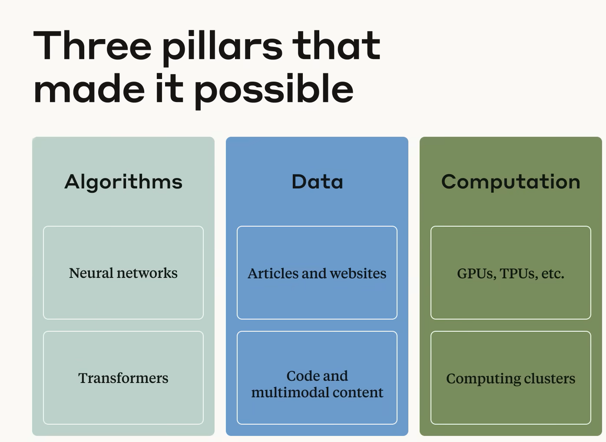

| Pillar | Includes | What it means |
|--------|----------|---------------|
| ⚙️ **Algorithms** | Neural networks, Transformers | Transformer architecture (2017) revolutionized processing of long text passages |
| 💾 **Data** | Articles & websites, Code & multimodal content | Explosion of digital data provided raw material for training |
| 🖥️ **Computation** | GPUs, TPUs, Computing clusters | Massive increases in computational power made it possible to train models on all that data |

> **Scaling laws:** As compute and data go up ↑, model intelligence goes up ↑ — and entirely new capabilities can emerge at certain scale thresholds.

### How It Works — Three Stages

**1. Pre-training** — Models analyze billions of text examples, learning to predict what comes next (next token prediction).

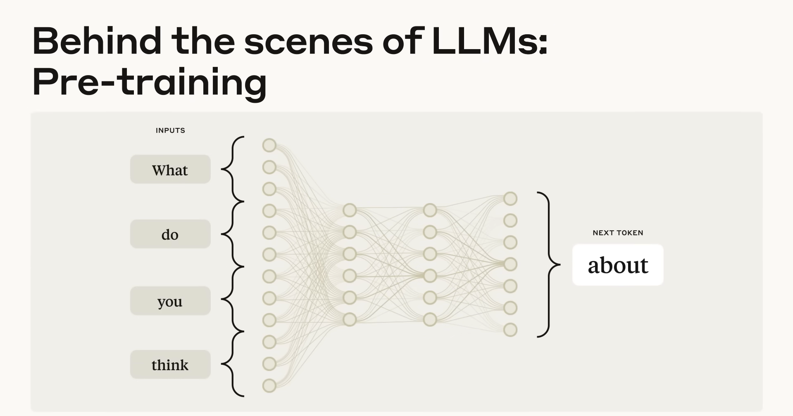

**2. Fine-tuning** — Models are refined to follow instructions and align with human preferences.

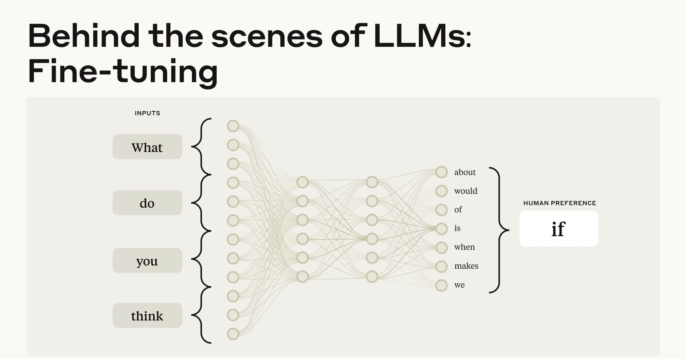

> **Anthropic's goals of fine-tuning — the 3 Hs:**

| Goal | Meaning |
|------|---------|
| 🟢 **Helpful** | Genuinely assists users in achieving their goals |
| 🔵 **Honest** | Doesn't deceive or mislead |
| 🟦 **Harmless** | Avoids causing harm to users or others |

**3. Deployment** — Users provide prompts; the model generates responses based on the prompts and patterns learned during training.

### What Makes Generative AI Powerful

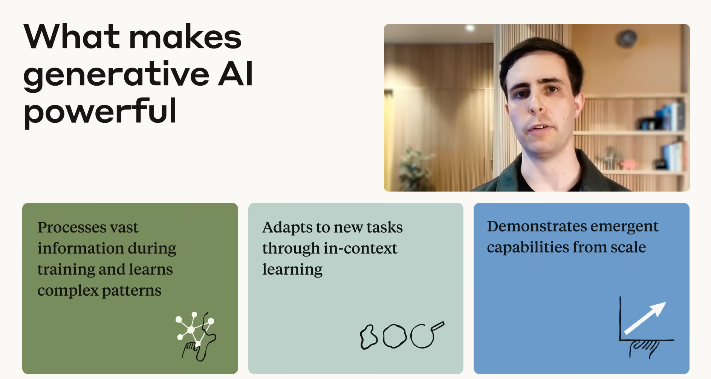

- **Processes vast information during training and learns complex patterns**
- **Adapts to new tasks through in-context learning** (learning from examples given directly in the prompt)
- **Demonstrates emergent capabilities from scale** — abilities that appear unpredictably as models grow larger

### Key Capabilities
- Versatile language skills
- General-purpose abilities
- Learning from examples
- Connecting to external tools and data

### Current Limitations
- **Knowledge cutoff date** — no awareness of events after training ended
- **Hallucinations** — can confidently state plausible but incorrect information
- **Context window constraints** — limited amount of information it can hold at once (includes your prompts, AI responses, and any other info you've shared)
- **Challenges with complex reasoning and math**

### Key Takeaways
- Generative AI **creates** new content — it doesn't just classify or retrieve existing data
- Three enablers: better **algorithms** (Transformer 2017), more **data**, and more **compute**
- LLMs learn in two phases: **pre-training** (broad knowledge) → **fine-tuning** (helpful behavior)
- Understanding these foundations directly strengthens your **Delegation** competence — knowing what AI can and can't do helps you decide when to use it

---

## Lecture 5: Capabilities & Limitations (Deep Dive 1 — Part B)

### Capabilities

> Despite having vast internal knowledge from training, LLMs don't have open-ended access to all external resources. Only specific tools or data sources that are explicitly connected are available — everything else remains locked.

- **Versatility across language tasks** — writing, summarising, translating, coding, and more without extra training
- **Conversational awareness** — maintains context across a dialogue
- **Task-switching** — can shift between diverse tasks in the same session
- **Connecting to external tools and data** — can access code execution, search, documents, and APIs *only when explicitly provided*

### Limitations

#### ⏳ Knowledge Cutoff Date
AI has no awareness of events after its training data ends.

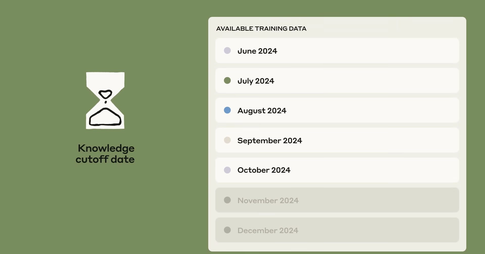

#### 🌀 Hallucinations
AI can confidently produce plausible-sounding but factually incorrect information.

#### 🪟 Context Window Constraints
The AI can only consider a limited amount of information at one time.

#### 🎲 Non-Deterministic Output
The same prompt can produce different answers each time — AI responses are not fixed or predictable.

#### 🧮 Reasoning Challenges
LLMs can struggle with complex multi-step reasoning and math. This is being addressed by **extended thinking** — models that reason step-by-step before answering.

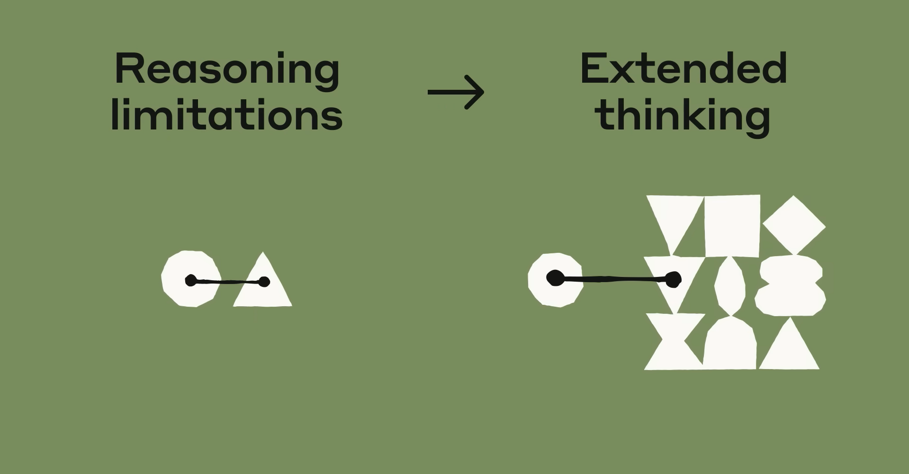

### Human + AI — Complementary Strengths

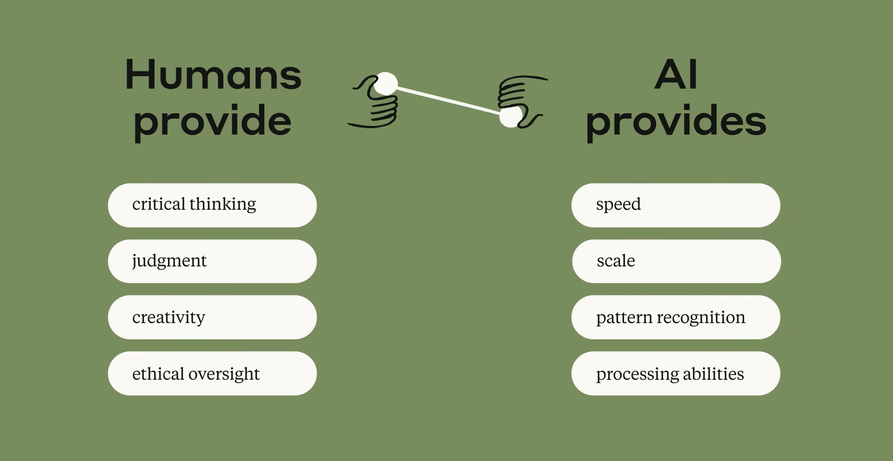

| Humans provide | AI provides |
|----------------|-------------|
| Critical thinking | Speed |
| Judgment | Scale |
| Creativity | Pattern recognition |
| Ethical oversight | Processing abilities |

> The most effective applications **combine** these strengths — neither humans alone nor AI alone.

### Looking Ahead

- **Evolving landscape** — the field is changing rapidly; today's limitations may not be tomorrow's
- **Human-AI collaboration** — the focus remains on working together, not replacing humans
- **Being hands-on** — practical experience is the best way to develop AI Fluency

### Key Takeaways
- Generative AI creates new content (text, images, code) rather than just analyzing existing data
- Three key enablers: algorithmic breakthroughs (Transformer), vast training data, increased compute
- AI learns through: **pre-training** (pattern recognition) → **fine-tuning** (helpful behaviour)
- Current capabilities: versatility across tasks, conversational awareness, connecting to external tools
- Current limitations: knowledge cutoff, hallucinations, context window constraints, non-deterministic output, reasoning challenges
- **Most effective applications combine human and AI strengths** — humans bring judgment and ethics; AI brings speed and scale

---

## Lecture 6: The 4Ds — Delegation

### What is Delegation?

> **Delegation** is making thoughtful decisions about what work is appropriate for you to do, for AI to do, or for you and AI to do together — and how to distribute those tasks.

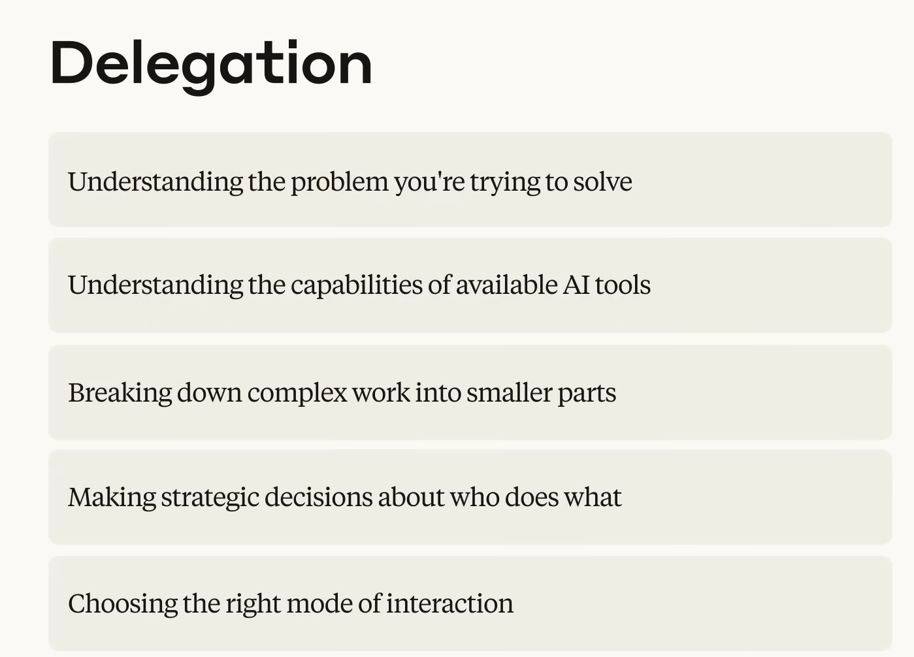

Effective delegation involves:
- Understanding the problem you're trying to solve
- Understanding the capabilities of available AI tools
- Breaking down complex work into smaller parts
- Making strategic decisions about who does what
- Choosing the right mode of interaction (Automation / Augmentation / Agency)

### Sub-Competency 1: 🎯 Problem Awareness

> The ability to clearly define your goals and understand what work is needed **before** involving AI tools.

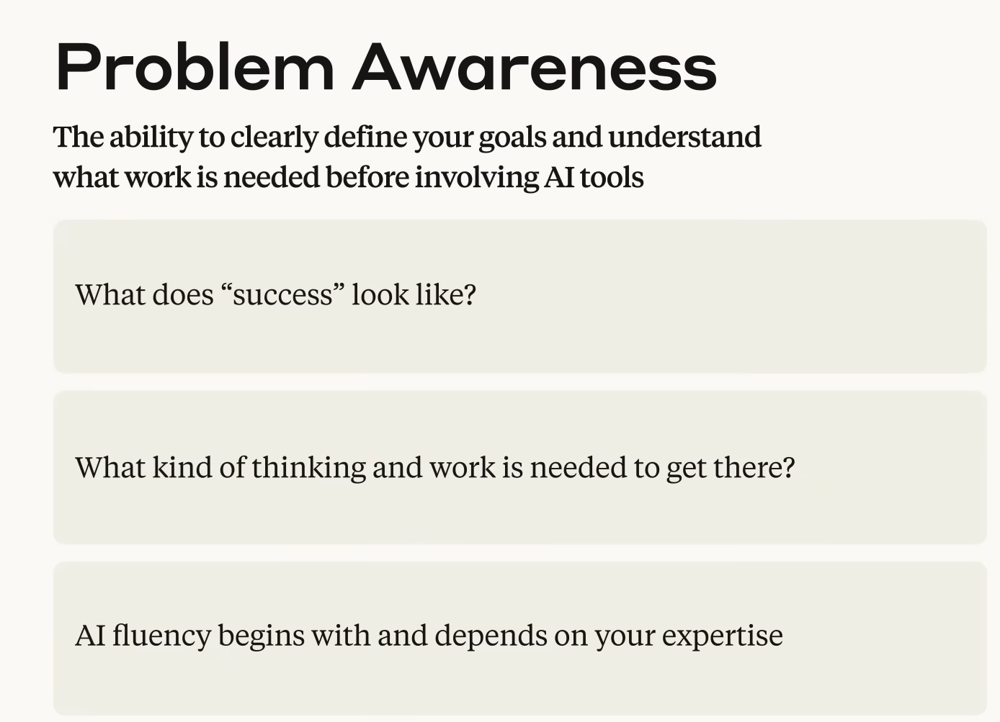

- What does **"success"** look like?
- What kind of thinking and work is needed to get there?
- **AI fluency begins with and depends on your own expertise**

### Sub-Competency 2: 🖥️ Platform Awareness

> A working knowledge of available AI systems and their specific capabilities and limitations.

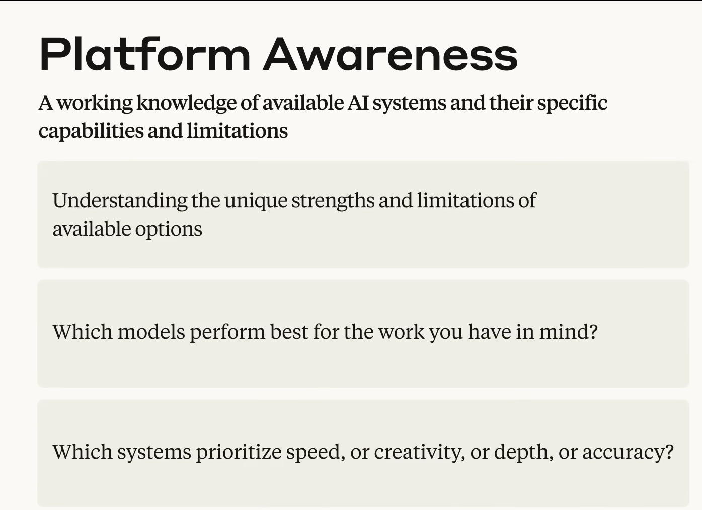

- Understanding the unique strengths and limitations of available options
- Which models perform best for the work you have in mind?
- Which systems prioritize **speed**, or **creativity**, or **depth**, or **accuracy**?

### Sub-Competency 3: 📋 Task Delegation

> The strategic process of dividing work between humans and AI.

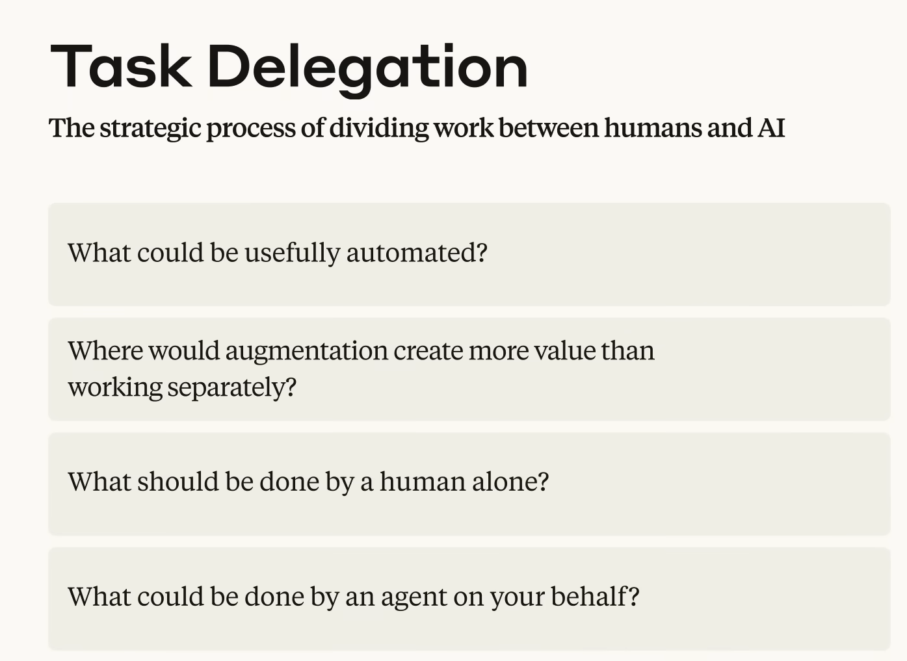

Ask yourself:
- What could be **usefully automated**?
- Where would **augmentation** create more value than working separately?
- What should be **done by a human alone**?
- What could be **done by an agent** on your behalf?

### Key Takeaways

- The **Delegation** competence is critical to **effective** and **efficient** AI use
- Delegation means deciding: do it yourself / do it together with AI / let AI handle it independently
- **Problem Awareness** = clearly understanding your goals before involving AI
- **Platform Awareness** = knowing what different AI systems can and can't do
- **Task Delegation** = strategically dividing work to leverage the strengths of both humans and AI
- Effective delegation requires both **domain expertise** and **understanding of AI capabilities**
- The goal isn't to automate everything — it's to create the **most effective human-AI partnership** for the task

---

## Lecture 7: The 4Ds — Description

### 🎯 What You'll Learn
- Understand how to effectively communicate your intentions to AI systems
- Recognize the importance of clear, purposeful communication
- Develop skills in three types of Description: **Product**, **Process**, and **Performance**

### What is Description?

> **Description** is the ability to communicate with AI in ways that create a productive collaborative environment. It goes beyond simply writing prompts — it involves creating a collaborative environment where both you and the AI can work effectively together.

- AI can't read your mind — the quality of your results comes down to how clearly you articulate your **needs**, **preferred approach**, and **desired interaction style**
- AI systems are **interactive partners**, not databases or vending machines
- Clear communication up front **saves time** and leads to **better results**

### Sub-Competency 1: 📦 Product Description

> Defining **what** you want in terms of outputs, format, audience, and style.

- *"Hey! Guess what I'm thinking?"* → *Sigh.* — don't make the AI guess your intent
- Be explicit about the **output** you want, its **format**, the **audience**, and the **style**

### Sub-Competency 2: 🛠️ Process Description

> Defining **how** the AI approaches your request — guiding its thought process, such as providing step-by-step instructions for the AI to follow.

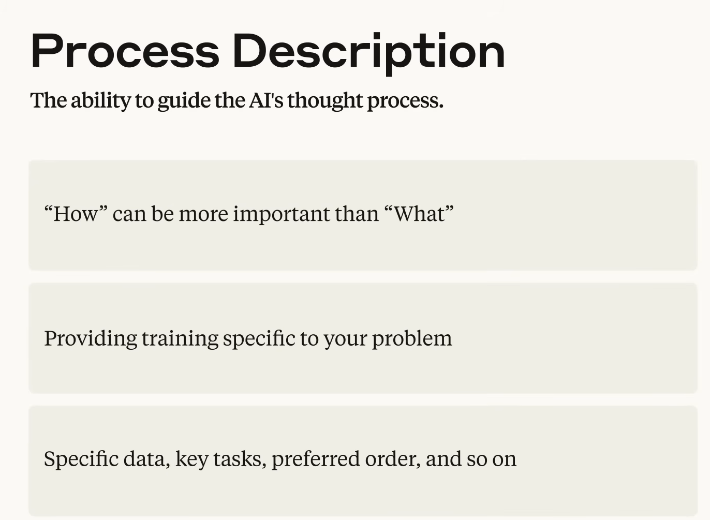

- **"How" can be more important than "What"** — the approach can matter as much as the end goal
- **Providing training specific to your problem** — give the AI context tailored to your exact situation
- Specify things like: **specific data**, **key tasks**, **preferred order**, and so on

### Sub-Competency 3: 🎭 Performance Description

> Defining the AI system's **behavior** during your collaboration — such as whether it should be concise or detailed, challenging or supportive.

- *"Act as a Socratic tutor."* — behavior can be shaped just like output
- **AI tools are interactive systems** that can behave differently in different contexts
- You need to **explain how you want the AI to behave** to get the best results

### Key Takeaways

- Description is about communicating with AI in ways that create a **productive collaborative environment**
- **Product Description** — clearly define what you want: outputs, format, audience, style
- **Process Description** — guide how the AI approaches your request; can be as important as the end goal itself
- **Performance Description** — define behavioral aspects: concise vs. detailed, challenging vs. supportive
- AI systems are **interactive partners**, not databases or vending machines
- You need to do **more than just write prompts**
- By nurturing your capacity for product, process, and performance description, you can transform AI tools from **generic assistants** into **finely tuned thinking partners**
- Clear communication with AI systems up front **saves time** and leads to **better results**

---

## Lecture 8: 6 Techniques for Effective Prompt Engineering

### 🎯 What You'll Learn
- Understand what prompt engineering is and why it matters for productive AI collaboration
- Apply six foundational prompting techniques to improve your AI interactions
- Identify common patterns that lead to successful AI interactions
- Troubleshoot and refine prompts when AI responses don't meet your needs

> **Communicating to AI** boils down to three things: **what we want**, **how we want it done**, and **how we want to interact with the AI**.

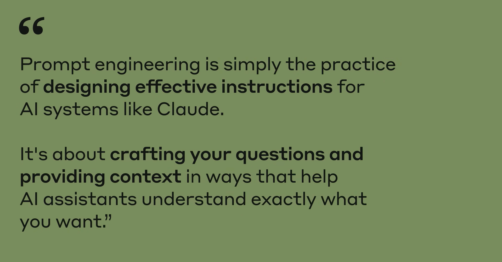

> **Prompt engineering** is simply the practice of designing effective instructions for AI systems like Claude. It's about **crafting your questions and providing context** in ways that help AI assistants understand exactly what you want.

### The 6 Foundational Techniques

| # | Technique | Before → After |
|---|-----------|-----------------|
| 1 | 🧭 **Provide context** | *"Tell me about climate change."* → *"Explain three major impacts of climate change on agriculture in tropical regions, with examples from the past decade."* |
| 2 | 🌟 **Offer examples** | Give example input→output pairs (few-shot) before asking for the real conversion, so the AI can match the pattern, style, or format |
| 3 | 📐 **Specify output constraints** | *"Design me a personal art portfolio website."* → specify sections, behavior (sticky/responsive nav), color palette, and features (dark/light toggle) |
| 4 | 🪜 **Break complex tasks into steps** | *"Analyze this quarterly sales data."* → give a numbered approach: identify top performers → compare quarters → highlight trends → suggest reasons |
| 5 | 🤔 **Ask it to think first** | *"Before answering, please think through this problem carefully. Consider the different factors involved, potential constraints, and various approaches..."* |
| 6 | 🎭 **Define role, style, or tone** | *"Please explain how rainbows form from the perspective of an experienced science teacher speaking to a bright 10-year-old..."* |

#### 1. 🧭 Provide Context — Three Levels of Specificity

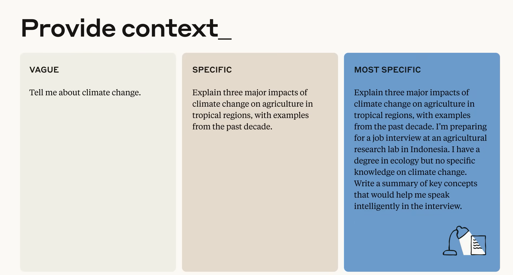

| Level | Example |
|-------|---------|
| **Vague** | *"Tell me about climate change."* |
| **Specific** | *"Explain three major impacts of climate change on agriculture in tropical regions, with examples from the past decade."* |
| **Most specific** | Same as above, **plus your own situation**: *"I'm preparing for a job interview at an agricultural research lab in Indonesia. I have a degree in ecology but no specific knowledge on climate change. Write a summary of key concepts that would help me speak intelligently in the interview."* |

> The more specific you are — adding your own goal/background on top of the task — the more tailored and useful the output.

#### 2. 🌟 Offer Examples

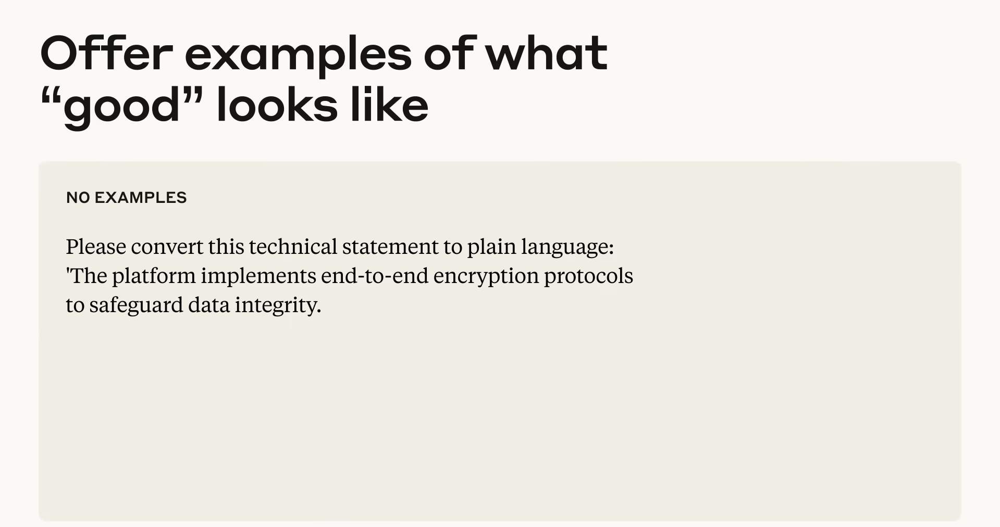
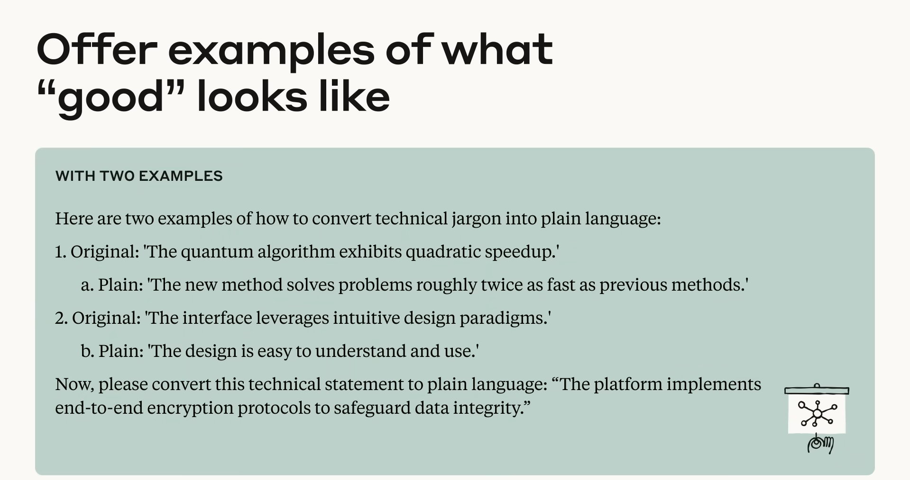

- **No examples** — the AI has to guess your desired tone/format from the instruction alone
- **With two examples** — showing 2 before/after conversions ("jargon → plain language") lets the AI infer the exact pattern before applying it to your real request

#### 3. 📐 Specify Output Constraints

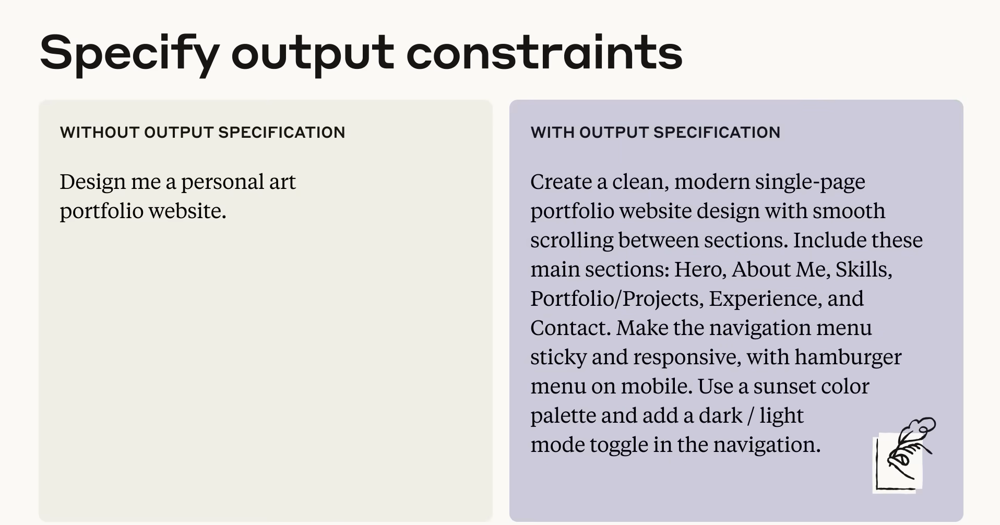

- **Without output specification** — *"Design me a personal art portfolio website."* (AI has to guess everything)
- **With output specification** — spells out layout (single-page, smooth scrolling), required sections, responsive/sticky nav behavior, color palette, and specific features (dark/light toggle)

#### 4. 🪜 Break Complex Tasks Into Steps

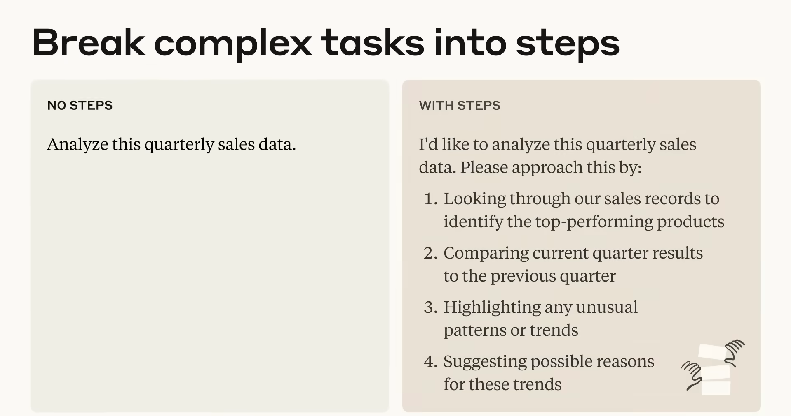

- **No steps** — *"Analyze this quarterly sales data."*
- **With steps** — numbered approach: identify top-performing products → compare quarters → highlight unusual patterns → suggest reasons for trends

#### 5. 🤔 Ask the AI to Think First

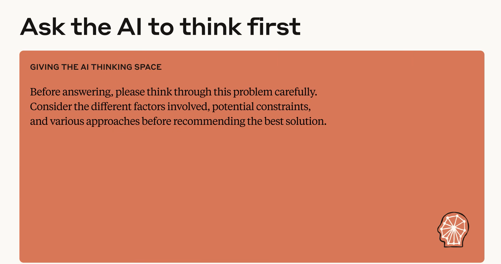

- Explicitly ask the AI to **think through the problem carefully** — consider factors, constraints, and approaches — *before* recommending a solution

#### 6. 🎭 Define Role, Style, or Tone

| Use case | Example |
|----------|---------|
| **For explanations** | *"Please explain how rainbows form from the perspective of an experienced science teacher speaking to a bright 10-year-old who's interested in science."* |
| **For brainstorming & feedback** | *"As a UX design expert, review this website wireframe and suggest three improvements focusing on user navigation and accessibility."* |

### 🔑 Secret Weapon: Ask the AI for Help with Prompting

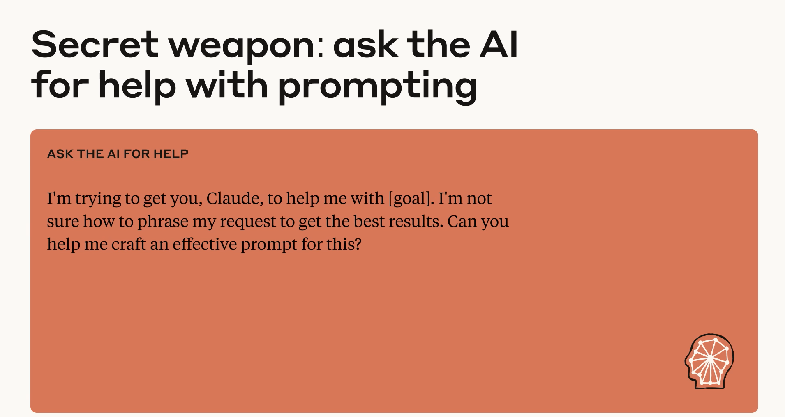

> *"I'm trying to get you, Claude, to help me with [goal]. I'm not sure how to phrase my request to get the best results. Can you help me craft an effective prompt for this?"*

- When you're not sure how to ask for something, **the AI can help improve your own prompt**
- Perhaps the **most powerful technique of all**

### 🔄 The Iterative Process

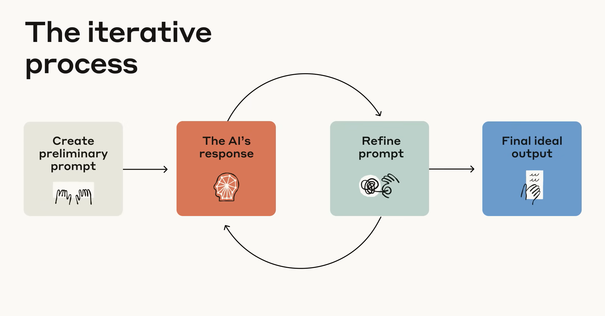

**Create preliminary prompt → The AI's response → Refine prompt → Final ideal output** (looping back to the AI's response as needed)

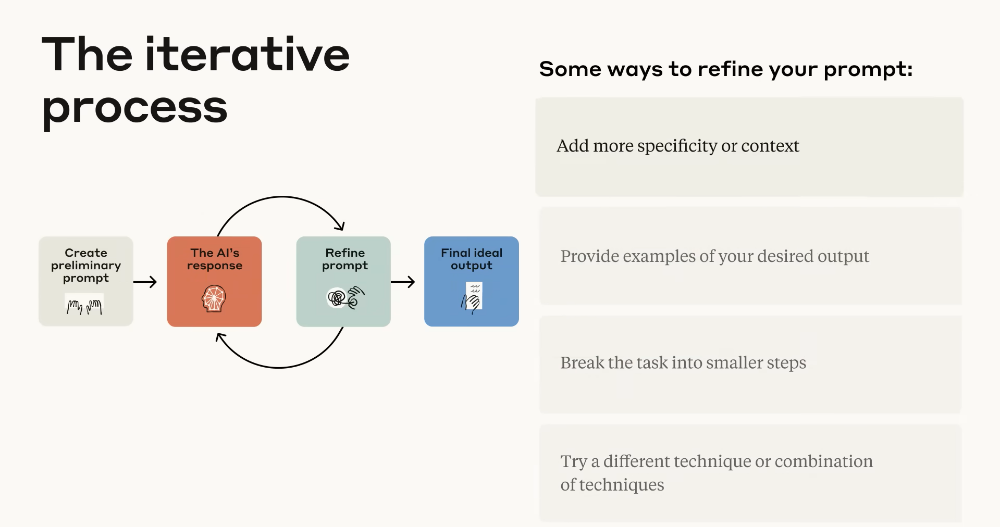

Some ways to refine your prompt:
- Add more specificity or context
- Provide examples of your desired output
- Break the task into smaller steps
- Try a different technique or combination of techniques

### 🛠️ Other Techniques to Try

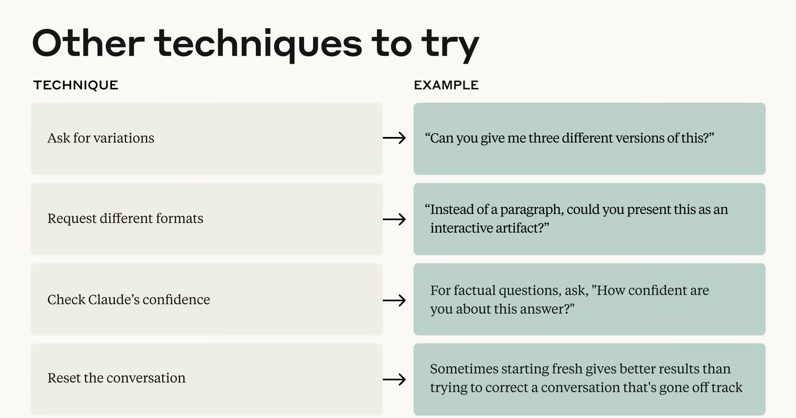

| Technique | Example |
|-----------|---------|
| **Ask for variations** | *"Can you give me three different versions of this?"* |
| **Request different formats** | *"Instead of a paragraph, could you present this as an interactive artifact?"* |
| **Check Claude's confidence** | For factual questions, ask: *"How confident are you about this answer?"* |
| **Reset the conversation** | Sometimes starting fresh gives better results than trying to correct a conversation that's gone off track |

### ✅ What Works and What Doesn't

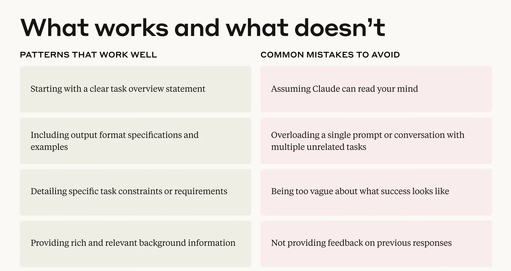

| Patterns that work well | Common mistakes to avoid |
|--------------------------|---------------------------|
| Starting with a clear task overview statement | Assuming Claude can read your mind |
| Including output format specifications and examples | Overloading a single prompt/conversation with multiple unrelated tasks |
| Detailing specific task constraints or requirements | Being too vague about what success looks like |
| Providing rich and relevant background information | Not providing feedback on previous responses |

### Key Takeaways

- Effective prompting combines **clear communication principles** with **AI-specific techniques**
- Six foundational techniques: **provide context**, **offer examples**, **specify output constraints**, **break down complex tasks**, **give the AI space to think**, **define roles**
- The "secret weapon" — **ask the AI itself** to help improve your prompt
- Successful prompting is **iterative** (and collaborative with the AI!) — expect to refine your approach based on results
- Common successful patterns: clear task overviews, format specifications, explicit constraints, and relevant background information
- Common mistakes: assuming the AI can read your mind, overloading prompts with unrelated tasks, being vague about success criteria, and not giving feedback on prior responses

---

## Lecture 9: The 4Ds — Discernment

### 🎯 What You'll Learn
- Understand how to evaluate AI outputs and processes thoughtfully
- Develop critical thinking skills for your AI interactions
- Learn to identify and address quality concerns in your AI interactions

### What is Discernment?

> **Discernment** is the ability to thoughtfully and critically evaluate what AI produces, how it produces it, and how it behaves.

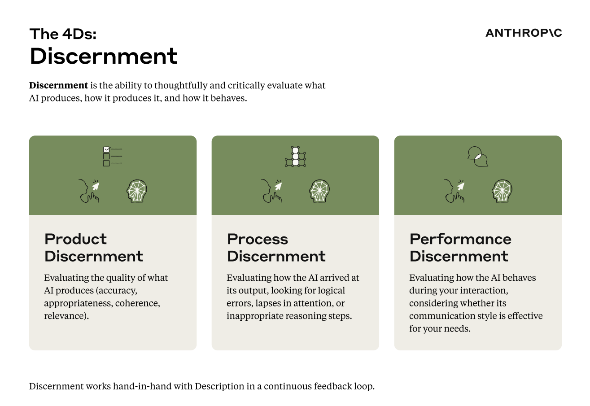

- Discernment is the **flip side of Description** — Description helps you communicate your intentions clearly; Discernment helps you evaluate whether what you receive **meets your needs**
- **Discernment works hand-in-hand with Description in a continuous feedback loop**
- Even the most advanced AI systems benefit from **human judgment and oversight**

**You need:**
- **Domain expertise** — your own knowledge of the subject
- **An understanding of how AI systems work** and their typical shortcomings

### Sub-Competency 1: 📋 Product Discernment

> Evaluating the **quality** of what AI produces — accuracy, appropriateness, coherence, relevance. *Your capacity to judge the quality of the AI output.*

- Is it **factually accurate**?
- Is it **appropriate to audience and purpose**?
- Is it **coherent and well-structured**?
- **Does it meet my requirements**?
- **Does it add value**?

### Sub-Competency 2: 🧩 Process Discernment

> Evaluating **how the AI arrived** at its output — looking for logical errors, lapses in attention, or inappropriate reasoning steps. *Your capacity to judge the quality of the problem-solving approach.*

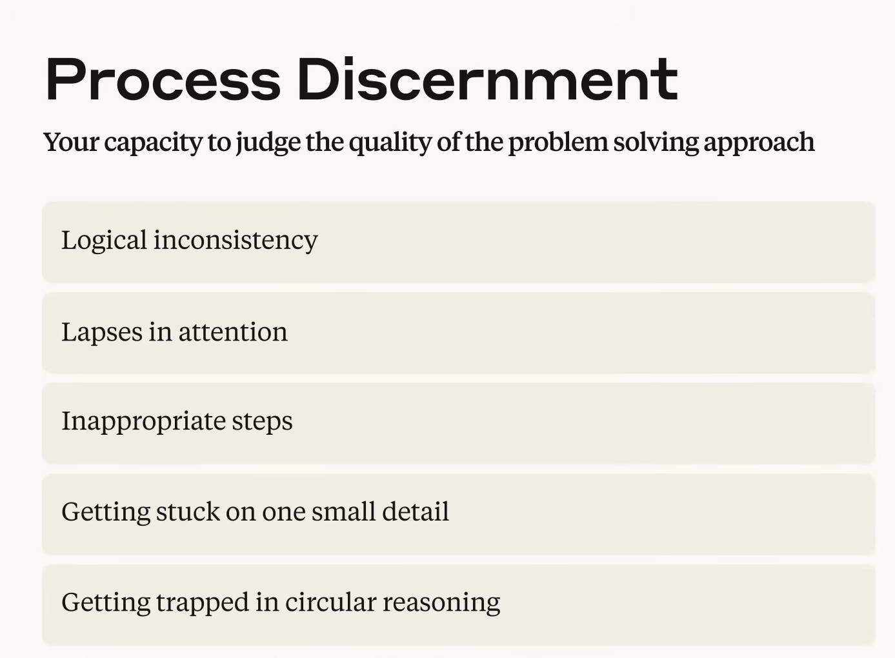

- **Logical inconsistency**
- **Lapses in attention**
- **Inappropriate steps**
- **Getting stuck on one small detail**
- **Getting trapped in circular reasoning**

### Sub-Competency 3: 💬 Performance Discernment

> Evaluating **how the AI behaves** during your interaction — considering whether its communication style is effective for your needs. *Your capacity to judge AI behaviors.*

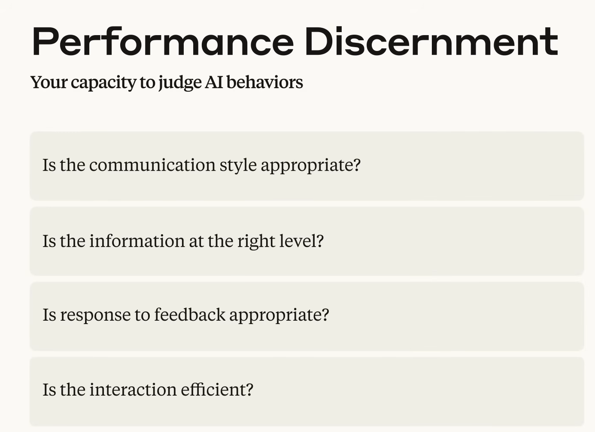

- Is the **communication style appropriate**?
- Is the **information at the right level**?
- Is the **response to feedback appropriate**?
- Is the **interaction efficient**?

### 🔁 Feedback and Correction

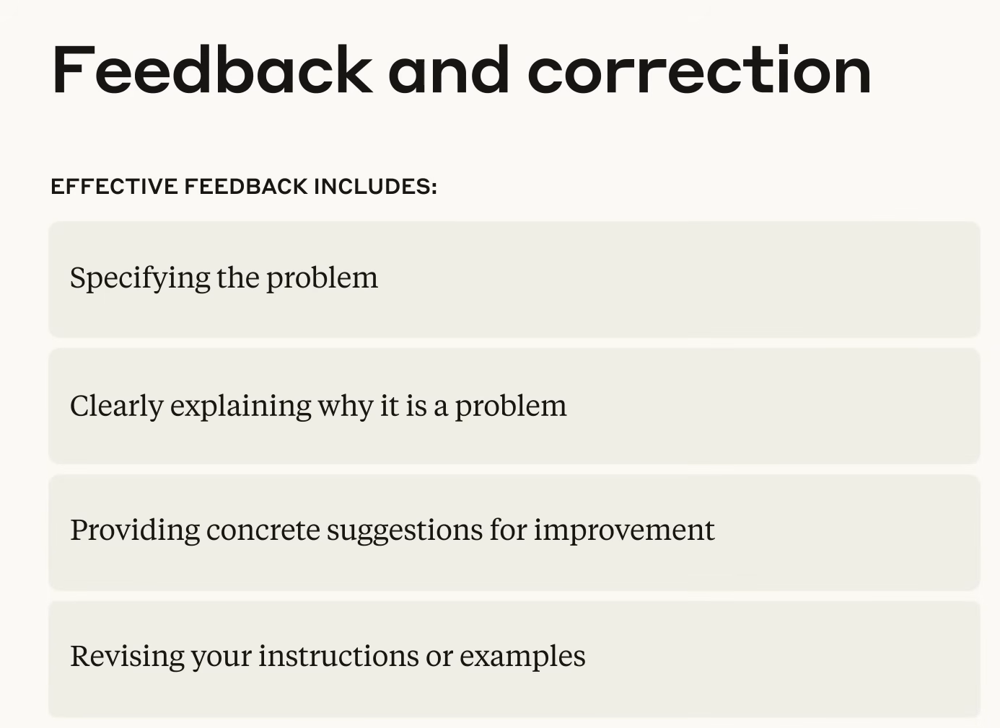

**Effective feedback includes:**
- **Specifying the problem**
- **Clearly explaining why it is a problem**
- **Providing concrete suggestions for improvement**
- **Revising your instructions or examples**

### Key Takeaways

- Discernment is your ability to thoughtfully evaluate **what** AI produces, **how** it produces it, and **how it behaves**
- **Product Discernment** — evaluating the quality of actual outputs (accuracy, appropriateness, coherence, relevance)
- **Process Discernment** — assessing how the AI arrived at its output, looking for logical errors, attention gaps, or inappropriate reasoning
- **Performance Discernment** — evaluating how the AI behaves within the collaboration process itself, considering whether its communication style is effective for your needs
- **Discernment evaluates how well your needs were met**
- **A continuous loop of instruction and evaluation drives quality** — Discernment works hand-in-hand with Description
- **Discernment ensures that AI collaboration remains guided by human judgment** — even the most advanced AI systems benefit from human oversight

### 🏋️ Exercise: Expert Discernment — Evaluating AI Responses in Your Domain

> **Goal:** Practice Product, Process, and Performance Discernment by evaluating AI-generated content in a domain where you have expertise, recognizing how your knowledge enhances your ability to critically assess AI outputs.

1. **Return to your area of expertise** — recall the topic you discussed with Claude in the earlier "Explore something you love" exercise
2. **Ask for multiple explanations** — start a new conversation and ask Claude to generate **three different explanations or analyses** of a specific aspect of your expert topic (e.g., three explanations of depth of field for photography, three analyses of fermentation for cooking, three perspectives on a historical event)
3. **Apply your expert discernment**:
   - **Product Discernment** — Which explanation is most accurate? Any factual errors/misconceptions? Is the level of detail appropriate?
   - **Process Discernment** — Does Claude follow logical reasoning? Are there gaps in analysis? Does it make appropriate connections between concepts?
   - **Performance Discernment** — Was Claude attentive to your specific question and responsive to feedback? Is terminology used appropriately? How does tone/style affect clarity?
4. **Provide feedback and refinement** — identify the strongest and weakest explanations, explain *why*, then work with Claude to create an improved version
5. **Reflect** — What specific knowledge let you judge strengths/weaknesses? How might a non-expert struggle to discern quality here? What does this teach about the relationship between domain knowledge and effective Discernment?

> 💡 For a more playful Discernment workout, try the "Game Night" suggestions in the final lesson's "Additional Activities."

### 🤔 Reflection
- Which type of Discernment (Product, Process, or Performance) do you find most challenging to apply, and why?
- How does Discernment complement Description? How do they work together?
- What signals or patterns might indicate that an AI output requires closer scrutiny?

### 🔜 What's Next
In the next lesson, you'll apply both **Description** and **Discernment** skills to the overarching course project — communicating effectively with AI *and* critically evaluating its outputs to produce results that leverage the best of both human and AI capabilities.

---

<!-- Add new lectures below this line -->
