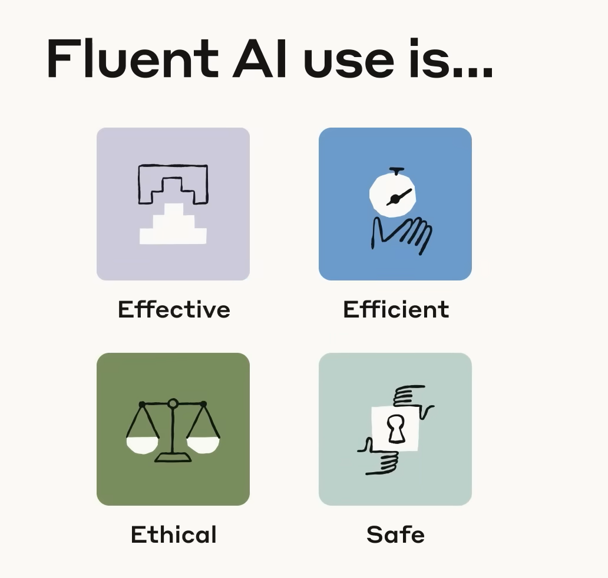
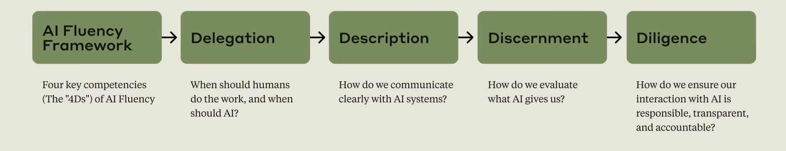
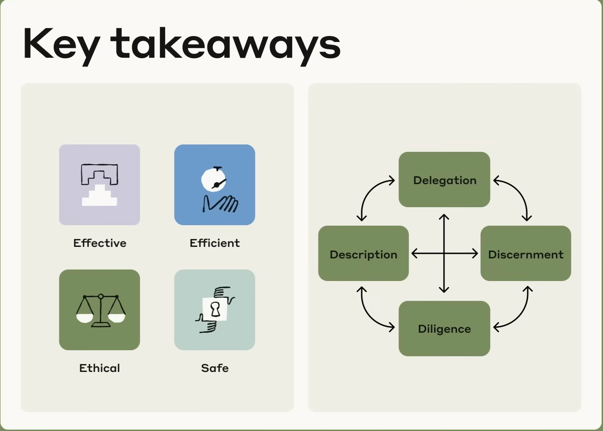
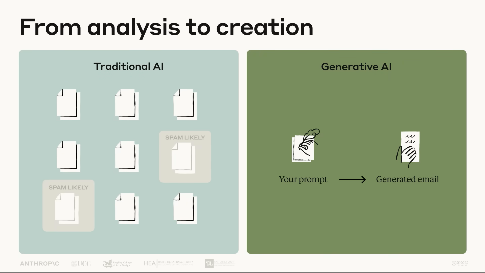
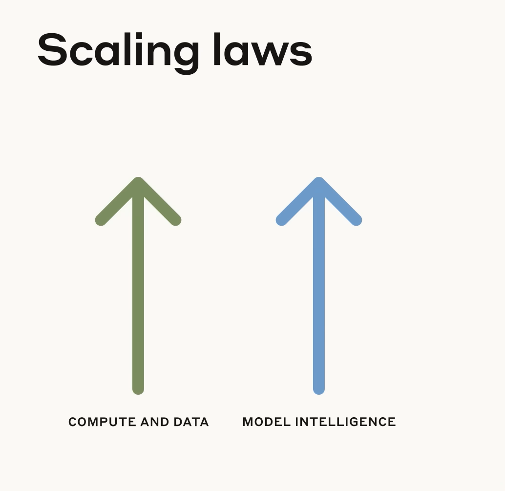
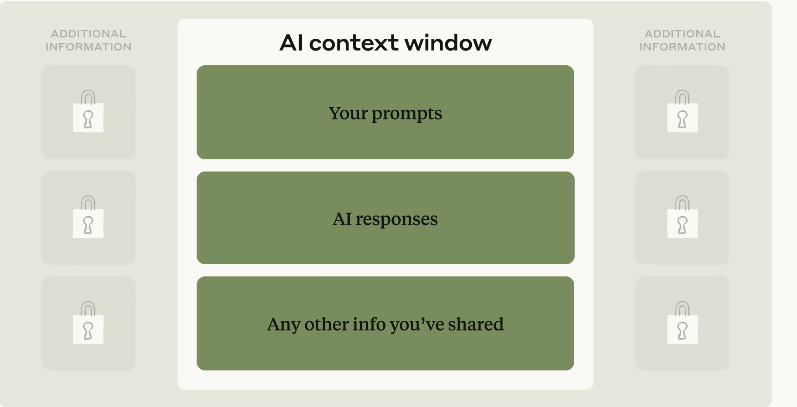
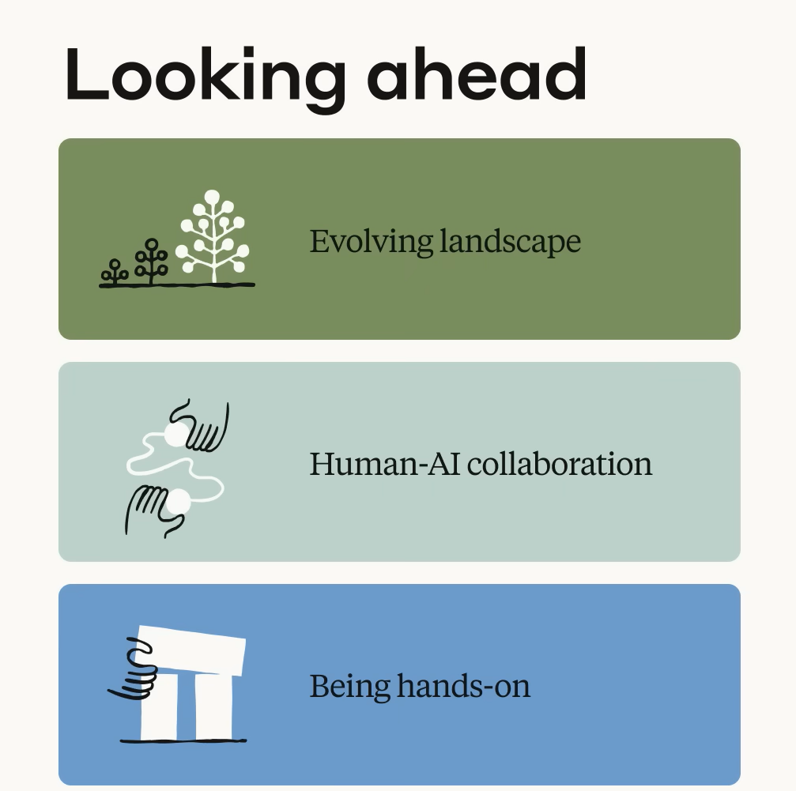

# 📚 Claude AI Certification — Course Notes

---

## Lecture 1: Introduction & AI Fluency Framework

> **Welcome!** This video introduces the course's focus: developing meaningful collaboration with AI rather than just learning about AI technology. The course explores how to build a lasting framework for working with AI systems that goes beyond simple and temporary tips and tricks.

### 🧠 What is AI Fluency?
The ability to collaborate with AI in ways that are:
- **Effective**
- **Efficient**
- **Ethical**
- **Safe**

### Course Structure
Covers each of the AI Fluency core competencies — the **4Ds** — as well as key technical and practical concepts.

### The 4D Competencies
| # | Competency | Core Question |
|---|------------|---------------|
| 1 | **Delegation** | When should humans do the work, and when should AI? |
| 2 | **Description** | How do we communicate clearly with AI systems? |
| 3 | **Discernment** | How do we evaluate what AI gives us? |
| 4 | **Diligence** | How do we ensure our interaction with AI is responsible, transparent, and accountable? |

### What You'll Gain by the End of the Course
- A framework for thoughtful AI interaction
- Confidence in choosing **when** and **how** to work with AI effectively
- Practical collaboration skills
- The ability to evaluate and disseminate AI-assisted work responsibly

### Key Takeaways
- This course focuses on **human-AI collaboration**, not just understanding AI as a technology
- AI Fluency means engaging with AI systems effectively, efficiently, ethically, and safely
- The AI Fluency Framework centers on the **4D competencies**: Delegation, Description, Discernment, and Diligence
- The goal is to develop **lasting skills** that remain relevant as AI technology evolves
- Effective AI collaboration requires both practical skills and a **fundamental shift in how we think** about working with AI

---

## Lecture 2: The AI Fluency Framework

### 🎯 What You'll Learn
By the end of this lesson, you'll be able to:
- Understand what AI Fluency means and why it matters in today's rapidly evolving technological landscape
- Recognize three emerging ways we collaborate with AI: Automation, Augmentation, and Agency

### Why Do We Need AI Fluency?
AI Fluency involves developing **practical skills, knowledge, insights, and values** that help you interact with AI systems in ways that are effective, efficient, ethical, and safe.

### 🔄 Three Ways People Engage with AI

| Mode | Description |
|------|-------------|
| ⚡ **Automation** | The AI completes specific tasks based on your instructions |
| 🤝 **Augmentation** | You and AI collaborate as creative thinking and task execution partners |
| 🧠 **Agency** | You configure AI to work independently on your behalf — establishing its knowledge and behavior patterns rather than just giving it specific tasks |

---

## Lecture 3: The 4D Framework Deep Dive

### What You'll Learn
By the end of this lesson, you'll be able to:
- Explain the AI Fluency Framework and its core "4Ds": Delegation, Description, Discernment, and Diligence

### The 4D Framework — Overview

The four competencies work **together** across all three modes of AI engagement (Automation, Augmentation, Agency).

| Competency | What it means |
|------------|---------------|
| **Delegation** | Thoughtfully deciding what work to do with AI vs. doing yourself |
| **Description** | Communicating clearly with AI systems |
| **Discernment** | Evaluating AI outputs and behavior with a critical eye |
| **Diligence** | Ensuring you interact with AI responsibly |

### Sub-Competencies (Three sub-skills inside each D)

> Each 4D competency breaks down into three sub-skills. Note: the naming pattern differs per competency — only Description and Discernment follow the **Product / Process / Performance** structure.

#### 🎯 Delegation
Deciding what work should be done by humans, by AI, or distributed between them.
- **Problem Awareness** — Clearly understanding your goals and the nature of the work *before* involving AI
- **Platform Awareness** — Understanding the capabilities and limitations of different AI systems
- **Task Delegation** — Thoughtfully distributing work between humans and AI to leverage the strengths of each

#### 💬 Description
Effectively communicating with AI systems to get useful outputs.
- **Product Description** — Defining *what* you want: outputs, format, audience, and style
- **Process Description** — Defining *how* the AI approaches your request (e.g., step-by-step instructions)
- **Performance Description** — Defining the AI's *behavior* during collaboration (e.g., concise or detailed, challenging or supportive)

#### 🔍 Discernment
Thoughtfully and critically evaluating AI outputs, processes, and behavior.
- **Product Discernment** — Evaluating the quality of what AI produces (accuracy, appropriateness, coherence, relevance)
- **Process Discernment** — Evaluating *how* the AI arrived at its output (logical errors, lapses in attention, inappropriate reasoning)
- **Performance Discernment** — Evaluating how the AI *behaves* during interaction (is its communication style effective for your needs?)

#### 🛡️ Diligence
Using AI responsibly and ethically, with transparency and accountability.
- **Creation Diligence** — Being thoughtful about which AI systems you use and how you interact with them
- **Transparency Diligence** — Being honest about AI's role in your work with everyone who needs to know
- **Deployment Diligence** — Taking responsibility for verifying and vouching for the outputs you use or share

### Key Takeaways

- The **4Ds apply across all three modes** of working with AI (Automation, Augmentation, Agency)
- The 4Ds are **interconnected with each other** — they influence one another in all directions, not a one-way sequence
- Each D has **three sub-competencies** that make the framework practical and actionable
- Developing these competencies **prepares you for evolving AI capabilities** — not just today's tools
- AI Fluency means engaging with AI in ways that are effective, efficient, ethical, and safe

---

## 📖 Reference: Key Terminology Cheat Sheet

> Official Anthropic course reference — useful for quick revision before the exam.

### 🔄 Human-AI Interaction Modes (Full Definitions)

| Mode | Full Definition |
|------|-----------------|
| ⚡ **Automation** | AI performs specific tasks based on specific human instructions. The human defines what needs to be done, and the AI executes it. |
| 🤝 **Augmentation** | Humans and AI collaborate as thinking partners to complete tasks together. Involves iterative back-and-forth where both contribute to the outcome. |
| 🧠 **Agency** | Humans configure AI to work independently on their behalf, including interacting with other humans or AI. The human establishes the AI's knowledge and behavior patterns rather than specifying exact actions. |

### AI Technical Concepts

| Term | Definition |
|------|------------|
| **Generative AI** | AI systems that can create new content (text, images, code, etc.) rather than just analyzing existing data |
| **Large Language Models (LLMs)** | Generative AI systems trained on vast amounts of text data to understand and generate human language |
| **Claude** | Anthropic's family of large language models |
| **Parameters** | Mathematical values within an AI model that determine how it processes information; modern LLMs contain billions |
| **Neural networks** | Computing systems composed of interconnected nodes organized in layers that learn patterns from data through training |
| **Transformer architecture** | Breakthrough AI design from 2017 that enables LLMs to process text in parallel while attending to relationships between words across long passages |
| **Scaling laws** | As models grow larger with more data and compute, performance improves in consistent patterns; new capabilities can emerge at certain scale thresholds |
| **Pre-training** | Initial training phase where AI learns patterns from vast text data, building foundational language understanding |
| **Fine-tuning** | Additional training after pre-training to follow instructions, give helpful responses, and avoid harmful content |
| **Context window** | The amount of information an AI can consider at one time (conversation history + shared documents); has a maximum limit |
| **Hallucination** | When AI confidently states something that sounds plausible but is actually incorrect |
| **Knowledge cutoff date** | The point after which an AI model has no built-in knowledge, based on when training ended |
| **Reasoning / thinking models** | AI models designed to think step-by-step through complex problems for improved logical reasoning |
| **Temperature** | Controls how random AI responses are — higher = more creative/varied; lower = more predictable/focused |
| **RAG (Retrieval Augmented Generation)** | Technique that connects AI to external knowledge sources to improve accuracy and reduce hallucinations |
| **Bias** | Systematic patterns in AI outputs that unfairly favor or disadvantage certain groups, often from training data |

### Prompt Engineering Concepts

| Term | Definition |
|------|------------|
| **Prompt** | The input given to an AI model, including instructions and any shared documents |
| **Prompt engineering** | The practice of designing effective prompts to produce desired AI outputs |
| **Chain-of-thought prompting** | Encouraging AI to work through a problem step by step, breaking complex tasks into smaller steps |
| **Few-shot learning (n-shot prompting)** | Teaching AI by showing examples of desired input-output patterns; "N" = number of examples provided |
| **Role / persona definition** | Specifying a character, expertise level, or communication style for the AI to adopt (e.g., "speak as a UX expert") |
| **Output constraints / formatting** | Specifying the desired format, length, or structure of the AI's response within your prompt |
| **Think-first approach** | Asking the AI to work through its reasoning before giving a final answer, for more thorough responses |

---

## Lecture 4: Understanding Generative AI (Deep Dive 1 — Part A)

### What You'll Learn
By the end of this lesson, you'll be able to:
- Define generative AI and how it differs from other AI types
- Recognize the key characteristics and technological foundations of generative AI

### What is Generative AI?

> Generative AI refers to AI systems that can **create new content** rather than just analyzing existing data.

| Traditional AI | Generative AI |
|----------------|---------------|
| Classifies emails as spam or not spam | Can write a completely new email for you |

### Three Pillars That Made It Possible

| Pillar | Includes | What it means |
|--------|----------|---------------|
| ⚙️ **Algorithms** | Neural networks, Transformers | Transformer architecture (2017) revolutionized processing of long text passages |
| 💾 **Data** | Articles & websites, Code & multimodal content | Explosion of digital data provided raw material for training |
| 🖥️ **Computation** | GPUs, TPUs, Computing clusters | Massive increases in computational power made it possible to train models on all that data |

> **Scaling laws:** As compute and data go up ↑, model intelligence goes up ↑ — and entirely new capabilities can emerge at certain scale thresholds.

### How It Works — Three Stages

**1. Pre-training** — Models analyze billions of text examples, learning to predict what comes next (next token prediction).

**2. Fine-tuning** — Models are refined to follow instructions and align with human preferences.

> **Anthropic's goals of fine-tuning — the 3 Hs:**

| Goal | Meaning |
|------|---------|
| 🟢 **Helpful** | Genuinely assists users in achieving their goals |
| 🔵 **Honest** | Doesn't deceive or mislead |
| 🟦 **Harmless** | Avoids causing harm to users or others |

**3. Deployment** — Users provide prompts; the model generates responses based on the prompts and patterns learned during training.

### What Makes Generative AI Powerful

- **Processes vast information during training and learns complex patterns**
- **Adapts to new tasks through in-context learning** (learning from examples given directly in the prompt)
- **Demonstrates emergent capabilities from scale** — abilities that appear unpredictably as models grow larger

### Key Capabilities
- Versatile language skills
- General-purpose abilities
- Learning from examples
- Connecting to external tools and data

### Current Limitations
- **Knowledge cutoff date** — no awareness of events after training ended
- **Hallucinations** — can confidently state plausible but incorrect information
- **Context window constraints** — limited amount of information it can hold at once (includes your prompts, AI responses, and any other info you've shared)
- **Challenges with complex reasoning and math**

### Key Takeaways
- Generative AI **creates** new content — it doesn't just classify or retrieve existing data
- Three enablers: better **algorithms** (Transformer 2017), more **data**, and more **compute**
- LLMs learn in two phases: **pre-training** (broad knowledge) → **fine-tuning** (helpful behavior)
- Understanding these foundations directly strengthens your **Delegation** competence — knowing what AI can and can't do helps you decide when to use it

---

## Lecture 5: Capabilities & Limitations (Deep Dive 1 — Part B)

### What You'll Learn
By the end of this lesson, you'll be able to:
- Identify major capabilities and limitations of current generative AI

### Capabilities

> Despite having vast internal knowledge from training, LLMs don't have open-ended access to all external resources. Only specific tools or data sources that are explicitly connected are available — everything else remains locked.

- **Versatility across language tasks** — writing, summarising, translating, coding, and more without extra training
- **Conversational awareness** — maintains context across a dialogue
- **Task-switching** — can shift between diverse tasks in the same session
- **Connecting to external tools and data** — can access code execution, search, documents, and APIs *only when explicitly provided*

### Limitations

#### ⏳ Knowledge Cutoff Date
AI has no awareness of events after its training data ends.

#### 🌀 Hallucinations
AI can confidently produce plausible-sounding but factually incorrect information.

#### 🪟 Context Window Constraints
The AI can only consider a limited amount of information at one time.

#### 🎲 Non-Deterministic Output
The same prompt can produce different answers each time — AI responses are not fixed or predictable.

#### 🧮 Reasoning Challenges
LLMs can struggle with complex multi-step reasoning and math. This is being addressed by **extended thinking** — models that reason step-by-step before answering.

### Human + AI — Complementary Strengths

| Humans provide | AI provides |
|----------------|-------------|
| Critical thinking | Speed |
| Judgment | Scale |
| Creativity | Pattern recognition |
| Ethical oversight | Processing abilities |

> The most effective applications **combine** these strengths — neither humans alone nor AI alone.

### Looking Ahead

- **Evolving landscape** — the field is changing rapidly; today's limitations may not be tomorrow's
- **Human-AI collaboration** — the focus remains on working together, not replacing humans
- **Being hands-on** — practical experience is the best way to develop AI Fluency

### Key Takeaways
- Generative AI creates new content (text, images, code) rather than just analyzing existing data
- Three key enablers: algorithmic breakthroughs (Transformer), vast training data, increased compute
- AI learns through: **pre-training** (pattern recognition) → **fine-tuning** (helpful behaviour)
- Current capabilities: versatility across tasks, conversational awareness, connecting to external tools
- Current limitations: knowledge cutoff, hallucinations, context window constraints, non-deterministic output, reasoning challenges
- **Most effective applications combine human and AI strengths** — humans bring judgment and ethics; AI brings speed and scale

---

<!-- Add new lectures below this line -->
