[⬅ Back to course index](../README.md)

# 📚 AI Fluency: Framework & Foundations — Course Notes

---

## Lectures 1–3: The AI Fluency Framework

> **Welcome!** This course's focus: developing meaningful collaboration with AI, not just learning AI technology — a lasting framework, not temporary tips and tricks.

### 🧠 What is AI Fluency?
The ability to collaborate with AI in ways that are:
- **Effective**
- **Efficient**
- **Ethical**
- **Safe**

AI Fluency = developing **practical skills, knowledge, insights, and values** for interacting with AI systems.

### 🔄 Three Ways to Engage with AI

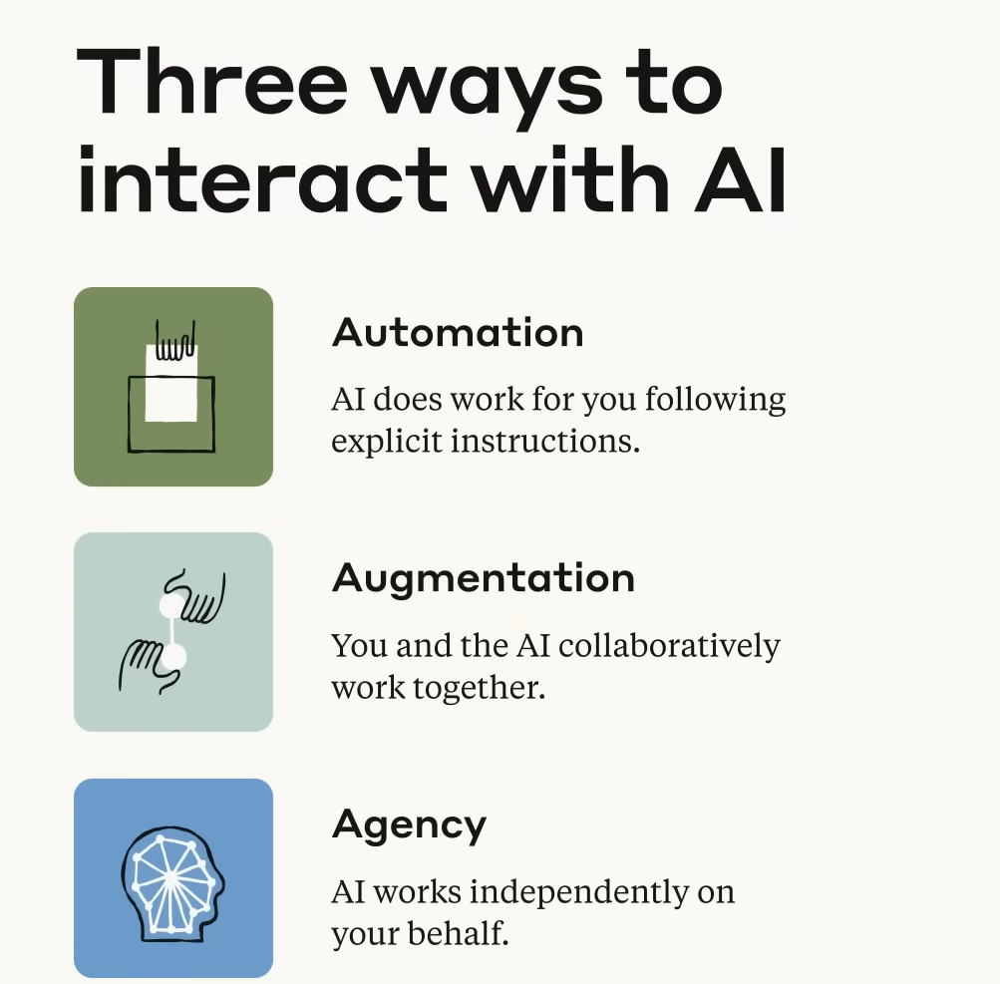

| Mode | Description |
|------|-------------|
| ⚡ **Automation** | The AI completes specific tasks based on your instructions |
| 🤝 **Augmentation** | You and AI collaborate as creative thinking and task execution partners |
| 🧠 **Agency** | You configure AI to work independently on your behalf — establishing its knowledge and behavior patterns rather than just giving it specific tasks |

### The 4D Framework — Overview

The four competencies work **together** across all three modes of AI engagement (Automation, Augmentation, Agency).

| # | Competency | Core Question | What it means |
|---|------------|---------------|---------------|
| 1 | 🎯 **Delegation** | When should humans do the work, and when should AI? | Thoughtfully deciding what work to do with AI vs. doing yourself |
| 2 | 💬 **Description** | How do we communicate clearly with AI systems? | Communicating clearly with AI systems |
| 3 | 🔍 **Discernment** | How do we evaluate what AI gives us? | Evaluating AI outputs and behavior with a critical eye |
| 4 | 🛡️ **Diligence** | How do we ensure our interaction with AI is responsible, transparent, and accountable? | Ensuring you interact with AI responsibly |

### Sub-Competencies (Three sub-skills inside each D)

> Each 4D competency breaks down into three sub-skills. Note: the naming pattern differs per competency — only Description and Discernment follow the **Product / Process / Performance** structure.

#### 🎯 Delegation
Deciding what work should be done by humans, by AI, or distributed between them.
- **Problem Awareness** — Clearly understanding your goals and the nature of the work *before* involving AI
- **Platform Awareness** — Understanding the capabilities and limitations of different AI systems
- **Task Delegation** — Thoughtfully distributing work between humans and AI to leverage the strengths of each

#### 💬 Description
Effectively communicating with AI systems to get useful outputs.
- **Product Description** — Defining *what* you want: outputs, format, audience, and style
- **Process Description** — Defining *how* the AI approaches your request (e.g., step-by-step instructions)
- **Performance Description** — Defining the AI's *behavior* during collaboration (e.g., concise or detailed, challenging or supportive)

#### 🔍 Discernment
Thoughtfully and critically evaluating AI outputs, processes, and behavior.
- **Product Discernment** — Evaluating the quality of what AI produces (accuracy, appropriateness, coherence, relevance)
- **Process Discernment** — Evaluating *how* the AI arrived at its output (logical errors, lapses in attention, inappropriate reasoning)
- **Performance Discernment** — Evaluating how the AI *behaves* during interaction (is its communication style effective for your needs?)

#### 🛡️ Diligence
Using AI responsibly and ethically, with transparency and accountability.
- **Creation Diligence** — Being thoughtful about which AI systems you use and how you interact with them
- **Transparency Diligence** — Being honest about AI's role in your work with everyone who needs to know
- **Deployment Diligence** — Taking responsibility for verifying and vouching for the outputs you use or share

### Key Takeaways

- This course focuses on **human-AI collaboration**, not just understanding AI as a technology — it requires a **fundamental shift in how we think** about working with AI, not just new skills
- The **4Ds apply across all three modes** of working with AI (Automation, Augmentation, Agency)
- The 4Ds are **interconnected with each other** — they influence one another in all directions, not a one-way sequence
- Each D has **three sub-competencies** that make the framework practical and actionable
- Developing these competencies **prepares you for evolving AI capabilities** — lasting skills, not just today's tools

---

## 📖 Reference: Key Terminology Cheat Sheet

> Official Anthropic course reference — useful for quick revision before the exam.

### 🔄 Human-AI Interaction Modes (Full Definitions)

| Mode | Full Definition |
|------|-----------------|
| ⚡ **Automation** | AI performs specific tasks based on specific human instructions. The human defines what needs to be done, and the AI executes it. |
| 🤝 **Augmentation** | Humans and AI collaborate as thinking partners to complete tasks together. Involves iterative back-and-forth where both contribute to the outcome. |
| 🧠 **Agency** | Humans configure AI to work independently on their behalf, including interacting with other humans or AI. The human establishes the AI's knowledge and behavior patterns rather than specifying exact actions. |

### AI Technical Concepts

| Term | Definition |
|------|------------|
| **Generative AI** | AI systems that can create new content (text, images, code, etc.) rather than just analyzing existing data |
| **Large Language Models (LLMs)** | Generative AI systems trained on vast amounts of text data to understand and generate human language |
| **Claude** | Anthropic's family of large language models |
| **Parameters** | Mathematical values within an AI model that determine how it processes information; modern LLMs contain billions |
| **Neural networks** | Computing systems composed of interconnected nodes organized in layers that learn patterns from data through training |
| **Transformer architecture** | Breakthrough AI design from 2017 that enables LLMs to process text in parallel while attending to relationships between words across long passages |
| **Scaling laws** | As models grow larger with more data and compute, performance improves in consistent patterns; new capabilities can emerge at certain scale thresholds |
| **Pre-training** | Initial training phase where AI learns patterns from vast text data, building foundational language understanding |
| **Fine-tuning** | Additional training after pre-training to follow instructions, give helpful responses, and avoid harmful content |
| **Context window** | The amount of information an AI can consider at one time (conversation history + shared documents); has a maximum limit |
| **Hallucination** | When AI confidently states something that sounds plausible but is actually incorrect |
| **Knowledge cutoff date** | The point after which an AI model has no built-in knowledge, based on when training ended |
| **Reasoning / thinking models** | AI models designed to think step-by-step through complex problems for improved logical reasoning |
| **Temperature** | Controls how random AI responses are — higher = more creative/varied; lower = more predictable/focused |
| **RAG (Retrieval Augmented Generation)** | Technique that connects AI to external knowledge sources to improve accuracy and reduce hallucinations |
| **Bias** | Systematic patterns in AI outputs that unfairly favor or disadvantage certain groups, often from training data |

### Prompt Engineering Concepts

| Term | Definition |
|------|------------|
| **Prompt** | The input given to an AI model, including instructions and any shared documents |
| **Prompt engineering** | The practice of designing effective prompts to produce desired AI outputs |
| **Chain-of-thought prompting** | Encouraging AI to work through a problem step by step, breaking complex tasks into smaller steps |
| **Few-shot learning (n-shot prompting)** | Teaching AI by showing examples of desired input-output patterns; "N" = number of examples provided |
| **Role / persona definition** | Specifying a character, expertise level, or communication style for the AI to adopt (e.g., "speak as a UX expert") |
| **Output constraints / formatting** | Specifying the desired format, length, or structure of the AI's response within your prompt |
| **Think-first approach** | Asking the AI to work through its reasoning before giving a final answer, for more thorough responses |

---

## Lectures 4–5: Understanding Generative AI — Capabilities & Limitations (Deep Dive 1)

### What is Generative AI?

> Generative AI refers to AI systems that can **create new content** rather than just analyzing existing data.

| Traditional AI | Generative AI |
|----------------|---------------|
| Classifies emails as spam or not spam | Can write a completely new email for you |

### Three Pillars That Made It Possible

| Pillar | Includes | What it means |
|--------|----------|---------------|
| ⚙️ **Algorithms** | Neural networks, Transformers | Transformer architecture (2017) revolutionized processing of long text passages |
| 💾 **Data** | Articles & websites, Code & multimodal content | Explosion of digital data provided raw material for training |
| 🖥️ **Computation** | GPUs, TPUs, Computing clusters | Massive increases in computational power made it possible to train models on all that data |

> **Scaling laws:** As compute and data go up ↑, model intelligence goes up ↑ — and entirely new capabilities can emerge at certain scale thresholds.

### How It Works — Three Stages

**1. Pre-training** — Models analyze billions of text examples, learning to predict what comes next (next token prediction).

**2. Fine-tuning** — Models are refined to follow instructions and align with human preferences.

> **Anthropic's goals of fine-tuning — the 3 Hs:**

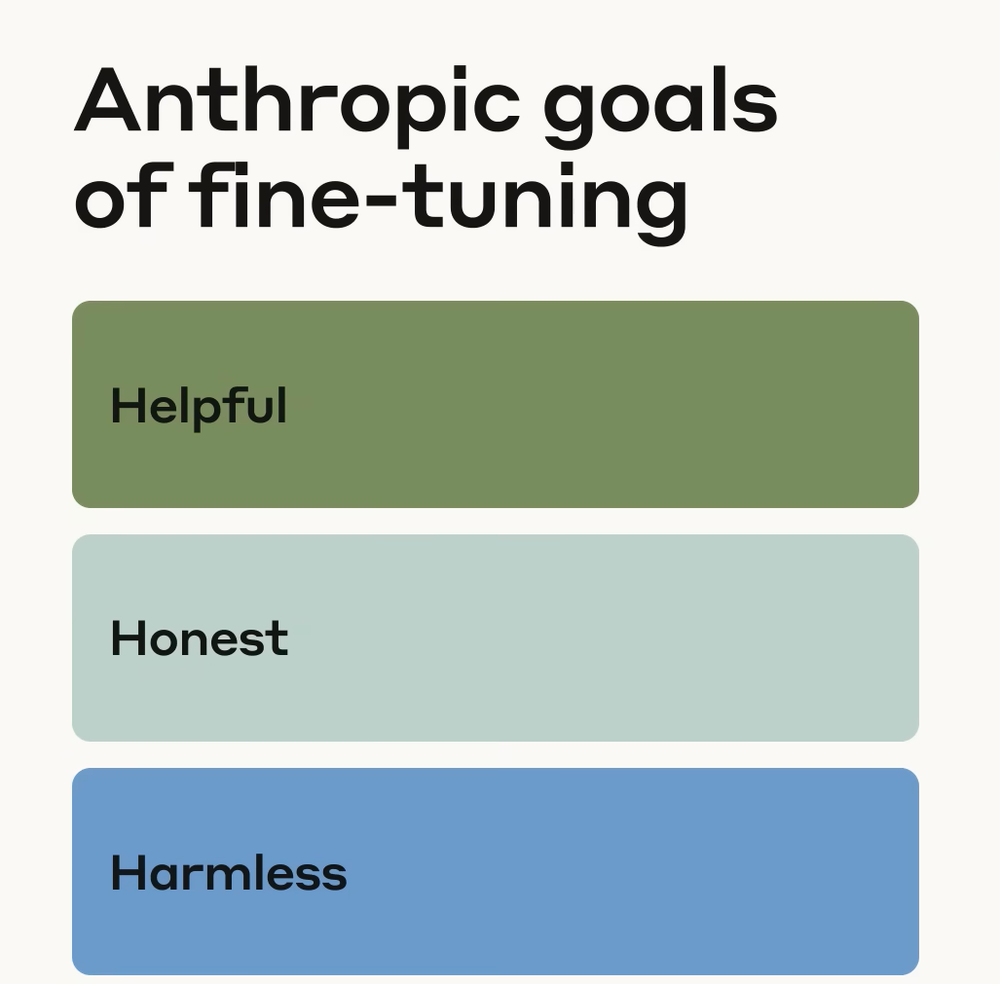

| Goal | Meaning |
|------|---------|
| 🟢 **Helpful** | Genuinely assists users in achieving their goals |
| 🔵 **Honest** | Doesn't deceive or mislead |
| 🟦 **Harmless** | Avoids causing harm to users or others |

**3. Deployment** — Users provide prompts; the model generates responses based on the prompts and patterns learned during training.

### What Makes Generative AI Powerful

- **Processes vast information during training and learns complex patterns**
- **Adapts to new tasks through in-context learning** (learning from examples given directly in the prompt)
- **Demonstrates emergent capabilities from scale** — abilities that appear unpredictably as models grow larger

### Key Capabilities
- Versatile language skills
- General-purpose abilities
- Learning from examples
- Connecting to external tools and data

### Current Limitations
- **Knowledge cutoff date** — no awareness of events after training ended
- **Hallucinations** — can confidently state plausible but incorrect information
- **Context window constraints** — limited amount of information it can hold at once (includes your prompts, AI responses, and any other info you've shared)
- **Challenges with complex reasoning and math**

### Capabilities (In Depth)

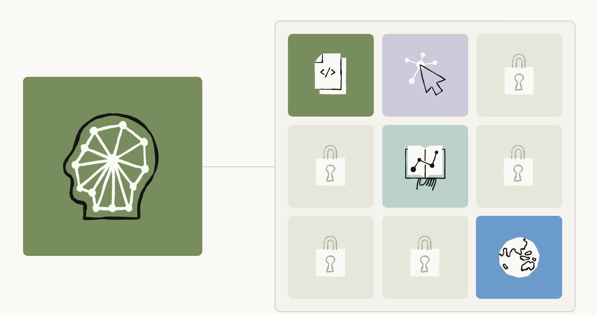

> Despite having vast internal knowledge from training, LLMs don't have open-ended access to all external resources. Only specific tools or data sources that are explicitly connected are available — everything else remains locked.

- **Versatility across language tasks** — writing, summarising, translating, coding, and more without extra training
- **Conversational awareness** — maintains context across a dialogue
- **Task-switching** — can shift between diverse tasks in the same session
- **Connecting to external tools and data** — can access code execution, search, documents, and APIs *only when explicitly provided*

### Limitations

#### ⏳ Knowledge Cutoff Date
AI has no awareness of events after its training data ends.

#### 🌀 Hallucinations
AI can confidently produce plausible-sounding but factually incorrect information.

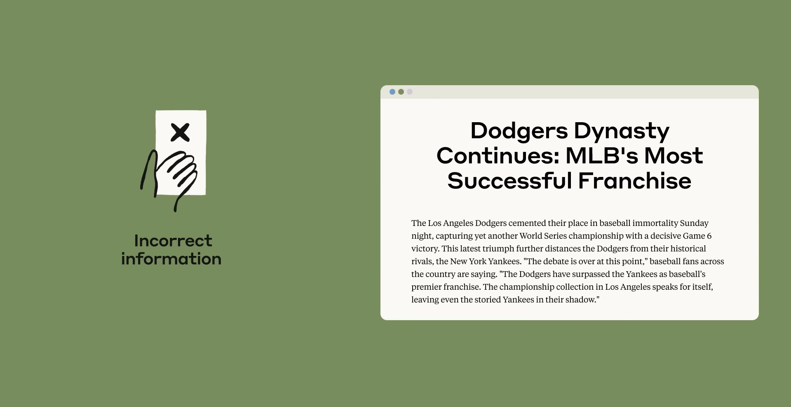

#### 🪟 Context Window Constraints
The AI can only consider a limited amount of information at one time.

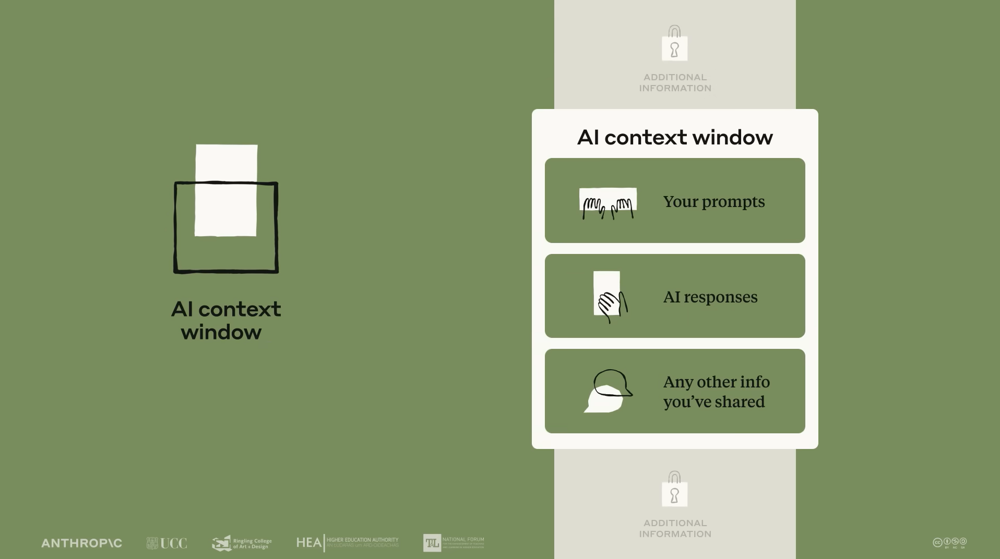

#### 🎲 Non-Deterministic Output
The same prompt can produce different answers each time — AI responses are not fixed or predictable.

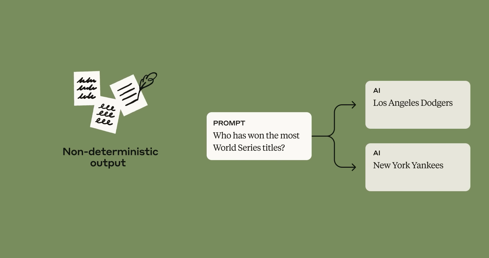

#### 🧮 Reasoning Challenges
LLMs can struggle with complex multi-step reasoning and math. This is being addressed by **extended thinking** — models that reason step-by-step before answering.

### Human + AI — Complementary Strengths

| Humans provide | AI provides |
|----------------|-------------|
| Critical thinking | Speed |
| Judgment | Scale |
| Creativity | Pattern recognition |
| Ethical oversight | Processing abilities |

> The most effective applications **combine** these strengths — neither humans alone nor AI alone.

### Looking Ahead

- **Evolving landscape** — the field is changing rapidly; today's limitations may not be tomorrow's
- **Human-AI collaboration** — the focus remains on working together, not replacing humans
- **Being hands-on** — practical experience is the best way to develop AI Fluency

### Key Takeaways
- Generative AI **creates** new content — it doesn't just classify or retrieve existing data
- Three key enablers: algorithmic breakthroughs (**Transformer**), vast **training data**, increased **compute**
- AI learns through: **pre-training** (broad pattern recognition) → **fine-tuning** (helpful, honest, harmless behavior)
- Current capabilities: versatility across tasks, conversational awareness, connecting to external tools
- Current limitations: knowledge cutoff, hallucinations, context window constraints, non-deterministic output, reasoning challenges
- **Most effective applications combine human and AI strengths** — humans bring judgment and ethics; AI brings speed and scale
- Understanding these foundations directly strengthens your **Delegation** competence — knowing what AI can and can't do helps you decide when to use it

---

## Lecture 6: The 4Ds — Delegation

### What is Delegation?

> **Delegation** is making thoughtful decisions about what work is appropriate for you to do, for AI to do, or for you and AI to do together — and how to distribute those tasks.

Effective delegation involves:
- Understanding the problem you're trying to solve
- Understanding the capabilities of available AI tools
- Breaking down complex work into smaller parts
- Making strategic decisions about who does what
- Choosing the right mode of interaction (Automation / Augmentation / Agency)

### Sub-Competency 1: 🎯 Problem Awareness

> The ability to clearly define your goals and understand what work is needed **before** involving AI tools.

- What does **"success"** look like?
- What kind of thinking and work is needed to get there?
- **AI fluency begins with and depends on your own expertise**

### Sub-Competency 2: 🖥️ Platform Awareness

> A working knowledge of available AI systems and their specific capabilities and limitations.

- Understanding the unique strengths and limitations of available options
- Which models perform best for the work you have in mind?
- Which systems prioritize **speed**, or **creativity**, or **depth**, or **accuracy**?

### Sub-Competency 3: 📋 Task Delegation

> The strategic process of dividing work between humans and AI.

Ask yourself:
- What could be **usefully automated**?
- Where would **augmentation** create more value than working separately?
- What should be **done by a human alone**?
- What could be **done by an agent** on your behalf?

### Key Takeaways

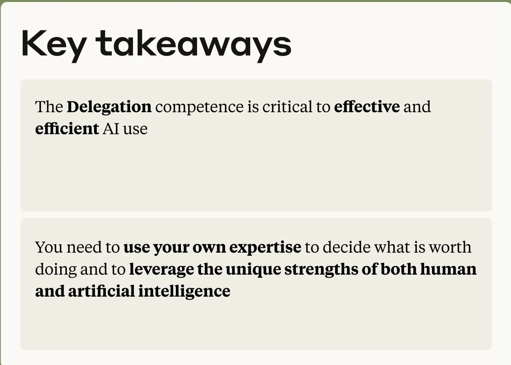

- The **Delegation** competence is critical to **effective** and **efficient** AI use
- Delegation means deciding: do it yourself / do it together with AI / let AI handle it independently
- **Problem Awareness** = clearly understanding your goals before involving AI
- **Platform Awareness** = knowing what different AI systems can and can't do
- **Task Delegation** = strategically dividing work to leverage the strengths of both humans and AI
- Effective delegation requires both **domain expertise** and **understanding of AI capabilities**
- The goal isn't to automate everything — it's to create the **most effective human-AI partnership** for the task

---

## Lecture 7: The 4Ds — Description

### What is Description?

> **Description** is the ability to communicate with AI in ways that create a productive collaborative environment. It goes beyond simply writing prompts — it involves creating a collaborative environment where both you and the AI can work effectively together.

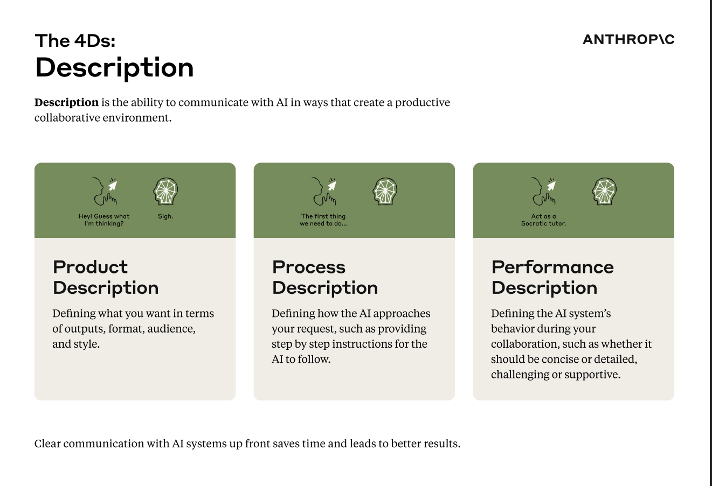

- AI can't read your mind — the quality of your results comes down to how clearly you articulate your **needs**, **preferred approach**, and **desired interaction style**
- AI systems are **interactive partners**, not databases or vending machines
- Clear communication up front **saves time** and leads to **better results**

### Sub-Competency 1: 📦 Product Description

> Defining **what** you want in terms of outputs, format, audience, and style.

- *"Hey! Guess what I'm thinking?"* → *Sigh.* — don't make the AI guess your intent
- Be explicit about the **output** you want, its **format**, the **audience**, and the **style**

### Sub-Competency 2: 🛠️ Process Description

> Defining **how** the AI approaches your request — guiding its thought process, such as providing step-by-step instructions for the AI to follow.

- **"How" can be more important than "What"** — the approach can matter as much as the end goal
- **Providing training specific to your problem** — give the AI context tailored to your exact situation
- Specify things like: **specific data**, **key tasks**, **preferred order**, and so on

### Sub-Competency 3: 🎭 Performance Description

> Defining the AI system's **behavior** during your collaboration — such as whether it should be concise or detailed, challenging or supportive.

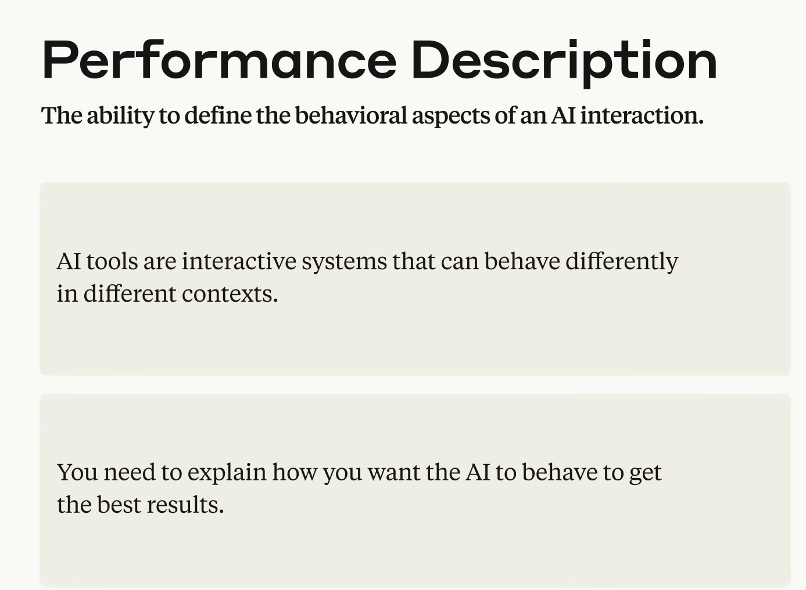

- *"Act as a Socratic tutor."* — behavior can be shaped just like output
- **AI tools are interactive systems** that can behave differently in different contexts
- You need to **explain how you want the AI to behave** to get the best results

### Key Takeaways

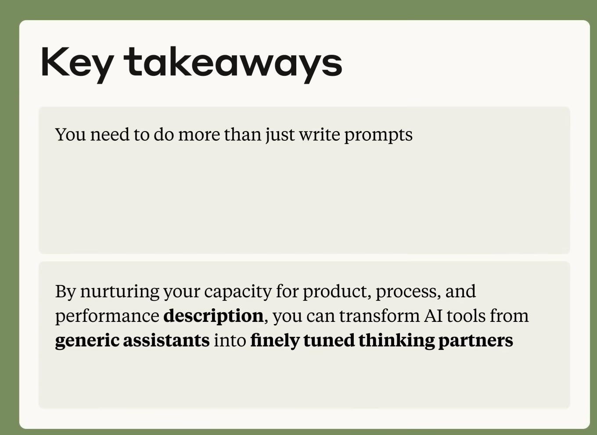

- Description is about communicating with AI in ways that create a **productive collaborative environment**
- **Product Description** — clearly define what you want: outputs, format, audience, style
- **Process Description** — guide how the AI approaches your request; can be as important as the end goal itself
- **Performance Description** — define behavioral aspects: concise vs. detailed, challenging vs. supportive
- AI systems are **interactive partners**, not databases or vending machines
- You need to do **more than just write prompts**
- By nurturing your capacity for product, process, and performance description, you can transform AI tools from **generic assistants** into **finely tuned thinking partners**
- Clear communication with AI systems up front **saves time** and leads to **better results**

---

## Lecture 8: 6 Techniques for Effective Prompt Engineering

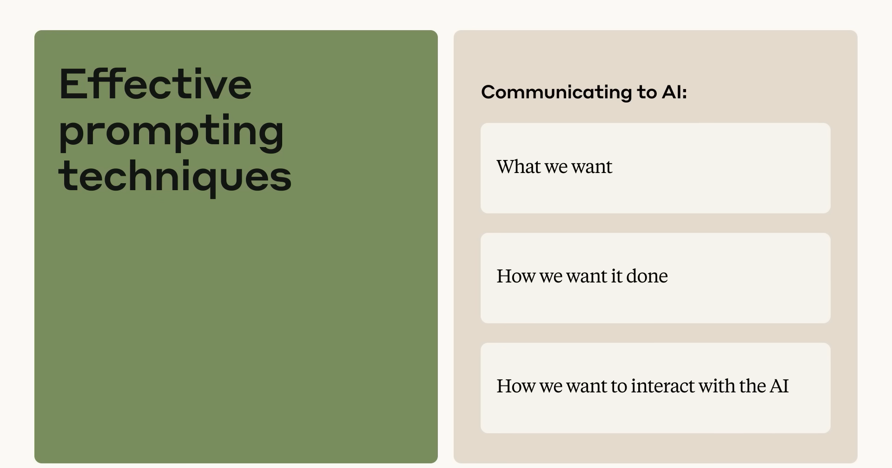

> **Communicating to AI** boils down to three things: **what we want**, **how we want it done**, and **how we want to interact with the AI**.

> **Prompt engineering** is simply the practice of designing effective instructions for AI systems like Claude. It's about **crafting your questions and providing context** in ways that help AI assistants understand exactly what you want.

### The 6 Foundational Techniques

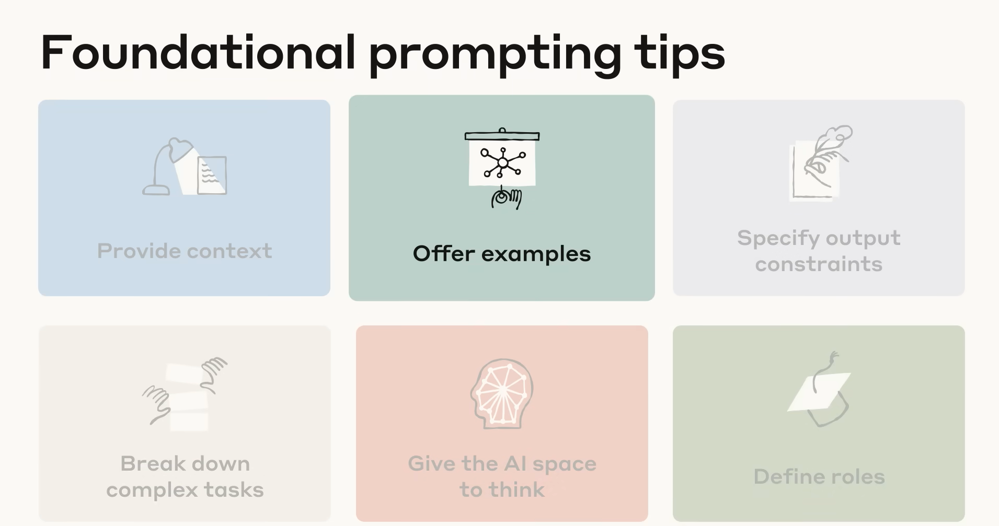

| # | Technique | Before → After |
|---|-----------|-----------------|
| 1 | 🧭 **Provide context** | *"Tell me about climate change."* → *"Explain three major impacts of climate change on agriculture in tropical regions, with examples from the past decade."* |
| 2 | 🌟 **Offer examples** | Give example input→output pairs (few-shot) before asking for the real conversion, so the AI can match the pattern, style, or format |
| 3 | 📐 **Specify output constraints** | *"Design me a personal art portfolio website."* → specify sections, behavior (sticky/responsive nav), color palette, and features (dark/light toggle) |
| 4 | 🪜 **Break complex tasks into steps** | *"Analyze this quarterly sales data."* → give a numbered approach: identify top performers → compare quarters → highlight trends → suggest reasons |
| 5 | 🤔 **Ask it to think first** | *"Before answering, please think through this problem carefully. Consider the different factors involved, potential constraints, and various approaches..."* |
| 6 | 🎭 **Define role, style, or tone** | *"Please explain how rainbows form from the perspective of an experienced science teacher speaking to a bright 10-year-old..."* |

#### 1. 🧭 Provide Context — Three Levels of Specificity

| Level | Example |
|-------|---------|
| **Vague** | *"Tell me about climate change."* |
| **Specific** | *"Explain three major impacts of climate change on agriculture in tropical regions, with examples from the past decade."* |
| **Most specific** | Same as above, **plus your own situation**: *"I'm preparing for a job interview at an agricultural research lab in Indonesia. I have a degree in ecology but no specific knowledge on climate change. Write a summary of key concepts that would help me speak intelligently in the interview."* |

> The more specific you are — adding your own goal/background on top of the task — the more tailored and useful the output.

#### 2. 🌟 Offer Examples

- **No examples** — the AI has to guess your desired tone/format from the instruction alone
- **With two examples** — showing 2 before/after conversions ("jargon → plain language") lets the AI infer the exact pattern before applying it to your real request

#### 3. 📐 Specify Output Constraints

- **Without output specification** — *"Design me a personal art portfolio website."* (AI has to guess everything)
- **With output specification** — spells out layout (single-page, smooth scrolling), required sections, responsive/sticky nav behavior, color palette, and specific features (dark/light toggle)

#### 4. 🪜 Break Complex Tasks Into Steps

- **No steps** — *"Analyze this quarterly sales data."*
- **With steps** — numbered approach: identify top-performing products → compare quarters → highlight unusual patterns → suggest reasons for trends

#### 5. 🤔 Ask the AI to Think First

- Explicitly ask the AI to **think through the problem carefully** — consider factors, constraints, and approaches — *before* recommending a solution

#### 6. 🎭 Define Role, Style, or Tone

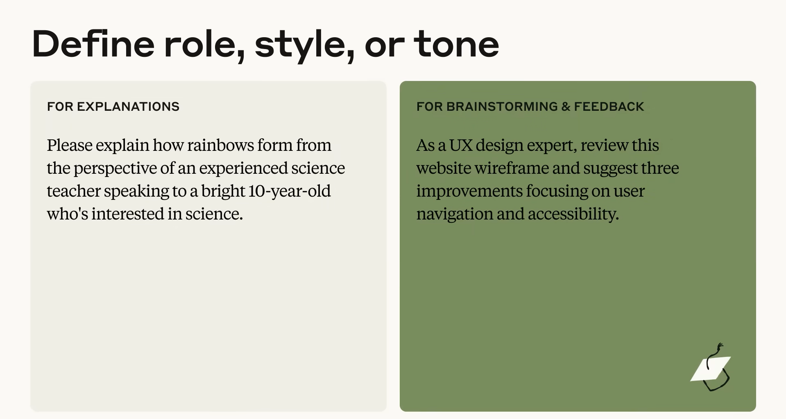

| Use case | Example |
|----------|---------|
| **For explanations** | *"Please explain how rainbows form from the perspective of an experienced science teacher speaking to a bright 10-year-old who's interested in science."* |
| **For brainstorming & feedback** | *"As a UX design expert, review this website wireframe and suggest three improvements focusing on user navigation and accessibility."* |

### 🔑 Secret Weapon: Ask the AI for Help with Prompting

> *"I'm trying to get you, Claude, to help me with [goal]. I'm not sure how to phrase my request to get the best results. Can you help me craft an effective prompt for this?"*

- When you're not sure how to ask for something, **the AI can help improve your own prompt**
- Perhaps the **most powerful technique of all**

### 🔄 The Iterative Process

**Create preliminary prompt → The AI's response → Refine prompt → Final ideal output** (looping back to the AI's response as needed)

Some ways to refine your prompt:
- Add more specificity or context
- Provide examples of your desired output
- Break the task into smaller steps
- Try a different technique or combination of techniques

### 🛠️ Other Techniques to Try

| Technique | Example |
|-----------|---------|
| **Ask for variations** | *"Can you give me three different versions of this?"* |
| **Request different formats** | *"Instead of a paragraph, could you present this as an interactive artifact?"* |
| **Check Claude's confidence** | For factual questions, ask: *"How confident are you about this answer?"* |
| **Reset the conversation** | Sometimes starting fresh gives better results than trying to correct a conversation that's gone off track |

### ✅ What Works and What Doesn't

| Patterns that work well | Common mistakes to avoid |
|--------------------------|---------------------------|
| Starting with a clear task overview statement | Assuming Claude can read your mind |
| Including output format specifications and examples | Overloading a single prompt/conversation with multiple unrelated tasks |
| Detailing specific task constraints or requirements | Being too vague about what success looks like |
| Providing rich and relevant background information | Not providing feedback on previous responses |

### Key Takeaways

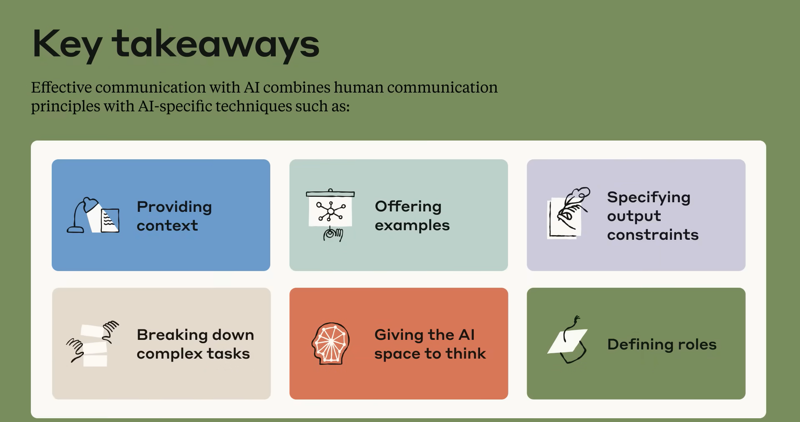

- Effective prompting combines **clear communication principles** with **AI-specific techniques**
- Six foundational techniques: **provide context**, **offer examples**, **specify output constraints**, **break down complex tasks**, **give the AI space to think**, **define roles**
- The "secret weapon" — **ask the AI itself** to help improve your prompt
- Successful prompting is **iterative** (and collaborative with the AI!) — expect to refine your approach based on results
- Common successful patterns: clear task overviews, format specifications, explicit constraints, and relevant background information
- Common mistakes: assuming the AI can read your mind, overloading prompts with unrelated tasks, being vague about success criteria, and not giving feedback on prior responses

---

## Lecture 9: The 4Ds — Discernment

### What is Discernment?

> **Discernment** is the ability to thoughtfully and critically evaluate what AI produces, how it produces it, and how it behaves.

- Discernment is the **flip side of Description** — Description helps you communicate your intentions clearly; Discernment helps you evaluate whether what you receive **meets your needs**
- **Discernment works hand-in-hand with Description in a continuous feedback loop**
- Even the most advanced AI systems benefit from **human judgment and oversight**

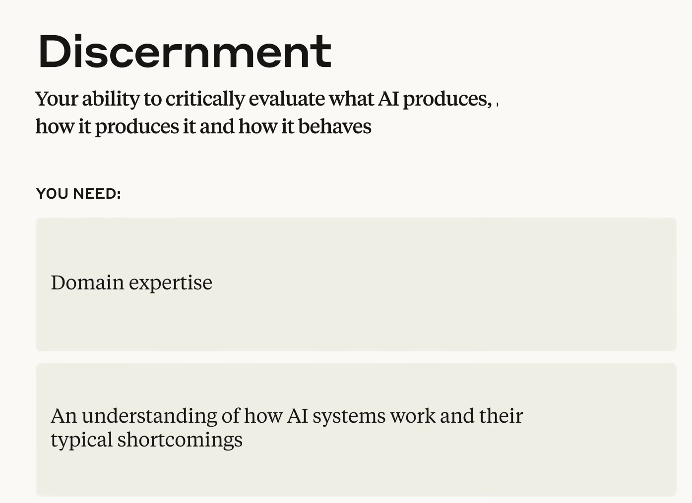

**You need:**
- **Domain expertise** — your own knowledge of the subject
- **An understanding of how AI systems work** and their typical shortcomings

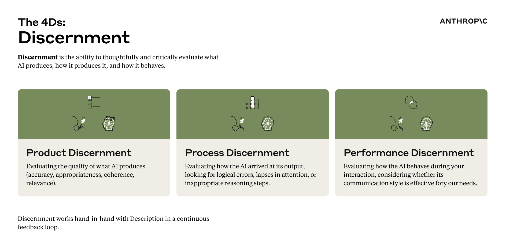

### Sub-Competency 1: 📋 Product Discernment

> Evaluating the **quality** of what AI produces — accuracy, appropriateness, coherence, relevance. *Your capacity to judge the quality of the AI output.*

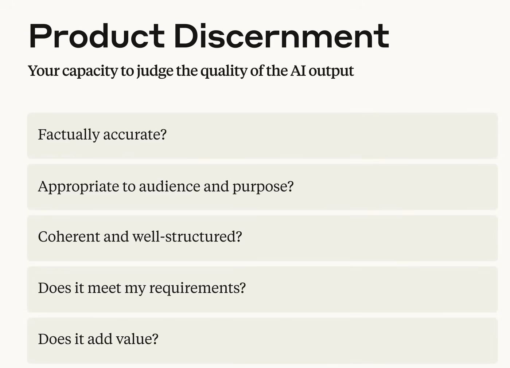

- Is it **factually accurate**?
- Is it **appropriate to audience and purpose**?
- Is it **coherent and well-structured**?
- **Does it meet my requirements**?
- **Does it add value**?

### Sub-Competency 2: 🧩 Process Discernment

> Evaluating **how the AI arrived** at its output — looking for logical errors, lapses in attention, or inappropriate reasoning steps. *Your capacity to judge the quality of the problem-solving approach.*

- **Logical inconsistency**
- **Lapses in attention**
- **Inappropriate steps**
- **Getting stuck on one small detail**
- **Getting trapped in circular reasoning**

### Sub-Competency 3: 💬 Performance Discernment

> Evaluating **how the AI behaves** during your interaction — considering whether its communication style is effective for your needs. *Your capacity to judge AI behaviors.*

- Is the **communication style appropriate**?
- Is the **information at the right level**?
- Is the **response to feedback appropriate**?
- Is the **interaction efficient**?

### 🔁 Feedback and Correction

**Effective feedback includes:**
- **Specifying the problem**
- **Clearly explaining why it is a problem**
- **Providing concrete suggestions for improvement**
- **Revising your instructions or examples**

### Key Takeaways

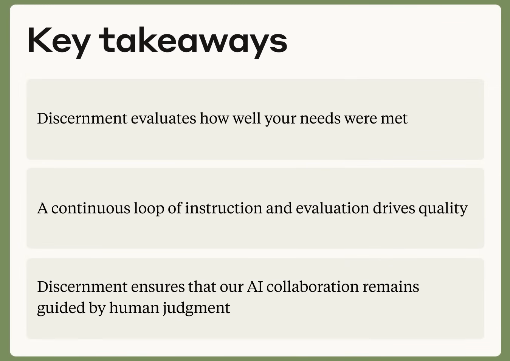

- Discernment is your ability to thoughtfully evaluate **what** AI produces, **how** it produces it, and **how it behaves**
- **Product Discernment** — evaluating the quality of actual outputs (accuracy, appropriateness, coherence, relevance)
- **Process Discernment** — assessing how the AI arrived at its output, looking for logical errors, attention gaps, or inappropriate reasoning
- **Performance Discernment** — evaluating how the AI behaves within the collaboration process itself, considering whether its communication style is effective for your needs
- **Discernment evaluates how well your needs were met**
- **A continuous loop of instruction and evaluation drives quality** — Discernment works hand-in-hand with Description
- **Discernment ensures that AI collaboration remains guided by human judgment** — even the most advanced AI systems benefit from human oversight

### 🏋️ Exercise: Expert Discernment — Evaluating AI Responses in Your Domain

> **Goal:** Practice Product, Process, and Performance Discernment by evaluating AI-generated content in a domain where you have expertise, recognizing how your knowledge enhances your ability to critically assess AI outputs.

1. **Return to your area of expertise** — recall the topic you discussed with Claude in the earlier "Explore something you love" exercise
2. **Ask for multiple explanations** — start a new conversation and ask Claude to generate **three different explanations or analyses** of a specific aspect of your expert topic (e.g., three explanations of depth of field for photography, three analyses of fermentation for cooking, three perspectives on a historical event)
3. **Apply your expert discernment**:
   - **Product Discernment** — Which explanation is most accurate? Any factual errors/misconceptions? Is the level of detail appropriate?
   - **Process Discernment** — Does Claude follow logical reasoning? Are there gaps in analysis? Does it make appropriate connections between concepts?
   - **Performance Discernment** — Was Claude attentive to your specific question and responsive to feedback? Is terminology used appropriately? How does tone/style affect clarity?
4. **Provide feedback and refinement** — identify the strongest and weakest explanations, explain *why*, then work with Claude to create an improved version
5. **Reflect** — What specific knowledge let you judge strengths/weaknesses? How might a non-expert struggle to discern quality here? What does this teach about the relationship between domain knowledge and effective Discernment?

> 💡 For a more playful Discernment workout, try the "Game Night" suggestions in the final lesson's "Additional Activities."

### 🤔 Reflection
- Which type of Discernment (Product, Process, or Performance) do you find most challenging to apply, and why?
- How does Discernment complement Description? How do they work together?
- What signals or patterns might indicate that an AI output requires closer scrutiny?

---

## Lecture 10: Project Execution with Description-Discernment Loops

> ⏱️ Estimated time: 30–60 minutes. A hands-on application of Lectures 6–9 (Delegation, Description, Discernment) to your own course project — no new theory, just practice.

### 🏋️ Exercise: Project Execution with Description-Discernment Loops

1. **Review your project plan** — pull up the plan from Lesson 5, quickly re-check your delegation decisions (human / AI / collaboration), and refine if needed based on what you've learned since
2. **Prepare your Description approach** — before executing, plan out:
   - **Product Description** — what specific outputs do you need for each task? format, style, length, level of detail?
   - **Process Description** — how should Claude approach each task? specific methods, frameworks, or steps?
   - **Performance Description** — what collaborative behavior do you want? concise vs. detailed, challenging vs. supportive, ideas-focused vs. analysis-focused?
3. **Execute using Description-Discernment loops** — for each task:
   - **Describe** clearly (Product / Process / Performance Description)
   - **Discern** the quality of what you receive (Product / Process / Performance Discernment)
   - **Refine** — give feedback on what worked/didn't, adjust your description, iterate until satisfied
   - **Integrate your own expertise** — add your perspective, creativity, domain knowledge; make the final call on what to keep, modify, or discard; **take responsibility for the final output**
   - Repeat the loop for each task until the project is complete

> **Example loop:** Task = "write a project summary." *Describe:* "Write a 200-word summary for a non-technical stakeholder, in 3 short paragraphs (Product); cover goal → approach → outcome, in that order (Process); keep the tone confident but not salesy (Performance)." *Discern:* the draft is accurate and well-structured (Product ✅) but jumped straight to outcome before explaining approach (Process ❌) and reads a little too promotional (Performance ❌). *Refine:* "Reorder to goal→approach→outcome, and tone it down — state facts rather than selling them." *Integrate:* you swap in the real budget figures only you have access to, then approve the final version.

### 🤔 Reflection
- What patterns did you notice in the types of descriptions that led to the best outcomes?
- Which required more effort from you: **Description** or **Discernment**? Why?
- How did your actual project execution compare to your initial plan from Lesson 5? What adjustments did you make along the way?

---

## Lecture 11: The 4Ds — Diligence

### What is Diligence?

> **Diligence** is taking responsibility for what we do with AI and how we do it.

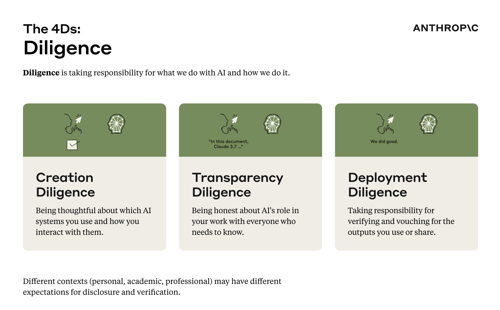

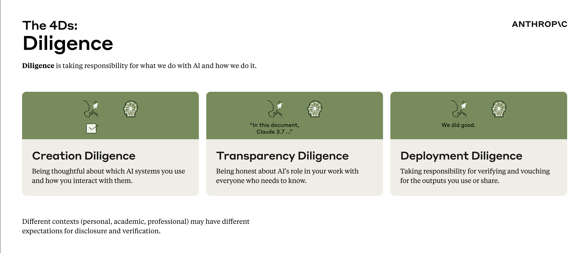

- While Delegation, Description, and Discernment primarily address **effectiveness and efficiency**, Diligence addresses **ethical and safety** aspects that are equally crucial
- Different contexts (personal, academic, professional) may have **different expectations** for disclosure and verification
- We each have a responsibility to **understand and meet these expectations**

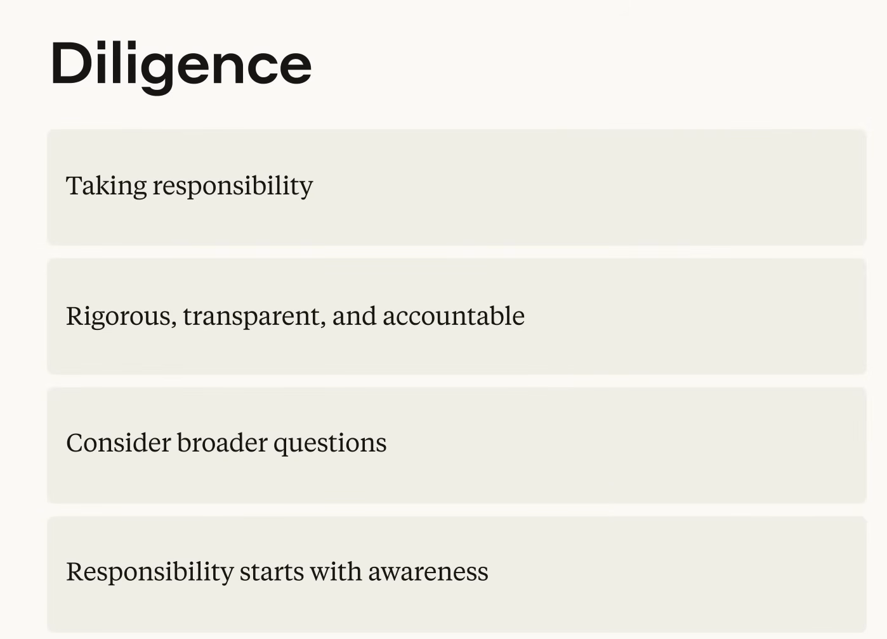

### Sub-Competency 1: 🧭 Creation Diligence

> Being thoughtful about **which AI systems** you use and how you interact with them. *Your ability to be critical and intentional about which AI systems you choose to use and how you use them.*

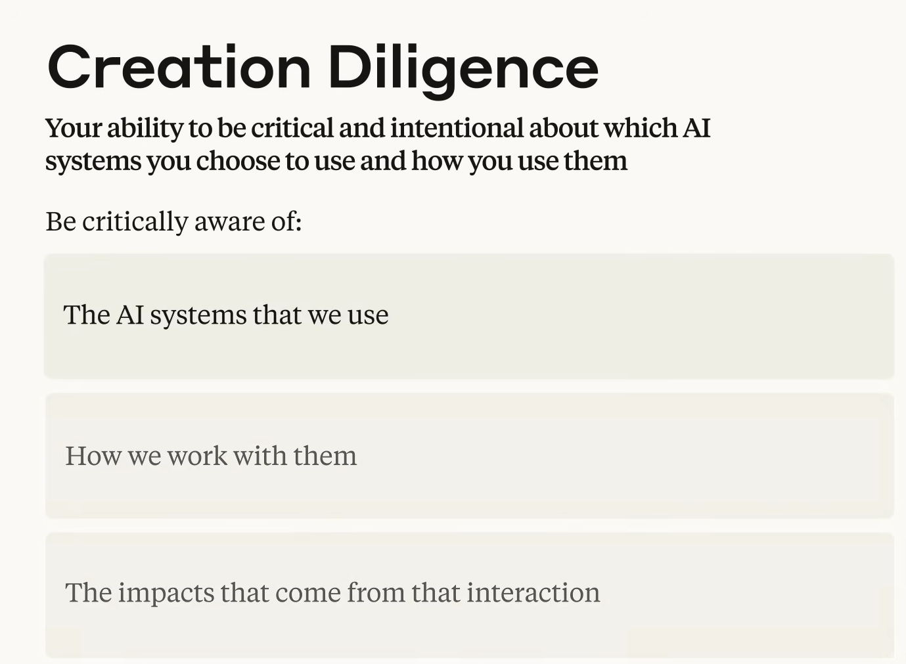

**Be critically aware of:**
- The AI systems that we use
- How we work with them
- The impacts that come from that interaction

### Sub-Competency 2: 📢 Transparency Diligence

> Being honest about **AI's role in your work** with everyone who needs to know. *The ability to be open and accurate about AI interaction with relevant stakeholders.*

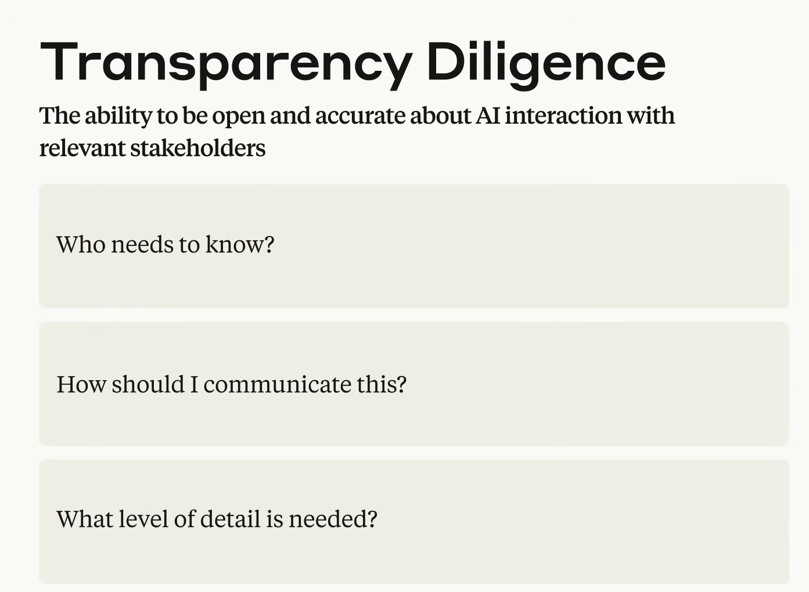

- **Who needs to know?**
- **How should I communicate this?**
- **What level of detail is needed?**

### Sub-Competency 3: ✅ Deployment Diligence

> Taking responsibility for **verifying and vouching** for the outputs you use or share. *The ability to take informed responsibility for the outputs you use or share after they've been created with AI assistance.*

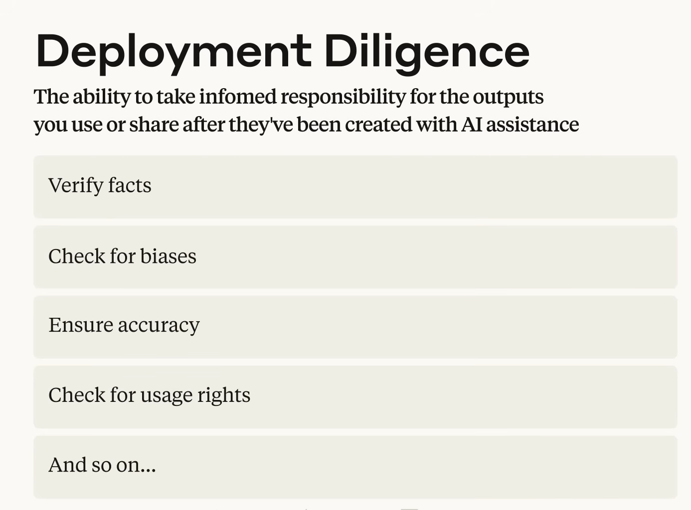

- **Verify facts**
- **Check for biases**
- **Ensure accuracy**
- **Check for usage rights**
- And so on...

### ⚖️ Ethical Frameworks

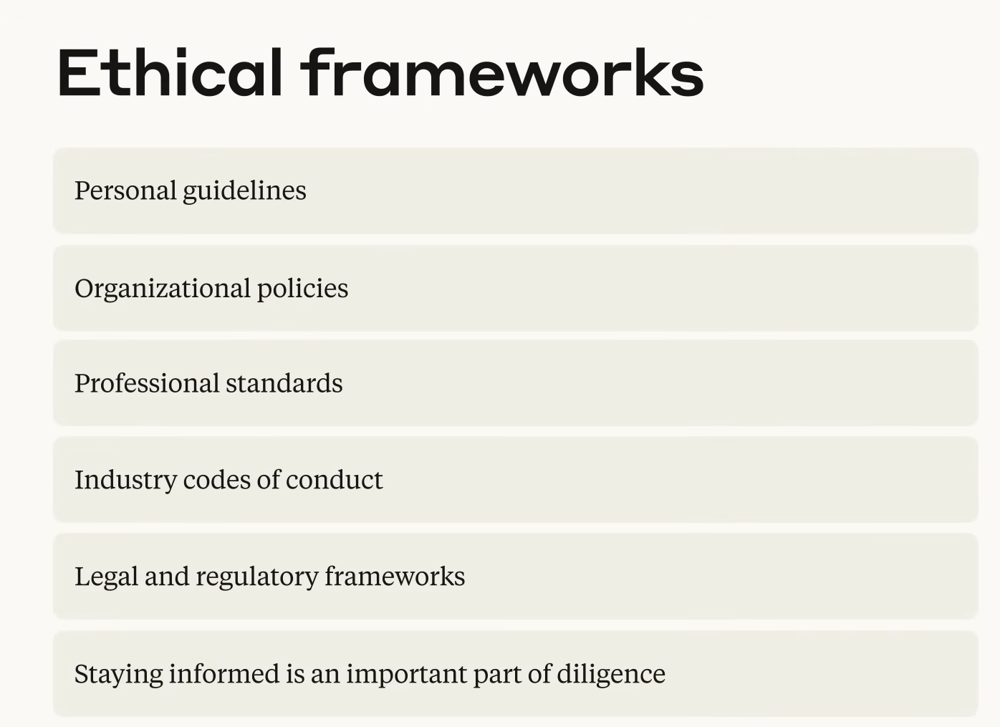

- Personal guidelines
- Organizational policies
- Professional standards
- Industry codes of conduct
- Legal and regulatory frameworks
- **Staying informed is an important part of diligence**

### Key Takeaways

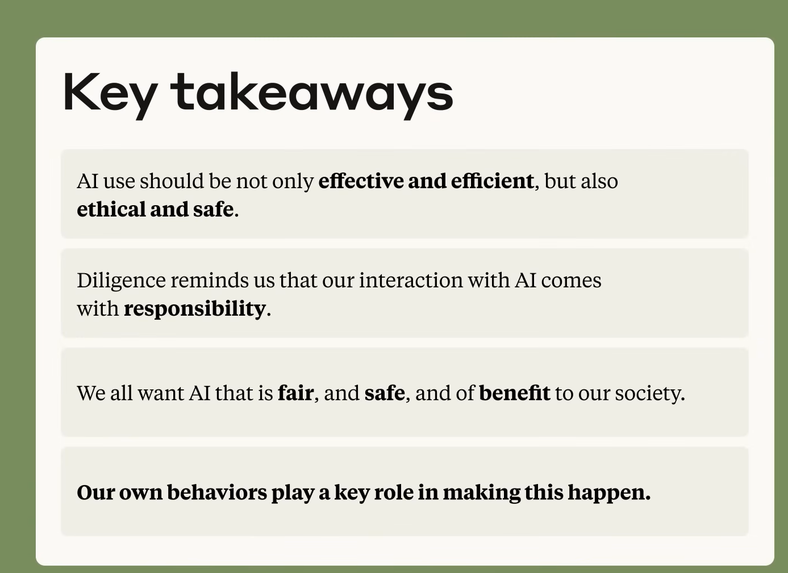

- Diligence is about **taking responsibility** for our AI collaborations
- **Creation Diligence** — being thoughtful about which AI systems we use and how we engage with them
- **Transparency Diligence** — being honest about AI's role in our work with everyone who needs to know
- **Deployment Diligence** — taking responsibility for verifying and vouching for the outputs we use or share
- Different contexts (personal, academic, professional) may have different expectations for disclosure and verification
- AI use should be not only **effective and efficient**, but also **ethical and safe**
- We all want AI that is **fair**, **safe**, and of **benefit** to society — **our own behaviors play a key role in making this happen**

### 🏋️ Exercise: Creating a Diligence Statement

> ⏱️ Estimated time: 14 minutes

A **diligence statement** is a transparent acknowledgment of AI's role in your work, along with your commitment to responsibility for the final output. Example:

> *"In creating this [document/project/content], I collaborated with [AI assistant name] to assist with [specific tasks: drafting, research, editing, etc.]. I affirm that all AI-generated and co-created content underwent thorough review and evaluation. The final output accurately reflects my understanding, expertise, and intended meaning. While AI assistance was instrumental in the process, I maintain full responsibility for the content, its accuracy, and its presentation. This disclosure is made in the spirit of transparency and to acknowledge the role of AI in the creation process."*

**Step 1: Understand diligence statements** *(~3 min)* — read the example above.

**Step 2: Reflect on your AI collaboration** *(~5 min)*:
- **Creation Diligence** — Which AI systems did you choose and why? What data/information did you share? Any privacy, security, or ethical considerations?
- **Transparency Diligence** — Who is the audience for your output? What disclosure expectations might they have? How specifically did AI contribute to different aspects?
- **Deployment Diligence** — What steps verified the accuracy/appropriateness of AI contributions? How did you ensure the final output meets your standards? What responsibility are you taking?

**Step 3: Draft your statement** *(~6 min)* — share your reflections (and optionally past conversations) with Claude, and collaborate to draft a statement addressing: which AI systems you used, how AI contributed, your review process, your assertion of responsibility, and any context-specific considerations.

**Step 4: Add your statement to your project** — e.g., footer, appendix, or metadata.

### 🤔 Reflection
- Which aspect of Diligence (Creation, Transparency, or Deployment) do you find most challenging, and why?
- How might your approach to Diligence vary depending on the context (personal, academic, professional)?
- How does acknowledging AI's role in your work affect how others might perceive it?
- What ethical considerations arose during your project that you hadn't anticipated?
- What personal guidelines might you develop for responsible AI collaboration going forward?

---

## Lecture 12: Conclusion — AI Fluency: Framework and Foundations

This concluding video revisits the AI Fluency Framework and brings together the key concepts explored throughout the course.

- The four core competencies (**the 4Ds**): **Delegation** (deciding what work to do with AI vs. independently), **Description** (communicating effectively with AI), **Discernment** (evaluating AI outputs and behaviors), **Diligence** (ensuring responsible AI collaboration)
- These competencies apply across all **three major ways of interacting with AI**: Automation, Augmentation, and Agency
- **Fluency develops through practice, not overnight mastery**
- AI systems are powerful but **not magical solutions** — they're only as useful and safe as we enable them to be through our thoughtful engagement

### Key Takeaways

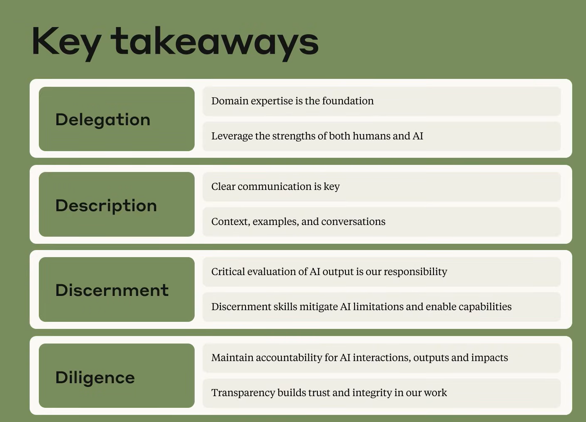

| Competency | Key Takeaways |
|---|---|
| 🎯 **Delegation** | Domain expertise is the foundation • Leverage the strengths of both humans and AI |
| 💬 **Description** | Clear communication is key • Context, examples, and conversations |
| 🔍 **Discernment** | Critical evaluation of AI output is our responsibility • Discernment skills mitigate AI limitations and enable capabilities |
| 🛡️ **Diligence** | Maintain accountability for AI interactions, outputs and impacts • Transparency builds trust and integrity in our work |

- AI Fluency develops through **intentional practice** of the four core competencies
- **Delegation** — our expertise and judgment remain the foundation of effective AI collaboration
- **Description** — clear communication that bridges our intentions and AI capabilities
- **Discernment** — thoughtful and critical evaluation of outputs to work within the system's constraints
- **Diligence** — ensures accountability, transparency, and responsibility in our AI work
- The most powerful outcomes emerge when **humans and AI build on each other's strengths**
- The framework is designed to **remain relevant as AI systems continue to evolve**

### 🏋️ Exercises

**Exercise 1: Discuss the AI Fluency Course with Claude**
- Engage Claude in a meaningful conversation about this course and the AI Fluency Framework (optionally upload a copy of the framework from ringling.libguides.com/ai/framework)
- Suggested conversation starters:
  - *"I've just completed a course on AI Fluency covering Delegation, Description, Discernment, and Diligence. Let's discuss how these competencies might apply to [my degree program / my job / etc.]."*
  - *"Let's explore how the AI Fluency Framework might evolve as AI capabilities advance. What new competencies might become important in the future?"*
  - *"Help me identify which of the 4D competencies I seem to understand well and which I might need to develop further, based on our conversation."*
  - *"Here's [some exercise you did in this course]. Let's analyze it to improve my competencies."*

**Exercise 2: Build a Personal AI Policy** — with Claude as a thinking partner, create your own guidelines for responsible/ethical AI collaboration:
- Clear standards for when/how you'll work with AI in different contexts
- Boundaries for sensitive or confidential information
- How you'll maintain quality control for AI-assisted work
- Ethical issues most relevant to your field or activities
- Decision-making criteria for addressing ethical dilemmas
- Perspectives of people who might be affected by your AI interactions
- How you'll disclose AI collaboration in different contexts
- Templates for attribution and transparency statements
- Criteria for when more detailed disclosure is appropriate

> **Example policy snippet:** *"I use Claude for drafting and research, never for final decisions involving client data. I always verify factual claims before sharing. Any deliverable with substantial AI involvement gets a one-line disclosure in the footer (see the Diligence Statement template above). I don't paste confidential client information into any AI tool without an enterprise data agreement in place."*

> 💡 Reflection for this lesson happens *through* the two exercises above — there are no separate reflection questions.

### 🎓 What's Next

Congratulations on completing **AI Fluency: Framework and Foundations**! This is just the beginning of the journey.

- Fluency develops through **practice** — each AI interaction is a chance to refine your skills
- Approach AI as a **thinking partner**, not just a tool
- Maintain a commitment to **effectiveness, efficiency, ethics, and safety**
- Additional exercises are available in **Lesson 12** to continue the journey
- Share what you've learned, seek diverse perspectives, and contribute to the conversation on working with AI in ways that amplify human potential while respecting our values and responsibilities to each other

---

## 📎 Appendix: Additional Activities (Self-Paced)

> ⏱️ Estimated time: self-paced — optional practice after finishing the course. Pick what resonates, or use as inspiration for your own.

### 🗺️ Build a Personal AI Fluency Plan

With an AI assistant, create a structured plan for developing your AI fluency over time:

1. **Current competency assessment** — rate yourself (novice / developing / confident) on each of the 4Ds; note specific strengths and growth areas; identify which interaction modes (Automation, Augmentation, Agency) you use most/least effectively
2. **Development priority identification** — pick 1–2 competencies to focus on first; identify which specific aspects matter most in your context; consider which interaction modes you want to grow
3. **Specific action planning** — create activities to develop each priority competency; set a timeline/frequency for practice; identify supporting resources/tools; define how you'll recognize progress

> Work with Claude as a thinking partner — share your self-assessments and get feedback on your plan.

### 📚 Build a Personal Prompt & Pattern Library

Create a personalized collection of effective prompts/patterns for recurring AI interactions:

1. **Common task template creation** — identify 5–10 recurring tasks; develop a template prompt for each that consistently works well; include placeholders for variable info
2. **Effective strategy documentation** — document which Description techniques work for which task types; record Discernment patterns that help you evaluate outputs; note what works best per interaction mode
3. **Personal reference resource building** — organize templates/strategies so they're easy to search; include examples of successful outputs; keep a system for updating the library as you find new approaches

> Ask Claude to help analyze your past successful interactions and identify what made them effective.

### 🎮 Game Night!

Playful exercises to practice precise **Description** and sharpen **Discernment** through word puzzles — puzzles have specific instructions (unlike open-ended tasks), making them great for both clear communication *and* discernment workouts.

**Swap Riddles**
- Create a riddle (or try: *"Five-score and more drums I tap to paint a symphony of light. What am I doing?"* → *typing on a ~104-key keyboard to create pixels on a monitor*)
- Have Claude guess **and explain its reasoning** — note not just the guess but the *why*
- Don't reveal the answer — instead nudge Claude toward the right chain-of-thought
- Switch sides: ask Claude for a riddle and have it guide you in return

**Co-operative Crosswords**
- Work on crossword clues together (cryptic clues are especially interesting)
- Focus isn't on solving skill — it's on **guiding and refining thinking**: *"Remember, it's only 5 letters"*, *"Can't be that, it starts with B"*, *"Maybe they mean 'swallow' the bird, not the drink"*
- These steering skills transfer directly to real projects

**Word Association**
- Pick 12–20 random words and collaborate with Claude to find relationships/themes
- When Claude makes a questionable connection or misses a pattern, point it out and guide it toward better reasoning — and stay open to Claude spotting things you missed
- Practice all three Discernment types:
  - **Product** — do the answers logically fit a cohesive theme?
  - **Process** — does Claude consider multiple possibilities, or fixate narrowly?
  - **Performance** — is Claude's communication clear? Does it ask good questions and build on your suggestions?

**More Game Suggestions**
- **Twenty Questions** — Claude thinks of something, you ask yes/no questions to guess it, then switch roles
- **Collaborative Storytelling** — alternate sentences building a story; observe how you both maintain coherence
- **A Wizard Approaches You in the Tavern** — play an RPG with an LLM as player or game master
- **Concepts & Constraints** — explain a complex concept under a tight constraint (e.g., "cooking metaphors only"); compare your approach to Claude's
- **Advanced Puzzling** — create logic/word puzzles for Claude to solve (or vice versa); programmers can swap in [Project Euler](https://projecteuler.net/) problems

---

<!-- Add new lectures below this line -->
