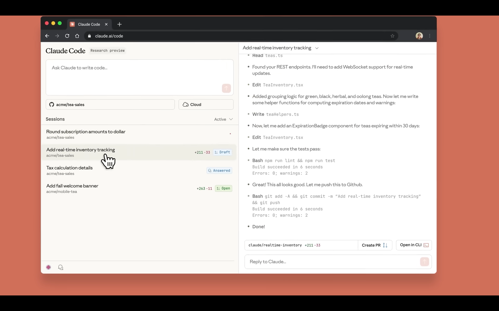
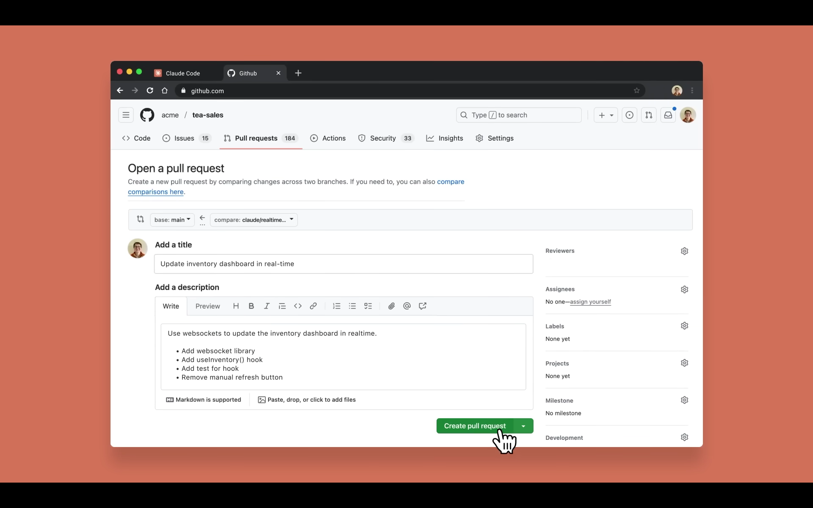
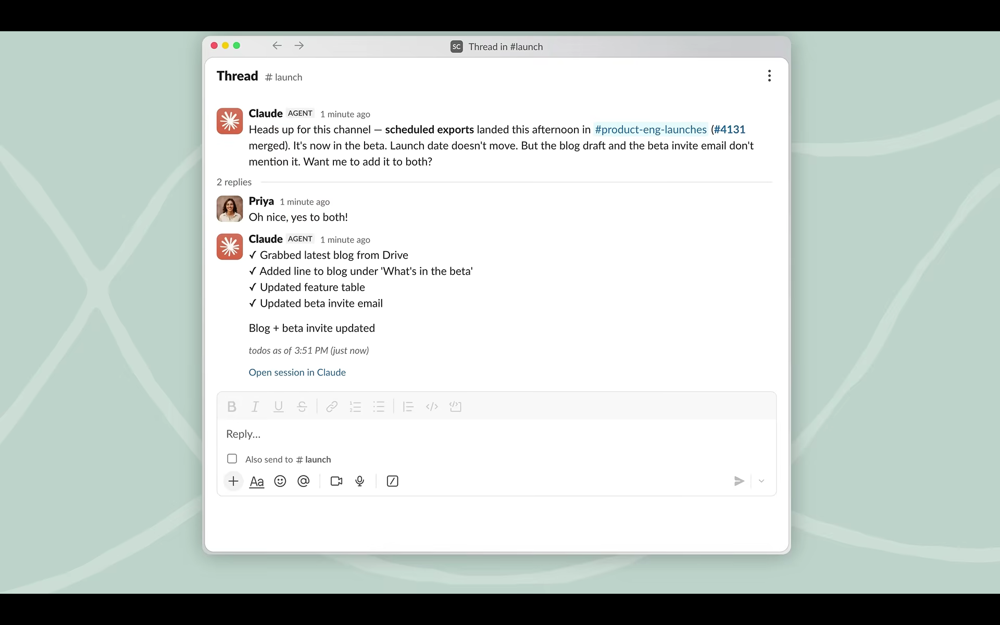
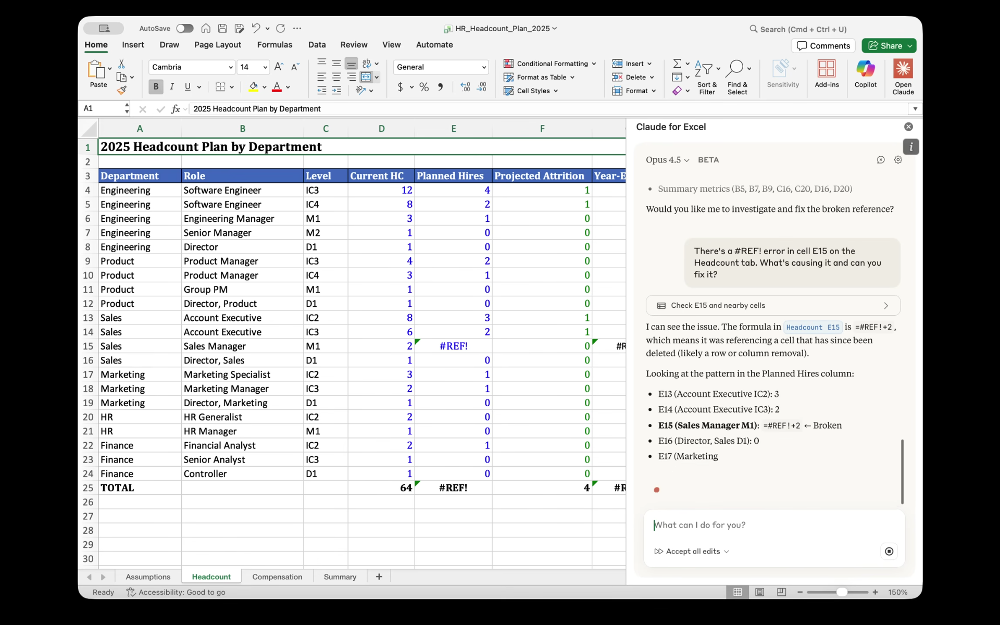
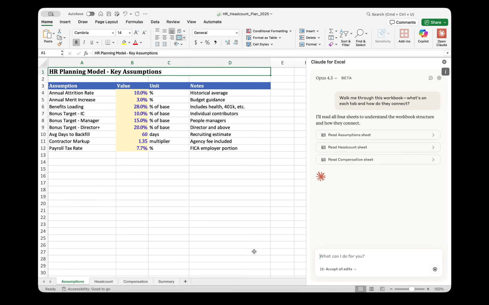
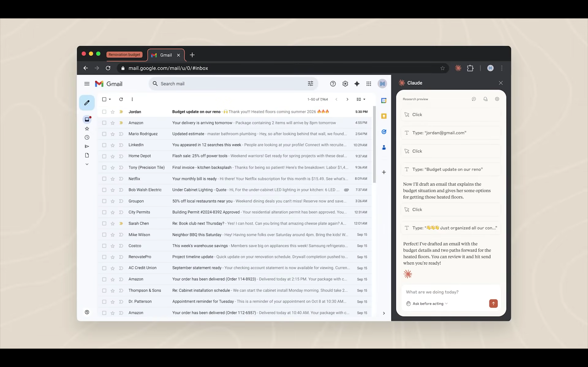
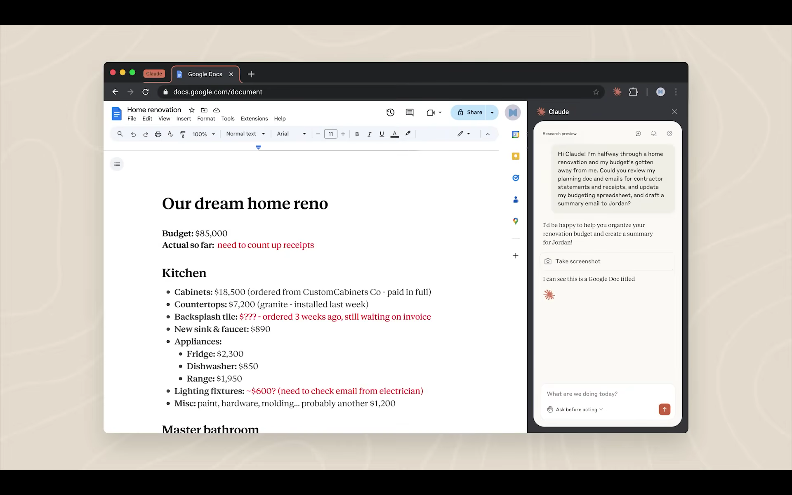
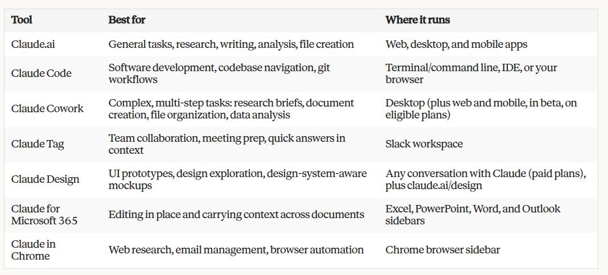

[⬅ Back to course index](../README.md)

# 📚 Claude 101 — Course Notes

---

## Chapter 1: What is Claude?

> Claude is more than a chatbot—it's an AI assistant designed to be your thinking partner.

### 🧠 Key Takeaways

- **Claude is built to be helpful, harmless, and honest** — At a high level, Claude is guided by principles that help it avoid toxic or discriminatory outputs, avoid helping humans engage in illegal or unethical activities, and broadly behave as a helpful, honest, and harmless AI system. This approach, called **Constitutional AI**, means Claude is trained to align with human values and operate transparently.
- **Claude is more than a chatbot** — Claude is capable of a wide variety of conversational and text processing tasks while maintaining a high degree of reliability and predictability, including summarization, search, creative and collaborative writing, Q&A, coding, and more. Think of Claude as a thinking partner who can help you tackle complex problems and work through challenging situations, not just answer simple questions.
- **Claude is designed to be steerable and collaborative** — Claude can take direction on personality, tone, and behavior, and customers report that Claude is much less likely to produce harmful outputs, easier to converse with, and more steerable—so you can get your desired output with less effort.
- **You can access Claude wherever you work** — Claude apps are available to all plan types—Free, Pro, Max, Team, and Enterprise. Your conversations, projects, memory, and preferences sync across all devices when you're signed in. Whether you're at your desk or on the go, Claude is available through web, desktop, and mobile apps.

### 🛠️ Understanding Claude's Capabilities

Claude can help with a wide range of tasks that go far beyond simple question-and-answer interactions to assistant-like partnership that can both **automate** *and* **augment** your work.

| Area | What Claude Excels At |
|------|------------------------|
| ✍️ **Writing & content creation** | Collaborates on social media posts, professional emails, and complex reports. Because Claude is trained to take direction on personality and tone, you can iterate together on structure and clarity until your voice comes through clearly. |
| 🔎 **Research & analysis** | Helps you explore research angles, compile findings, and analyze data to surface meaningful insights. You can upload documents and Claude will help you make sense of complex information — enabled by Claude's large **context window**, which can ingest 200K+ tokens (about 500 pages of text or more), with up to 1M tokens available on Pro, Max, Team, and Enterprise plans when using supported models. |
| 💻 **Coding assistance** | One of Claude's greatest strengths. Strong performance on real-world coding tasks means it can help you write, debug, and explain code across multiple programming languages. |
| 🧩 **Problem-solving & reasoning** | Handles complex cognitive tasks, mathematical problems, strategic thinking and analysis, and research. Claude can respond near-instantly or take time to reason first — a capability called **Thinking**. When a problem calls for careful analysis, Claude can work through it step by step before it answers. |
| 📖 **Learning new things** | Adapts to your learning style and pace. **Learning mode** is a Claude experience that guides your reasoning process rather than providing answers, helping develop critical thinking skills. |

> Get inspired on ways to use Claude in your specific function by exploring the [use-case gallery](https://claude.com/resources/use-cases) on claude.com. For a deeper dive into what AI can (and can't) do, see the [AI Capabilities](https://anthropic.skilljar.com/ai-capabilities-and-limitations) course.

### 🌐 Ways to Access Claude

Claude is the intelligence—the AI assistant you're learning to work with throughout this course. That same intelligence is available across multiple interfaces, each suited to different types of tasks.

| Interface | Description |
|-----------|-------------|
| **[Claude.ai](https://claude.ai/)** (+ mobile/desktop apps) | The primary way most people interact with Claude — ask questions, brainstorm ideas, create and edit documents, and more. Ideal for conversations, writing assistance, research, analysis, and creating files. **This is the focus of this course.** |
| **[Claude Code](https://claude.com/product/claude-code)** | An agentic coding tool designed for developers, but usable for all kinds of file manipulation on your desktop. Can directly edit files, run commands, and create commits. |
| **[@Claude](https://claude.com/claude-and-slack)** | Brings Claude directly into Slack — chat from the AI assistant header in any channel/conversation, or tag @Claude in threads. When connected, Claude searches your workspace's channels, DMs, and shared files for context. |
| **[Claude Design](https://claude.ai/design)** | A dedicated space for turning ideas into working interfaces. Describe what you want — or start from a sketch or screenshot — and Claude builds an interactive prototype you can refine and hand off to your team. |
| **[Claude for Microsoft 365](https://support.claude.com/en/articles/13892150-work-across-excel-powerpoint-and-word)** | Brings Claude into Excel, PowerPoint, Word, and Outlook as a sidebar — analyze, draft, and edit inside the document you already have open, carrying context from one app to the next. |

> This course focuses primarily on [Claude.ai](https://claude.ai/), but you can also check out [Claude Code in Action](https://anthropic.skilljar.com/claude-code-in-action) for more on using Claude in development workflows.

### 📝 Quick Reference: Claude's Core Principles (for exam prep)

| Principle | What it means |
|-----------|---------------|
| 🟢 **Helpful** | Designed to genuinely assist users in achieving their goals |
| 🔵 **Honest** | Doesn't deceive or mislead users |
| 🟦 **Harmless** | Avoids toxic, discriminatory outputs and illegal/unethical activities |
| 🎯 **Steerable** | Takes direction on personality, tone, and behavior |
| 🤝 **Collaborative** | Acts as a thinking partner, not just a question-answering tool |

> 🎓 **Memory tip:** Remember the **3 H's** (Helpful, Honest, Harmless) + **Constitutional AI** = Claude's core design principles

### 🤔 Lesson Reflection

- What tasks in your current work might benefit from having Claude as a thinking partner?
- Take a look at your calendar (or better yet, ask Claude to) and identify a few tasks you might want to use Claude to support.

---

## Chapter 2: Your First Conversation with Claude

> ⏱️ Estimated time: 20 minutes · 🎥 Video: *Getting started with Claude.ai*

> Claude brings AI intelligence, but you bring the context and expertise that makes the work meaningful.

### 🎯 Learning Objectives

By the end of this lesson, you will be able to:
- Start a new conversation with Claude and navigate the interface
- Write effective prompts using clear, specific language
- Upload files and images to provide Claude with additional context
- Use follow-up messages to iterate and refine Claude's responses

### 🧠 Key Takeaways

- Claude is a powerful, intelligent collaborator that amplifies your capabilities across all of your work. Claude brings AI intelligence, but **you** bring the context and expertise that makes the work meaningful.
- The best approach when speaking to Claude is like you would a coworker — **naturally, concisely, and conversationally.**
- Before your next conversation with Claude, consider: **setting the stage** (your role, objectives, and context), **defining the task** (what action you want Claude to take), and **specifying rules** (style, tone, and examples).
- When you upload relevant documents or background information into a chat, Claude considers that content in its response — think of it as a shortcut so Claude can understand what your needs are.
- The real power of Claude comes with **continued and frequent communication**, not just one-off prompts.

### 💬 Starting Your First Conversation

When you open [Claude.ai](https://claude.ai/), you'll see a clean interface with a text input area at the bottom of the screen.

Your prompts can range from simple questions (like brainstorming code names for a new feature) to complex requests to co-create files.

### ✍️ Writing Effective Prompts

All interactions with Claude begin with a **prompt**, and these prompts, combined with other context, impact Claude's response. The best approach when speaking to Claude is like you would a coworker — naturally, concisely, and conversationally.

But you may ask, what is a good prompt? Before your next conversation with Claude, consider a few things:

| # | Element | Ask yourself |
|---|---------|--------------|
| 1 | 🧩 **Setting the stage** | What is your role and what are your objectives? Is there context about your work that Claude should know about? |
| 2 | ✏️ **Defining the task** | What action do you want Claude to take? Do you want Claude to write, analyze, build, or something else? |
| 3 | ✅ **Specifying rules** | What's the style or tone you want Claude to use? Are there examples that you can attach to show Claude what you're looking for? |

#### Putting It Together

Here's an example prompt that uses all three elements:

> *"I'm the marketing lead at an indie streaming startup, and we're preparing an investor pitch deck for Series A investors. Can you research the current state of the independent film streaming market and identify key trends, competitor positioning, and growth opportunities? Use current web research with citations and structure it as a professional report of up to 5 pages, with an executive summary, market analysis, competitive landscape, and growth opportunities."*

| Element | How it shows up in this prompt |
|---------|--------------------------------|
| 🧩 **Setting the stage** | Marketing lead at an indie streaming startup, preparing a Series A investor pitch deck — the context and objective |
| ✏️ **Defining the task** | Research the market, with relevant details (trends, competitors, opportunities) — the specific action |
| ✅ **Specifying rules** | Current web research with citations, structured as a professional report — the exact style and format |

Here's that same prompt being entered into Claude.ai — note the toolbar below the input box (tools menu, model picker, and Research toggle):

> 💡 **Want to go deeper?** This prompt framework is adapted from the **4D Framework for AI Fluency**, developed through research collaboration between Professor Rick Dakan (Ringling College of Art and Design) and Professor Joseph Feller (University College Cork). The framework identifies four core competencies — **Delegation, Description, Discernment, and Diligence** — that enable effective collaboration with AI. See [ai-fluency/README.md](../ai-fluency/README.md) for the full course notes.

#### 🤖 Choosing a Model: Opus vs. Sonnet

The model picker (shown above) lets you choose which Claude model handles your request:

| Model | Best for | Notes |
|-------|----------|-------|
| 🔵 **Opus** | Most **complex** tasks | The largest scale model, with hybrid reasoning capabilities |
| 🟢 **Sonnet** | **Everyday** tasks | Default mode — balances capabilities with cost-effectiveness |

#### 💭 Extended Thinking Mode

Inside the tools menu you'll also find **Extended thinking** — a toggle that gives Claude space to reason step-by-step before answering. It's not a fit for every prompt:

| ✅ Good fit | ❌ Not worth it |
|-------------|-----------------|
| Project planning | Simple questions |
| Planning & trend analysis | Basic information |
| Technical problems | General writing |
| Math & coding | |

### 📎 Adding Context

Uploads, connectors, and custom preferences offer ways to give Claude even more context about your work.

Claude can analyze both text and visual elements (like images, charts, and graphics) in PDFs and other documents.

| Supported file types |
|-----------------------|
| PDF, DOCX, CSV, TXT, and common image formats like PNG and JPEG |

Some practical ways to use file uploads:
- Upload a document and ask Claude to summarize the key points
- Share an image and ask Claude to describe or analyze what it sees
- Attach a spreadsheet and ask Claude to identify trends in the data
- Upload code and ask Claude to explain how it works or find bugs

Once uploaded, Claude will automatically attempt to parse the file's content. In the chat, the file appears as an attachment and you can then prompt Claude about it.

> 💡 **Pro tip:** If you'd like Claude to consider specific preferences in every response, go to **Settings > General > "What personal preferences should Claude consider?"** to set preferences that apply to every conversation.

### 🔁 Iterating on Claude's Responses

Conversations with Claude are meant to be **iterative**. Chaining bite-sized prompts together allows for a natural dialogue where you guide the conversation based on Claude's replies.

If Claude's first response isn't quite what you wanted, you have several options:

| Option | Example |
|--------|---------|
| **Ask follow-up questions** | Build on Claude's response by asking for more detail, a different angle, or clarification: *"Can you expand on the second point?"* or *"That's helpful, but can you make it more concise?"* |
| **Provide feedback** | Tell Claude what you liked and didn't like about its response: *"This is good, but the tone is too formal. Can you make it more conversational?"* |
| **Redirect or restart** | If Claude went in a different direction than you intended, steer it back: *"Actually, I was asking about X, not Y. Let me clarify..."*. Worst case, restart your conversation in a new chat to fully refresh the context. |

> 💡 **Pro tip:** You can also click the pencil icon on any of your messages to edit and resubmit your prompt — useful when you want to refine your request rather than add a new message.

### 🌟 Personalizing Claude

Two features help Claude work better for you over time, increasing the power of your prompts:

| Feature | What it does |
|---------|---------------|
| 🧠 **Memory** | Automatically saves key context from your conversations — your role, preferences, past decisions, and working style — so you don't have to repeat yourself every time you start a new chat. Review, edit, or delete anything Claude remembers anytime in Settings; memory syncs across all your devices. |
| 🎨 **Styles** | Customize how Claude communicates. Choose from preset options — like concise, formal, or explanatory — or create your own custom style by describing exactly how you want Claude to write. Once set, your style applies across all conversations automatically. |

### 📝 Quick Reference: Prompt Framework (for exam prep)

| Element | Key Question | Example |
|---------|--------------|----------|
| 🧩 **Set the stage** | What's your role and objective? | *"I'm a marketing lead preparing a Series A pitch deck"* |
| ✏️ **Define the task** | What action should Claude take? | *"Research the indie streaming market and identify trends"* |
| ✅ **Specify rules** | What style, tone, format? | *"Professional report, 5 pages, with citations"* |

> 🎓 **Memory tip:** **Stage → Task → Rules** = Complete prompt structure (adapted from 4D Framework's **Description** competency)

### 🤔 Put It Into Practice

Before moving on, try prompting Claude with a question or task. If you need an idea to get started, feel free to explore the [use-case gallery](https://claude.com/resources/use-cases).

---

## Chapter 3: Getting Better Results

> ⏱️ Estimated time: 15 minutes

### 🎯 Learning Objectives

By the end of this lesson, you will be able to:
- Recognize common challenges when starting out with AI and use troubleshooting techniques to overcome them
- Define AI Fluency and know where to go to learn more about working with AI in a fluent way
- Explain how you might set up evals to better understand how Claude might perform with your unique workflows

### 🛠️ Common Challenges and How to Fix Them

As you start working with Claude, you'll likely encounter moments where the response isn't quite what you expected. **This is normal** — it's an opportunity to refine your approach.

| Challenge | What's happening | Try this |
|-----------|-------------------|----------|
| **Claude's response is too generic** | Your prompt didn't include enough context about your specific situation | Add details about your audience, role, or constraints. Instead of *"Write an email about the project delay,"* try *"Write an email to our enterprise client explaining that the software integration will be delayed by two weeks. They've been patient so far but this is the second delay. Keep it professional but apologetic."* |
| **The response is too long (or too short)** | Claude is guessing at appropriate length | Be explicit: *"Give me a two-paragraph summary"* or *"Keep this under 100 words"* or *"I need a comprehensive analysis — length isn't a concern."* |
| **Claude didn't follow my format** | Claude understood what you want but not how you want it presented | Show, don't just tell. Provide an example of the format, or describe the structure explicitly: *"Use bullet points with bold headers for each section."* |
| **I got confident-sounding information that turned out to be wrong** | Claude occasionally generates plausible but incorrect information, especially with specific facts or niche topics (a **hallucination**) | For high-stakes work, verify key facts independently. Ask Claude to cite sources or indicate confidence level. Enable web search to ground responses in current information. |
| **The tone isn't right** | Claude defaults to helpful and professional, which may not match your needs | Describe the tone in plain language: *"Make this more conversational"* or *"This should sound authoritative and formal."* Provide an example of writing in the style you want. |

### 🔁 The Iteration Mindset

One of the most important shifts when working with Claude is recognizing that your **first prompt rarely produces a perfect result** — and that's okay. Think of your initial prompt as the start of a conversation, not a one-shot request.

Effective Claude users:
- **Treat first drafts as starting points.** Review what Claude produces, identify what's working and what isn't, then refine.
- **Give specific feedback.** *"Make it shorter"* is fine, but *"Cut the first two paragraphs and make the conclusion more action-oriented"* is better.
- **Know when to start fresh.** If a conversation has gone off track, sometimes it's faster to open a new chat with a clearer prompt than to try to redirect.

### 🧭 What is AI Fluency?

> **AI Fluency** is the ability to collaborate effectively with AI tools — not just knowing which buttons to click, but developing the judgment to use AI well across different situations.

The **4D Framework for AI Fluency**, developed through research collaboration between Professor Rick Dakan (Ringling College of Art and Design) and Professor Joseph Feller (University College Cork), identifies four core competencies that, when combined, help you make the most of your AI interactions:

| # | Competency | What it includes |
|---|------------|-------------------|
| 1 | 🎯 **Delegation** | Deciding what work should be done by humans, what work should be done by AI, and how to distribute tasks between them. Includes understanding your goals, AI capabilities, and making strategic choices about collaboration. |
| 2 | 💬 **Description** | Effectively communicating with AI systems. Includes clearly defining outputs, guiding AI processes, and specifying desired AI behaviors and interactions. |
| 3 | 🔍 **Discernment** | Thoughtfully and critically evaluating AI outputs, processes, behaviors and interactions. Includes assessing quality, accuracy, appropriateness, and determining areas for improvement. |
| 4 | 🛡️ **Diligence** | Using AI responsibly and ethically. Includes making thoughtful choices about AI systems and interactions, maintaining transparency, and taking accountability for AI-assisted work. |

You've already been practicing these skills throughout this course:
- The prompt framework from **Lesson 2** (setting the stage, defining the task, specifying rules) is rooted in **Description**.
- The troubleshooting techniques above draw on **Discernment** and **Diligence**.

> 💡 To learn more, check out the full [ai-fluency/README.md](../ai-fluency/README.md) course notes — our free AI Fluency course explores all four competencies in depth, with practical exercises and real-world applications.

### 📊 Evaluating Claude for Your Workflows

As you start integrating Claude into more of your work, you might wonder: *how do I know if Claude is actually good at this particular task?*

This is where **Discernment** becomes essential. **Evals** (short for evaluations) are a way to develop intuition for assessing Claude's outputs on the tasks that matter to you — systematic ways to test how well Claude performs on specific types of tasks that matter to you.

#### Why Evals Matter

Your work is unique. Claude might excel at drafting marketing copy but need more guidance for technical documentation in your specific domain. Running simple evals helps you:
- Understand where Claude adds the most value in your workflow
- Identify tasks where you'll need to provide more context or examples
- Build confidence in Claude's outputs for recurring tasks

#### 🧪 A Simple Eval Approach

You don't need complex infrastructure to evaluate Claude. Here's a practical approach:

| # | Step | What to do |
|---|------|------------|
| 1 | **Gather examples** | Collect 5–10 examples of a task you do regularly — emails you've written, reports you've created, analyses you've done. |
| 2 | **Create test prompts** | Write prompts that would generate similar outputs. Include the context you'd naturally have when doing this work. |
| 3 | **Compare outputs** | Run your prompts and compare Claude's responses to your examples. Ask: *Does Claude capture the key information? Is the tone and style appropriate? What's missing or could be improved?* |
| 4 | **Refine your approach** | Based on what you learn, adjust your prompts, add examples to show Claude what good looks like, or identify where human review is essential. |

### 📈 Example: Using Claude for Data Analysis

> 🎥 This example is taken from the *AI Fluency for nonprofits* course, but it's relevant for anyone working with data in AI.

To evaluate how Claude might work with your data:
1. Find a dataset you've manually analyzed
2. Create prompts that request Claude to do the analysis on your behalf
3. Compare Claude's results to your originals
4. Note patterns and refine your prompt accordingly — maybe Claude gets the right numbers but misses the overall patterns

This kind of lightweight evaluation helps you develop intuition for how to work with Claude on tasks that matter to you — and where to focus your review and refinement energy.

### 📝 Quick Reference: 4D Framework (for exam prep)

| Competency | Core Question | Key Actions |
|------------|---------------|-------------|
| 🎯 **Delegation** | When should humans vs. AI do the work? | Understand goals, know AI capabilities, distribute tasks strategically |
| 💬 **Description** | How do we communicate clearly with AI? | Define product (what), process (how), performance (behavior) |
| 🔍 **Discernment** | How do we evaluate AI outputs? | Assess product quality, process reasoning, performance behavior |
| 🛡️ **Diligence** | How do we ensure responsible AI use? | Choose systems thoughtfully, maintain transparency, verify outputs |

> 🎓 **Memory tip:** The **4 Ds** work together in a continuous loop — Delegation → Description → Discernment → Diligence → (back to Delegation)

### 🤔 Lesson Reflection

- Which of the common challenges have you already encountered? What techniques might you try next time?
- Where in your work would a simple eval help you understand if Claude is a good fit for a recurring task?
- How might the 4D Framework help you think about your collaboration with Claude?

---

## Chapter 4: How You'll Work with Claude on Your Desktop

> ⏱️ Estimated time: 6 minutes

### 🎯 Learning Objectives

By the end of this lesson you'll be able to:
- Distinguish the ways you work with Claude on the desktop — working with Claude turn by turn, handing whole tasks off for Claude to run, and building software in your codebase
- Recognize which shape of work a task calls for before you start it
- Find where each way of working lives in the desktop app today

### 🖥️ Working with Claude on Your Desktop

The Claude desktop app is your home base for working with Claude — from a quick question mid-meeting to a report Claude assembles from six sources while you do something else. The work sorts into **three shapes**, and knowing which one you're in is the whole skill of this lesson:

1. 💬 **Working with Claude, turn by turn.** You and Claude go back and forth. You ask, Claude answers, you steer, it revises. The thinking happens in the exchange.
2. 🤝 **Handing work off to Claude.** You describe an outcome — a finished brief, a formatted deliverable, a task that runs every Monday — and Claude plans it, does it, and comes back with the result. You review the plan and the output; you don't stitch the steps together yourself.
3. 💻 **Building software with Claude Code.** Claude works directly in a codebase: reading it, writing and testing code, running commands. Built for developers, and worth knowing about even if you never open it.

The first two are where most knowledge workers spend their day; the third is the developer's workspace.

> **In the product today.** Turn-by-turn work happens in **Chat**. Work you hand off runs in **Cowork**. Building software happens in the **Code tab**. All three live in the Claude desktop app.

### 💬 Working with Claude, Turn by Turn

This is Claude as a thinking partner: the shape of work where the value is in the exchange itself. You bring a half-formed idea, an unfamiliar dashboard, a paragraph that isn't landing — and you work it out together, one turn at a time.

**Reach for this when:**
- **The answer changes what you ask next.** You're brainstorming, and each response opens the next question. You couldn't have written the whole request up front, because you didn't know yet.
- **You want to stay in it.** Drafting, editing, thinking out loud — the point is your judgment on every turn, not a finished thing at the end.
- **It's quick.** A question, a rewrite, a "what does this mean?" — small enough that setting up a whole task would be overhead.

**Try it out when:**
- You're staring at an unfamiliar dashboard. Screenshot it and ask *"what do these metrics mean?"* Claude explains while the dashboard stays in view, and your follow-up (*"okay, which of these should I actually worry about?"*) is the next turn.
- You're between meetings and need to structure a presentation. Talk it through by voice; Claude drafts an outline from what you said; you push back on section three; it revises. Four turns, done before your next call.
- You've been jotting product-launch ideas across Apple Notes for weeks. Ask Claude to pull together everything about the launch, figure out what you left half-finished, and check your other connected tools for gaps. Then work the gaps together.

**In the product today.** In the desktop app this is **Chat** — the same Claude you know from claude.ai, plus a few things that come from running natively on your computer:

| Feature | What it does |
|---------|---------------|
| **Quick entry** | Double-tap the Option key (Mac) to pull Claude up over whatever you're working on. It answers in a compact window that stays on top as you switch apps. |
| **Screenshots and window sharing** | Capture a screenshot or share a window so Claude sees what you see. (Mac) |
| **Dictation** | Talk through a problem instead of typing. (Mac) |
| **Desktop connectors** | Connect local tools and services so Claude can work with what's on your machine. |

### 🤝 Handing Work Off to Claude

Working agentically with Claude is a new way of working for many people. Instead of asking a question, you hand Claude the whole piece of work — gather the context, do the analysis, produce the finished thing — and it comes back done. You're **delegating**, not just chatting.

**Reach for this when:**
- **The task has several steps** you'd normally do in sequence. Pull the figures, compare them, draft the summary, format the doc. Handed off, that's one instruction, not four errands.
- **The output is a real deliverable.** A Word doc, a spreadsheet, a deck, a formatted PDF — saved where you need it, not pasted into a chat window for you to reassemble.
- **The work spans your tools.** Meeting notes in one place, the thread in Slack, last quarter's numbers in a spreadsheet. Set up a Friday roll-up as a scheduled task and Claude gathers all three itself every time it runs — nothing for you to round up first.
- **It should happen on a schedule, or while you're doing something else.** A Friday review of what shipped. A Monday briefing that preps you for your next meeting.

> Handing work off doesn't mean stepping back from it. Before Claude starts, it may ask a few questions to pin down scope and format, and it shows you the plan. As it works, you can watch the task take shape — the sources it's drawing from, the files forming, its progress through the plan — and steer at any point. And when Claude is set to ask before acting, it stops for your approval on the actions that matter, like sending an email or sharing a file. **You stay in control of what leaves your desk.**

**Try it out when:**
- You want to query all your tools like a database. *"Review what we decided about pricing last quarter across meeting notes, Slack, and email, then update the Q3 deck with the findings."* Claude finds the answer across all of them and updates the deck. Hand it off, keep working, check the result.
- You have a folder of 50+ project documents — contracts, financial reports, meeting transcripts. Ask Claude to find the ones most relevant to your initiative and produce a summary memo. It reads every page and pulls out the patterns that only emerge from reading all of them. Review fifty like you'd review five.
- You do the same work every Monday morning — check messages, assemble a status update, prep for the day's meetings. Set it up once as a scheduled task, and start Monday with answers instead of admin.

**In the product today.** In the desktop app, you can hand off tasks in **Cowork**. What that gives you today:

| Capability | What it does |
|------------|---------------|
| **Local folder access** | Point Claude at a folder; it reads what's there and saves finished work back to the same place. This is the concrete difference from turn-by-turn Chat, which can read what you upload but hands finished files back as downloads rather than saving them into your folder. |
| **Scheduled tasks** | Set a task once — a daily briefing, a weekly roundup, a morning inbox triage — and Claude runs it on the cadence you set. If your computer or the app was closed at the scheduled time, it catches up when you're back. |
| **Subagents** | For a big job, Claude splits the work across background workers running in parallel, each with its own context, and hands you one finished deliverable. |
| **Projects** | Group related tasks into a workspace with its own files, instructions, and memory — like projects in Chat, but built around the tasks you run. |
| **Browser use** | With Claude in Chrome, Claude navigates websites and pulls what it finds straight into the task — competitor pricing across ten sites, data from pages with no API. |
| **Computer use** | When there's no connector for what you need, Claude can operate your computer directly — clicking, typing, opening apps — asking permission before each app it touches, with a blocklist for anything off-limits. In research preview on Pro and Max plans. |
| **Plugins** | Ready-made bundles of skills, connectors, and agents built for a specific kind of work — a sales plugin, a finance one, a legal one — so Claude works the way that role works. Browse and add them under **Customize → Plugins**. |

> Cowork is available to **Pro, Max, Team, and Enterprise** users, with new capabilities added regularly.

### 💻 Building Software with Claude Code

If you write code, the desktop app gives you a full development environment. Claude works directly in your codebase — reading what's there, writing and modifying code, running commands. Visual diffs show what changed, a built-in terminal shows commands as they run, and **git tracks every version** so you can always roll back.

> If you're not a developer, the takeaway is just this: it's a separate tab, and this course doesn't need it — *Claude Code in Action* covers it in depth.

You choose **where** the work happens:

| Environment | What it means |
|-------------|----------------|
| **Local** | Select a folder on your computer and Claude works directly with those files — reading your project, using local tools, and running a development server you can preview in your browser. |
| **Cloud** | Connect a GitHub repository and Claude works in a cloud environment. Sessions continue even if you close the app, so you can start a big refactor and check back later. Good for larger codebases, or when you want to keep the work off your machine. |

You also choose **how much Claude does on its own**:

| Setting | What it means |
|---------|----------------|
| **Manually approve** | Claude proposes every change and waits for your approval. |
| **Accept edits** | Claude applies file edits automatically. |
| **Plan** | Claude creates a plan before making changes. |

> **In the product today.** This lives in the **Code tab** of the desktop app, available on Pro, Max, Team, and Enterprise plans. You can run multiple sessions across projects and filter them by environment (Local or Cloud) and status from the sidebar.

### 🧭 Choosing the Right Shape for the Task

You won't pick a tab first — you'll notice what kind of work is in front of you, and the tab follows. Here's the whole lesson in one table.

| You're about to… | The shape it takes | Where it lives today |
|-------------------|---------------------|------------------------|
| Ask, brainstorm, draft, or think something through, turn by turn | Working with Claude, turn by turn | **Chat** (quick entry, dictation, screenshots) |
| Hand off a multi-step task that ends in a finished deliverable, spans your tools, or runs on a schedule | Handing work off | **Cowork** (folder access, connectors, scheduled tasks, subagents) |
| Write, test, run, and ship code in a codebase | Building software | **The Code tab** (Local or Cloud) |

### 📝 Quick Reference: Three Shapes of Work (for exam prep)

| Shape | When to use it | Where it lives |
|-------|----------------|----------------|
| 💬 **Turn by turn** | Back-and-forth thinking, brainstorming, quick questions | **Chat** (desktop app) |
| 🤝 **Hand off work** | Multi-step tasks, finished deliverables, scheduled work | **Cowork** (Pro/Max/Team/Enterprise) |
| 💻 **Build software** | Direct codebase work, writing/testing code | **Code tab** (for developers) |

> 🎓 **Memory tip:** Chat = Conversation · Cowork = Complete tasks · Code = Codebase

### 🤔 Lesson Reflection

- Think about how you used Claude this week. Which requests were turn-by-turn thinking, and which were really whole tasks you fed in one question at a time because that's the habit?
- Take the task you'd most like off your plate. Is it multi-step, does it end in a real file, does it span your tools? If yes to any, it's a hand-off — write down the outcome you'd describe to Claude, not the first question you'd ask.

---

## Chapter 5: Introduction to Projects

> 🗂️ **Unit: Organizing Your Work and Knowledge** · ⏱️ Estimated time: 20 minutes · 🎥 Video: *Introduction to Projects — Getting started with projects in Claude.ai*

### 🎯 Learning Objectives

By the end of this lesson, you will be able to:
- Explain what projects are and when to use them
- Create a new project with a name, description, and visibility settings
- Add documents and files to your project's knowledge base
- Write effective project instructions to guide Claude's behavior
- Share projects with teammates (for Claude for Work (Team and Enterprise plan) users)

### 🧠 Key Takeaways

- **Projects are self-contained workspaces** with their own memory, chat histories, knowledge bases, and customized instructions. Think of them as dedicated environments for specific work streams.
- **Project knowledge** enhances Claude's understanding by letting you upload relevant documents that Claude references across all chats within that project. No more re-uploading the same files each time.
- **Project instructions** guide Claude's behavior — you can specify tone, expertise level, response style, and more. These instructions apply to every conversation within the project.
- **Projects scale automatically.** When your knowledge base approaches context limits, Claude switches to searching your project knowledge and pulling in only what's relevant, expanding capacity by up to **10x** while maintaining response quality.
- For **Claude for Work** users, projects enable collaboration. Share projects with teammates so everyone benefits from the same context, instructions, and accumulated knowledge.

### 🗂️ What Are Projects?

Projects are ideal for **storing knowledge** Claude should reference, **organizing related chats** around a specific topic or work area, and **collaborating** with team members who need access to the same shared context.

#### When to Use Projects

Projects are particularly valuable when you're working on something **ongoing** — not just a one-off question. Consider creating a project when you have a workflow with:
- **Reference materials** you'll use repeatedly (meeting notes, survey results, reports, historical data, etc.)
- **Consistent requirements** for how Claude should respond (always use formal language, always cite sources, always follow our template)
- **Team collaboration needs** where multiple people should work from the same foundation

### 🧩 Anatomy of a Project Page

A project page is built around three right-hand panels, each with its own visibility badge:

| Panel | Typical access | What it holds |
|-------|-----------------|-----------------|
| 🧠 **Memory** | *Only you* (private by default) | Builds automatically after a few chats — persists context across conversations within the project |
| 📋 **Instructions** | *All project users* | The behavior rules you write in Step 2 below, editable via a pencil icon |
| 📁 **Files** | *All project users* | Your knowledge base, with a capacity meter (e.g. *"1% of project capacity used"*) and a **+** button to add more |

Above that sits the project name, a **Share** button, and the chat prompt box (with its own model picker and history icon). Below the prompt box, chats split into **Your chats** (private until shared) and **Activity**.

> 💡 **Example:** a *"Brand Voice & Marketing Writing Assistant"* project for a flower distribution company — its instructions define Claude as *"a marketing writing assistant for Flower Power,"* and its knowledge base holds a Voice & Style Manual, a Brand Voice Framework, and Brand Voice & Messaging Guidelines (`.docx`/`.txt`/`.pdf` files, each shown with a line count).

### 🏗️ Creating Your First Project

Setting up a project takes just a few minutes.

#### Step 1: Set Up Your Project

1. Hover over the left sidebar and click **"Projects,"** or navigate directly to `claude.ai/projects`
2. Click **"+ New Project"** in the upper right corner
3. Give your project a descriptive name (e.g., *"Q4 Marketing Campaign"* or *"Product Documentation"*)
4. Add a brief description of what you're working on. Claude doesn't see this description directly — it helps you and your teammates understand the project's purpose.
5. Choose your **visibility settings**: keep it private or share with your organization (for Claude for Work users)

#### Step 2: Add Project Instructions

Project instructions tell Claude how to behave across all conversations in this project. Click **"Instructions"** to open the instructions panel.

Good project instructions typically include:

| Type | Example |
|------|---------|
| **Context** about what you're working on | *"This project is for creating marketing content for our B2B software product."* |
| **Process** instructions | *"First consider a blog structure that will entice this audience, then write the draft."* |
| **Tone and style** preferences | *"Use a professional but conversational tone. Avoid jargon when possible."* |
| **Specific requirements** | *"Always include a call-to-action at the end of marketing copy."* |

Once you've written your instructions, click **"Save instructions."** These apply to every chat in this project and work alongside any user preferences and styles you've set.

> 💡 You can also use project instructions to **automate workflows** — e.g., *"When I upload a meeting transcript, create a structured summary using this template."* Think of instructions as programming Claude's behavior for this project.

#### Step 3: Build Your Knowledge Base

Your project's knowledge base is where you upload documents that Claude should reference, via the files menu on the right side of your project's main page.

Click the **"+"** button to add content — supported types include PDF, DOCX, CSV, TXT, HTML, and more, or connect to **Google Drive** to link documents directly.

**What to upload:**
- Reference documents (brand guidelines, style guides, templates)
- Background materials (research reports, meeting notes, requirements docs)
- Examples of work you want Claude to emulate
- Technical documentation or specifications

> 💡 **Pro tip:** Name your files descriptively. Claude uses file names to understand and retrieve the right information, so `Q4-2024-Brand-Guidelines.pdf` is more helpful than `document1.pdf`.

### 📈 How Projects Handle Large Knowledge Bases

Projects automatically scale to handle large amounts of content through a process called **Retrieval Augmented Generation (RAG)**. At a high level, Claude can automatically find and use the most relevant parts of your uploaded documents when answering, without you needing to tell it which file to look at.

When your project knowledge approaches the context window limit, Claude stops loading everything at once and instead **searches your project's files**, retrieving only what's relevant to your question — expanding your project's capacity by **up to 10x** while maintaining response quality.

You'll see a visual indicator when your project is RAG-enabled, but the experience should feel the same — you can still upload documents, chat with Claude, and get context-aware responses.

### 💬 Working Within Your Project

Once your project is set up, you can start chatting with Claude. Each conversation within the project **automatically** has access to your knowledge base and follows your project instructions.

### 🤝 Collaboration Features

For users on **Claude for Work (Team and Enterprise)** plans, projects become even more powerful through collaboration features.

#### Permission Levels

| Level | What it means |
|-------|-----------------|
| 👀 **Can view** | Members can see project contents, access knowledge, and chat — but can't make changes. Read-only access with discussion rights. |
| ✏️ **Can edit** | Members have full collaboration power. They can modify instructions, update knowledge, manage other members, and actively contribute to the project. |
| 👑 **Owner** | Project creators control everything, including who sees the project. They can share with specific people or make projects visible to the entire organization. |

#### Sharing Your Project

1. Open the project you want to share
2. Click the **"Share project"** button to the right of the project name
3. Add individual members using their name or email, or copy and paste a list of email addresses for bulk sharing (the project then shows up in their **"Shared with you"** section)
4. Or, share with **"Everyone at [your organization]"** to make your project discoverable within the Team tab

> In the share dialog, each person gets their own access-level dropdown (e.g., **Can edit**) next to their name, plus a **General access** setting (e.g., *"Only people invited"*) and a **Copy link** shortcut for bulk sharing.

Team members receive **email notifications** when you share a project with them, and they can find shared projects in their **"Shared with me"** tab.

### 💡 Example Projects to Inspire You

Not sure where to start? Here are some common project types across different functions:

| Project | What to upload | What Claude does |
|---------|------------------|--------------------|
| **Q4 product launch** | Product specs, competitive analysis, messaging brainstorming notes | Keeps this context top of mind for any inquiry or document draft |
| **Research support** | Competitive review, user research data, customer feedback | Synthesizes sources, drafts reports, maintains consistency across recommendations |
| **Client account hub** | Client's brand guidelines, past deliverables, communication history | Matches their tone and references their specific context when creating proposals or reports |
| **Event planning workspace** | Venue contracts, speaker bios, attendee data | Generates run-of-show documents, attendee communications, and post-event reports consistent with your event's theme |
| **Job description generator** | Past job descriptions, team charters, internal headcount request docs | Drafts job descriptions that reflect your team's actual work and culture |

More ideas from the video — projects aren't just for work:

| 🌂 Bring a product to market | ✏️ Establish a content creation hub | 🍎 Develop an educational course |
|---|---|---|
| **📊 Financial & budget planning** | | **🏠 Manage a home renovation** |

### ✅ Best Practices for Projects

- **Start focused, then expand.** Begin with a specific use case rather than trying to create one project for everything. You can always add more content as you go.
- **Keep your knowledge base current.** Outdated documents can lead to outdated responses. Review and update your project knowledge periodically.
- **Write clear instructions.** Be specific about what you want. Vague instructions lead to inconsistent results.
- **Name your documents descriptively** (e.g., `Q4-2025-Sales-Report.pdf` not `report.pdf`) and group related files together. Claude uses filenames and proximity to understand relationships between documents.
- **Reference documents by name.** When asking questions, you can mention specific documents to help Claude focus its search: *"Based on our Q3 report, what were the top customer concerns?"*

### 📝 Quick Reference: Projects (for exam prep)

| Component | What it does | Who sees it |
|-----------|--------------|-------------|
| 🧠 **Memory** | Automatically builds context across conversations | Only you (private) |
| 📋 **Instructions** | Behavior rules for Claude (tone, style, process) | All project users |
| 📁 **Files** | Your knowledge base (PDFs, DOCX, CSV, etc.) | All project users |
| 💬 **Chats** | Individual conversations within the project | Private until shared |

> 🎓 **Memory tip:** Projects = **Self-contained workspaces** with their own knowledge, instructions, and memory

**Key features for exam:**
- Projects use **RAG (Retrieval Augmented Generation)** when knowledge base grows large
- Can expand capacity **up to 10x** with automatic searching
- **Team/Enterprise** users can share projects with permission levels (View, Edit, Owner)

### 🤔 Lesson Reflection

- What ongoing work could benefit from having a dedicated project with persistent context?
- What documents do you expect you'll be re-uploading or re-explaining to Claude on a regular basis?
- If you're on a team, are there projects that would benefit from shared knowledge and instructions?

---

## Chapter 6: Creating with Artifacts

> 🗂️ **Unit: Organizing Your Work and Knowledge** · ⏱️ Estimated time: 20 minutes

### 🎯 Learning Objectives

By the end of this lesson, you will be able to:
- Explain what artifacts are and when Claude creates them
- Share artifacts with colleagues and publish them publicly
- Troubleshoot common artifact issues

### 🎨 What Are Artifacts?

**Artifacts** are standalone, interactive outputs that Claude creates in a dedicated window alongside your conversation. Instead of getting a long block of code or text buried in the chat, you see your content rendered and ready to use — whether that's a working website, an interactive chart, or a document you can immediately download.

Claude automatically creates an artifact when content meets certain criteria:
- It's **significant and self-contained**, typically over 15 lines
- It's something you're likely to want to **edit, iterate on, or reuse**
- It represents **complex content** that stands on its own without needing the surrounding conversation
- It's content you'll want to **reference or use later**

### 🧰 Common Artifact Types

Claude can create different types of artifacts, each suited to different needs:

| Type | What it's for |
|------|-----------------|
| 📄 **Documents** (markdown & plain text) | Great for anything text-heavy that you'll want to export or continue editing, like meeting notes, reports, project plans, blog posts, and other written content |
| 💻 **Code snippets** | Working code in any programming language — Python, JavaScript, C++, and more. View the code, copy it, or download it to use in your own projects |
| 🌐 **HTML pages** | Complete web pages with HTML, CSS, and JavaScript in a single file. Perfect for landing pages, forms, interactive demos, or quick prototypes |
| 🖼️ **SVG images** | Scalable vector graphics for logos, icons, illustrations, and other visual elements. These render directly in the artifact window so you can see exactly what you're getting |
| 📊 **Mermaid diagrams** | Flowcharts, sequence diagrams, Gantt charts, org charts, and more. Describe the relationships you want to visualize, and Claude will create a diagram you can refine |
| ⚛️ **React components** | Interactive UI elements with real functionality — calculators, dashboards, games, data visualizations. These aren't just mockups; they include actual logic and respond to user input |

> Word documents, Excel spreadsheets, PowerPoint presentations, and PDFs work differently. Claude creates those through a separate **file creation** capability, not as artifacts, and returns them to you as files you can download.

### ✨ Creating Your First Artifact

Creating an artifact is as simple as having a conversation. Just describe what you want, and Claude will determine whether to present it as an artifact. For example, you might say:

- *"Create a flowchart showing our customer onboarding process"* — note: Claude may now generate visual diagrams like flowcharts as HTML using **Imagine**, in addition to code-based artifacts
- *"Build an interactive dashboard that lets me input monthly expenses and see a breakdown"*
- *"Design a landing page for a productivity app with a hero section and feature list"*
- *"Write a project brief template I can reuse for new initiatives"*

If Claude doesn't automatically create an artifact when you expect one, you can explicitly ask: *"Create this as an artifact"* or *"Show me this in an artifact."*

When Claude generates an artifact, it appears in a dedicated window to the right of your conversation. From here, you can:

| Action | What it does |
|--------|---------------|
| **View different formats** | Toggle between a preview (how it looks) and the underlying code |
| **Copy content** | Click the copy icon to grab the content for use elsewhere |
| **Download files** | Save the artifact as a file to your computer |
| **View code** | See exactly what Claude generated under the hood |

### 🔗 Sharing and Publishing Artifacts

Once you've created something useful, you have several options for sharing it:

| Option | Who it's for | How it works |
|--------|----------------|----------------|
| **Copy or download** | Anyone | For personal use or sharing via other channels, use the copy or download buttons in the lower right corner of the artifact window |
| **Share within your organization** | Claude for Work (Team & Enterprise) | The shared artifact stays within your organization and requires team authentication to access |
| **Publish publicly** | Free, Pro, and Max users | Makes the artifact accessible to anyone with the link |

When you publish:
- Only the **selected version** becomes public (your chat remains private)
- **Anyone can view and interact** with the artifact without a Claude account

To publish, click the **"Share"** or **"Publish"** button in the upper right corner of the artifact. You can unpublish at any time by returning to that artifact and removing public access.

> ⚠️ Once published, an artifact is publicly accessible via its link — anyone can view it, even without a Claude account. Published artifacts are **not indexed by search engines**, so they won't appear in Google results.

### 💡 Tips for Getting the Most from Artifacts

- **Be specific about what you want.** *"Build a budget tracker"* is good, but *"Build a monthly budget tracker where I can input expenses by category, see a pie chart breakdown, and get a warning when I'm over budget"* is better.
- **Describe the end user.** Telling Claude who will use the artifact helps it make appropriate design choices. *"This flowchart is for new employees"* leads to different results than *"This flowchart is for the engineering team."*
- **Iterate incrementally.** Ask Claude to add one feature or make one change at a time. This makes it easier to identify what's working and catch issues early.
- **Request artifacts when needed.** If you ask for something substantial and Claude responds in the chat instead of creating an artifact, just say *"Please create that as an artifact."*

### 📝 Quick Reference: Artifact Types (for exam prep)

| Type | File formats | Best for |
|------|--------------|----------|
| 📄 **Documents** | Markdown, plain text | Reports, notes, blog posts |
| 💻 **Code snippets** | Any language | Python, JavaScript, C++, etc. |
| 🌐 **HTML pages** | HTML/CSS/JS | Landing pages, forms, prototypes |
| 🖼️ **SVG images** | SVG graphics | Logos, icons, illustrations |
| 📊 **Mermaid diagrams** | Code-based diagrams | Flowcharts, org charts, Gantt charts |
| ⚛️ **React components** | Interactive UI | Calculators, dashboards, games |

> 🎓 **Memory tip:** Artifacts = **Standalone, interactive outputs** that appear in a dedicated window (vs. buried in chat)

**Key features for exam:**
- Artifacts are created when content is **significant (15+ lines)** and **self-contained**
- Can be **shared** within org (Team/Enterprise) or **published publicly** (Free/Pro/Max)
- Published artifacts are **not indexed** by search engines

### 🤔 Lesson Reflection

- What recurring work could benefit from having an interactive artifact you can reuse?
- Are there processes in your work that would be clearer as a flowchart or diagram?
- What prototype or tool would help you test an idea quickly?

---

## Chapter 7: Working with Skills

> 🗂️ **Unit: Organizing Your Work and Knowledge** · ⏱️ Estimated time: 15 minutes

### 🎯 Learning Objectives

By the end of this lesson, you will be able to:
- Explain what Skills are and how Claude uses them
- Identify Anthropic's built-in Skills for document creation
- Enable and manage Skills in your settings

> 📋 **Plan availability:** Skills are currently a feature preview for **Pro, Max, Team, and Enterprise** plans. If you're on the Free plan, you can read along to understand the concept and skip the hands-on steps.

### 🧩 What Are Skills?

**Skills** are folders of instructions, scripts, and resources that Claude loads dynamically to improve performance on specialized tasks. Think of them as **expertise packages** — they teach Claude how to complete specific tasks in a repeatable way.

You've already seen Skills at work if you've used Claude to create Excel spreadsheets, PowerPoint presentations, Word documents, or PDFs — those file creation capabilities are powered by Skills running behind the scenes. But Skills go far beyond document creation: custom Skills can codify entire repeatable workflows — a quarterly variance analysis methodology, a brand voice review process, or a compliance checklist — so Claude follows the same rigorous steps every time.

#### Types of Skills

| Type | Who makes them | How they're used |
|------|------------------|--------------------|
| 🏛️ **Anthropic Skills** | Created and maintained by Anthropic | Enhanced document creation for Excel, Word, PowerPoint, and PDF files. Available to all paid users — Claude invokes them automatically when relevant, no setup needed |
| 🛠️ **Custom Skills** | You or your organization | Built for specialized workflows and domain-specific tasks — e.g. applying brand guidelines to presentations, structuring meeting notes in a specific format, or executing your organization's data analysis workflows |

### ⚙️ Enabling Skills

Skills are currently available as a **feature preview** for users on Pro, Max, Team, and Enterprise plans. To use Skills, you'll need **Code execution and file creation** enabled, since Skills require Claude's secure sandboxed computing environment to function.

1. Navigate to **Settings > Capabilities**
2. Ensure that **Code execution and file creation** is toggled on
3. Scroll to the **Skills** section
4. Toggle individual skills on or off as needed

| Plan | Enabling Skills |
|------|-------------------|
| **Enterprise** | Organization **Owners** must first enable both Code execution and Skills in Admin settings before individual members can access them |
| **Team** | Enabled by **default** at the organization level |

Once enabled, you'll see available Skills listed in your settings, including Anthropic's built-in Skills and any custom Skills you've uploaded.

### 🚀 Using Skills in Practice

The beauty of Skills is that you typically don't need to think about them — Claude handles skill selection automatically based on your request. Examples of prompts that would invoke Skills:
- *"Create an Excel spreadsheet tracking monthly expenses with formulas for totals"*
- *"Turn this meeting notes document into a PowerPoint presentation"*
- *"Generate a PDF report summarizing this data"*
- *"Build a financial model in Excel with scenario analysis"*

When Claude uses a Skill, you'll see it mentioned in Claude's chain of thought as it works. The output will be a downloadable file you can save to your computer or directly to Google Drive.

#### 📁 File Editing

This same capability means Claude can work with your **actual files** (within a contained environment) to create updated versions of them.

> Note: in Chat, Claude creates a **new version** of the document rather than editing the original in place.

Upload slides, spreadsheets, contracts (or any `.xlsx`, `.pptx`, `.docx`, or `.pdf` files) and watch as Claude creates slides, performs analyses, and adds suggested edits. When Claude is done, you can download these files or open them in Drive — e.g. a "Pricing Analysis" spreadsheet, a "Market Research" PDF, a "Pitch Deck" presentation, or a "Food Truck Business" document.

> ⚠️ To use these capabilities you'll need to give Claude access to external data sources — toggle **"Allow limited network access"** on when prompted. This lets Claude install packages and libraries to perform advanced data analysis, custom visualizations, and specialized file processing. Monitor closely, as it **increases security risks**; allowed domains can be managed in Settings.

### 🔒 Security Considerations

Because Skills can include executable code, it's important to use them thoughtfully:
- Only install custom Skills from trusted sources
- Anthropic's built-in Skills are tested and maintained by Anthropic
- Custom Skills you upload are private to your individual account
- If you're installing a custom Skill from an external source, review its contents before use to understand what it does

### 🏗️ Creating Custom Skills

While Anthropic's built-in Skills cover common document creation tasks, the real power of Skills comes from **creating your own**. Custom Skills let you teach Claude your specific workflows, brand guidelines, and ways of working — so Claude can apply that knowledge automatically whenever it's relevant.

The easiest way to create a custom Skill is through **conversation with Claude itself** — you don't need to write code or manually create files; Claude handles the technical structure for you.

| Step | What to do |
|------|-------------|
| 1. **Start a new chat** | Tell Claude what you want to create, e.g. *"I want to create a skill for writing quarterly business reviews"* or *"I need a skill that applies our brand guidelines to presentations."* |
| 2. **Answer Claude's questions** | Claude interviews you about your workflow: What should this skill do? What makes good output for this type of work? Can you give examples of when you'd use this skill? |
| 3. **Upload reference materials** | Templates, style guides, brand assets, or examples of work you're proud of — all help Claude understand exactly what you're looking for |
| 4. **Save your skill** | Claude generates a file containing your properly structured skill. Save it and it's ready for Claude to use |
| 5. **See your skills** | Find the **Customize** tab in the left sidebar — see all skills available to you, and edit them manually or by chatting with Claude |

Your custom Skill will appear in your Skills list alongside Anthropic's built-in Skills. From that point forward, Claude will **automatically invoke it** whenever you work on relevant tasks — no manual triggering needed. You can improve your skills with iteration — ask Claude to edit a skill and it will update the files for you.

### ⚖️ Skills vs. Projects

You might be wondering — if both skills and projects can be used to give more context to Claude, when should I use each? Think of it this way: **projects store knowledge, skills perform tasks.**

- **Projects are knowledge hubs.** They hold the reference materials Claude needs to understand your work — project specs, meeting notes, research documents. When you upload files to a project, Claude draws on that information across every conversation within that project.
- **Skills are procedural machines.** They encode *how* Claude should execute a task — the specific steps, order of operations, and methodology you want followed every time. Skills shine when you have repeatable workflows you want Claude to run consistently.

The two features **complement each other**. A skill can reference knowledge stored in a project — your "customer call prep" skill might pull from customer profiles uploaded to a project's knowledge base. The project provides the **what** (information), the skill provides the **how** (process).

|  | 🗂️ Projects | 🛠️ Skills |
|---|---|---|
| **Purpose** | Store knowledge Claude references | Define processes Claude executes |
| **Best for** | Long-term context, reference materials, team collaboration | Repeatable workflows, multi-step tasks, consistent methodology |
| **Example** | Customer hub, research buddy, feedback generator | Process guidelines (like brand or legal), blog drafting, PDF creation |
| **Persistence** | Knowledge available across all chats in the project | Instructions applied when the skill is invoked |

### 📝 Quick Reference: Skills vs. Projects (for exam prep)

|  | 🗂️ Projects | 🛠️ Skills |
|---|-------------|------------|
| **Purpose** | Store knowledge Claude references | Define processes Claude executes |
| **Best for** | Long-term context, reference materials | Repeatable workflows, multi-step tasks |
| **Persistence** | Knowledge available across all project chats | Instructions applied when skill is invoked |
| **Plan availability** | All plans | Pro, Max, Team, Enterprise (feature preview) |

> 🎓 **Memory tip:** Projects = **Knowledge hubs** (what) · Skills = **Procedural machines** (how)

**Key features for exam:**
- **Anthropic Skills** = Built-in (Excel, Word, PowerPoint, PDF creation)
- **Custom Skills** = You create for specialized workflows
- Skills require **Code execution** enabled
- Can create skills by **chatting with Claude** (no manual coding needed)

### 🤔 Lesson Reflection

- What types of documents do you create regularly that could benefit from Claude's built-in Skills?
- Are there repetitive workflows in your work that might be good candidates for custom Skills?
- How might Skills change the way you think about document creation and data analysis?

---

## Chapter 8: Connecting Your Tools

> 🗂️ **Unit: Expanding Claude's Reach** · ⏱️ Estimated time: 16 minutes

### 🎯 Learning Objectives

By the end of this lesson, you will be able to:
- Explain what connectors are and why they matter for your work with Claude
- Navigate the connectors directory and set up your first connection
- Use connected tools effectively in your conversations with Claude

### 🔌 What Are Connectors?

**Connectors** transform Claude from an assistant into an informed collaborator by giving Claude access to the same tools, data, and context that you use every day. Instead of starting every conversation from scratch, Claude can work directly with your actual information.

Connectors allow Claude to **read information and perform actions** on your behalf. Depending on the connector and permissions you grant, Claude can search your files, retrieve documents, analyze data, create new content, update records, and execute tasks across your connected applications—all from within your conversation.

#### The Model Context Protocol (MCP)

**MCP** powers connectors. Think of MCP like **USB-C for AI** — a universal standard that allows Claude to connect to many different applications through a single, consistent interface. This open standard means developers can build connectors for any tool, and those connectors work seamlessly with Claude.

#### Types of Connectors

| Type | What it does |
|------|---------------|
| 🌐 **Web connectors** | Link Claude to cloud services like Google Drive, Notion, Slack, and Asana |
| 💻 **Desktop extensions** | Run locally on your computer through the Claude Desktop app, giving Claude access to local files and native applications |

### 🔍 Finding and Connecting Tools

Anthropic maintains a directory of recommended connectors at **claude.ai/directory**. The directory is organized into two tabs:

- **Web:** Cloud services and applications (Gmail, Notion, Slack, Asana, Linear, Stripe, and many more)
- **Desktop extensions:** Local tools that run on your computer through the Claude Desktop app

The directory lists **connectors rather than individual applications**, so one entry can cover several related tools. The Atlassian Rovo connector, for example, reaches both Jira and Confluence, so look for Atlassian rather than either app by name. If a tool you need doesn't have its own entry, you can add it as a **custom connector** instead.

> 💡 You can also browse available connectors by clicking the **+** button in the lower left of the chat window, then selecting **Connectors**.

### 🌐 Setting Up a Web Connector

Here's how to connect a cloud service:

| Step | What to do |
|------|------------|
| 1. **Find the connector** | Navigate to claude.ai/directory, or click + > Connectors in any chat |
| 2. **Click Connect** | Select the connector you want to add |
| 3. **Authenticate** | You'll be redirected to the service's login page. Sign in with your existing credentials |
| 4. **Grant permissions** | Review the specific permissions Claude is requesting, then authorize access |
| 5. **Test the connection** | Return to Claude and try a simple request, like *"Can you access my [tool name]?"* |

Once connected, Claude can search, read, and in some cases take actions within that service—depending on the permissions you've granted.

### 💻 Desktop Extensions

**Desktop extensions** require the Claude Desktop app rather than the web interface. These extensions let Claude interact with local applications, your file system, and native features on macOS or Windows.

Some desktop extensions include:
- Local file access for reading and organizing documents
- Browser control for automated web tasks
- Native application integration (like Figma for design work)

#### Installing a Desktop Extension

| Step | What to do |
|------|------------|
| 1. **Download the app** | Download and install the Claude Desktop app |
| 2. **Navigate to Extensions** | Open the app and navigate to Settings > Extensions |
| 3. **Browse and install** | Browse available extensions and click Install |
| 4. **Complete setup** | Follow any additional setup steps specific to that extension |

### 🚀 Using Connectors in Your Work

Once you've connected your tools, Claude considers them when responding to your requests. Here are some practical ways to use connected tools:

#### Project Management (Asana, Linear, Jira)
- *"What are my highest priority tasks due this week?"*
- *"Create a new task for reviewing the Q4 budget proposal"*
- *"Summarize the status of our product launch project"*

#### Communication (Slack, Gmail)
- *"Find the email thread where we discussed the vendor contract"*
- *"Draft a reply to the latest message in the #marketing channel"*
- *"What did the team decide about the timeline in yesterday's discussion?"*

#### Documentation (Notion, Google Drive, Confluence)
- *"Search our documentation for our brand voice guidelines"*
- *"Summarize the meeting notes from last week's product review"*
- *"What does our style guide say about using contractions?"*

#### Business Tools (Stripe, PayPal, HubSpot)
- *"Show me revenue trends for the past quarter"*
- *"What's the status of the Acme Corp opportunity?"*
- *"List recent transactions over $1,000"*

### 🔒 Security and Permissions

When you connect Claude to external services, you're granting it access to read—and sometimes modify—data within those services. Here are some important considerations:

| Consideration | What it means |
|---------------|---------------|
| **Scoped access** | Permissions are specific to what the connector needs and you can toggle individual permissions on and off within each application's menu |
| **Claude sees what you see** | Claude can only access data you have access to. Connecting your work email doesn't give Claude access to your CEO's inbox—only your own |
| **Revocable at any time** | You can disconnect a service through Claude's settings or through the third-party service's security settings |

> ⚠️ Just as with Skills, you can find or build custom connectors. Exercise the same caution — only install connectors from trusted sources.

### 📝 Quick Reference: Connectors (for exam prep)

| Type | Platform | Examples |
|------|----------|----------|
| 🌐 **Web connectors** | Cloud services | Gmail, Notion, Slack, Asana, Linear, Stripe, Google Drive |
| 💻 **Desktop extensions** | Local computer | Local files, browser control, native apps (Figma) |

> 🎓 **Memory tip:** **MCP (Model Context Protocol)** = USB-C for AI — universal standard for connectors

**Key features for exam:**
- Connectors allow Claude to **read AND perform actions** on your behalf
- **Permissions are scoped** — Claude only sees what you see
- **Revocable anytime** via Claude settings or third-party service settings
- Directory at **claude.ai/directory**
- Only install connectors from **trusted sources**

### 🤔 Lesson Reflection

- Which of your daily work tools would be most valuable to connect to Claude?
- What tasks currently require you to copy and paste information that connectors could handle automatically?
- Are there workflows where combining data from multiple connected sources would save you significant time?

> **What's next:** In the next lesson, you'll learn about **Enterprise Search** — a specialized feature for Claude for Work users that connects Claude to your organization's knowledge sources with custom prompts optimized for your company's context.

---

## Chapter 9: Enterprise Search

> 🗂️ **Unit: Expanding Claude's Reach** · ⏱️ Estimated time: 17 minutes

> ⚠️ **Plan availability:** Enterprise Search is available on **Team and Enterprise plans** only, and must be enabled by a workspace admin.

### 🎯 Learning Objectives

By the end of this lesson, you will be able to:
- Explain what Enterprise Search is and the types of questions it can answer
- Understand how the setup process works for both admins and users
- Recognize how security and permissions protect organizational data

### 🔍 What is Enterprise Search?

**Enterprise Search** adds a dedicated **"Ask {Your Org Name}"** option to your sidebar. It's designed specifically for finding and synthesizing knowledge buried across your company's tools and data sources.

Think of Enterprise Search as a **pre-built project for your entire organization** — your company's knowledge base is already loaded, so you can jump right in to get context-aware responses to your questions.

> 💡 Unlike regular chats with connectors enabled, Enterprise Search is specifically designed for **information gathering**, using custom instructions configured by the Anthropic team.

### 💬 What Can You Ask?

Enterprise Search is particularly valuable for questions that span multiple sources or require synthesizing information from across your organization.

#### Common Use Cases

**🚀 Getting up to speed**
- *"What happened yesterday while I was out?"*
- *"Summarize key updates across the business from the last week"*
- *"What are the current blockers on the Platform project?"*

**📋 Policy and process questions**
- *"What is our company's remote work policy?"*
- *"How do I submit an expense report?"*
- *"What's the process for requesting time off?"*

**📊 Research and analysis**
- *"What are the main reasons customers cite for choosing competitors?"*
- *"Summarize discussions about the Q4 product roadmap"*
- *"Find information about our customer onboarding process"*

**👋 Onboarding new team members**
- *"How does our authentication system work?"*
- *"Who should I talk to about learning the billing system?"*
- *"What tools does the engineering team use for deployment?"*

**📈 Performance and project tracking**
- *"Find discussions and documents related to the marketing campaign"*
- *"What were the key decisions from last week's leadership meetings?"*
- *"Summarize team contributions to the Infrastructure initiative"*

When you ask a question, Claude searches across all your connected tools—such as SharePoint documents, Slack conversations, Gmail threads, and Google Drive files—and synthesizes information into a unified response. **Plus, it always cites its sources** so you can get the full context.

### ⚙️ Setting Up Enterprise Search

Enterprise Search requires a two-step setup process: first an admin configures it for the organization, then individual users authenticate with their personal accounts.

#### For Admins (Owners)

The Enterprise Search project is **enabled by default** for all Team and Enterprise organizations, but an Owner needs to complete the initial setup:

| Step | What to do |
|------|------------|
| 1. **Open the project** | Click "Ask Your Org" in the left sidebar |
| 2. **Start setup** | Click "Set up for your org" to continue (or "Disable" to turn the feature off) |
| 3. **Connect tools** | Choose a connector for **Documents** (like Google Drive or SharePoint) and **Chat** (like Slack or Microsoft Teams). Email is recommended but optional |
| 4. **Add more tools** | Click "+ Add more" to set up any additional tools your team needs |
| 5. **Customize name** | Enter a project name — it will appear as "Ask [Name]" in everyone's sidebar |
| 6. **Finish** | Add a description, then click "Finish set up" |

Once setup is complete, the project becomes available to all members of your organization.

#### For Users

After an admin has set up Enterprise Search, you'll see the **"Ask {Org Name}"** project starred in your sidebar:

| Step | What to do |
|------|------------|
| 1. **Open the project** | Click on the project in your sidebar |
| 2. **Follow onboarding** | Complete the guided onboarding flow to connect to the recommended services |
| 3. **Authenticate** | Sign in to each service you want to search (Slack, Google, Microsoft 365, etc.) |
| 4. **Start asking** | Begin asking Claude questions about your organization's knowledge |

> 💡 The more connectors you enable, the more comprehensive your search results will be. You can always add more connectors later by clicking "Connect" in the project's Instructions section.

### 🔒 That's a Lot of Data … Is This Safe?

In short, **yes**. Here's why:

| Security feature | What it means |
|------------------|---------------|
| **Permission-based access** | Enterprise Search only shows what you already have permission to access in the original connected tool |
| **Private conversations** | Your conversations remain private |
| **No separate indexing** | Your connected data isn't indexed or stored separately |

### 📝 Quick Reference: Enterprise Search (for exam prep)

| Feature | What it means |
|---------|---------------|
| 🏢 **"Ask {Your Org}"** | Dedicated sidebar option for org-wide knowledge search |
| 🔍 **Multi-source synthesis** | Searches SharePoint, Slack, Gmail, Google Drive, etc. simultaneously |
| 📚 **Pre-built project** | Organization's knowledge base already loaded (unlike regular connectors) |
| 🔗 **Always cites sources** | Every answer links back to original documents/threads |
| ⚙️ **Custom instructions** | Optimized by Anthropic team for information gathering |

> 🎓 **Memory tip:** Enterprise Search = **Pre-built org-wide project** with custom search instructions

**Key features for exam:**
- **Plan availability:** Team and Enterprise only
- **Two-step setup:** Admin configures → Users authenticate
- **Permission-based:** Only shows what you already have access to
- **Not indexed separately:** Data stays in original tools
- **Ideal for:** Onboarding, policy questions, cross-team research

### 🤔 Lesson Reflection

- What questions do you frequently ask colleagues that could be answered by searching your organization's documents and communications?
- Are there onboarding or training scenarios where Enterprise Search could help new team members get up to speed faster?
- Which data sources would be most valuable to connect for your specific role?

---

## Chapter 10: Research for Deep Dives

> 🗂️ **Unit: Expanding Claude's Reach** · ⏱️ Estimated time: 12 minutes

### 🎯 Learning Objectives

By the end of this lesson, you will be able to:
- Explain what Research does: systematic, multi-source investigation
- Identify when to use Research for comprehensive information gathering
- Understand how Research uses Thinking to plan its approach before it gathers information
- Write effective Research prompts for complex investigations

### 🔬 Researching with Claude

**Research** transforms how Claude finds and analyzes information. Instead of a single search, Claude operates **agentically**—conducting multiple searches that build on each other while determining exactly what to investigate next.

#### Key Features

| Feature | What it means |
|---------|---------------|
| ⏱️ **Takes time** | Research takes a few minutes or more, depending on the question. Claude can send out many searches at once, sometimes across hundreds of sources |
| 🧠 **Works with Thinking** | Claude plans its approach before it searches, breaking complex requests into manageable pieces |
| 📚 **Multi-source investigation** | Explores different angles of your question automatically and works through open questions systematically |
| 🔗 **Citations included** | Delivers thorough answers complete with easy-to-check citations for verification |

### 🔍 What is Research?

**Research** is an advanced feature that transforms Claude from a conversational assistant into a systematic investigator. When you enable Research, Claude doesn't just answer your question—it explores it from multiple angles, synthesizing information from across the web and your connected integrations.

> 💡 Think of it as having a **skilled research assistant** who gathers information, cross-references sources, and compiles a comprehensive report while you stay on your own work.

Research is particularly valuable when you need more than a quick answer. It's designed for situations where a thorough understanding requires pulling together information from multiple sources, comparing different perspectives, and synthesizing findings into actionable insights.

### 🎯 When to Use Research

Understanding when to use Research versus other Claude capabilities helps you get the best results for your specific needs.

#### ✅ Use Research when you need:

- Comprehensive reports that synthesize information from multiple sources
- In-depth analysis across the web and your connected integrations (like Google Workspace)
- Thorough investigations that would typically require hours of manual work
- Comparative analysis, such as evaluating competitors or vendor options
- Reports with citations you can verify

#### Research is ideal for:

- Market analysis and competitive research
- Planning complex projects, like team offsites or product launches
- Synthesizing information from your email, calendar, and documents
- Creating technical documentation that draws from multiple sources
- Preparing briefings that require current, verified information

#### 🌐 Consider web search instead when:

- You need a quick, specific fact (like today's stock price or a company's address)
- The answer requires only one or two sources
- Speed matters more than comprehensiveness

#### 🧠 Consider turning on Thinking instead when:

- You need deep reasoning on a complex problem that doesn't require external information
- You're working on mathematical problems, code debugging, or logical analysis
- The answer comes from reasoning through a problem rather than gathering information

#### 🏢 Consider enterprise search instead when:

- You need answers that draw from your organization's internal knowledge — documents, Slack threads, emails, meeting notes
- You're onboarding and want to quickly find how your company handles something (like policies, processes, or past decisions)
- You're asking a question that's specific to your company, not the public web

### ⚙️ How Research Works

When you enable Research, you're activating an **agentic, multi-step process** that goes far beyond a simple web search. Claude autonomously decides what to search next based on what it has already found.

| Step | What happens |
|------|-------------|
| **1. Claude plans its approach** | Claude thinks through its approach before it searches: it breaks down your request, identifies what information it needs, and plans how to investigate the different angles of your question |
| **2. Claude conducts multiple searches** | Rather than running a single search, Claude conducts many searches that build on each other. It determines what to investigate next based on what it finds |
| **3. Claude synthesizes findings** | After gathering information from multiple sources—including the web and any connected integrations like Gmail, Google Calendar, or Google Drive—Claude compiles everything into a comprehensive, well-organized report |
| **4. Claude provides citations** | Every claim in Research reports links back to its source, making it easy to verify information and dig deeper when needed |

### 🚀 Using Research in Practice

Here's how to enable and use Research:

| Step | What to do |
|------|------------|
| 1. **Open the menu** | Click the **+** button on the bottom left of your chat interface |
| 2. **Select Research** | Select Research from the menu—it appears highlighted once active |
| 3. **Enter your prompt** | Enter your prompt and submit |
| 4. **Wait for results** | Claude will work in the background, and you'll see progress indicators as it searches and analyzes |

> ⚠️ **Important:** Web search must be enabled for Research to function. If you haven't already turned on web search, you can do so from the same **+** menu.

### ✍️ Tips for Effective Research Prompts

Since a Research run takes minutes rather than seconds, investing time in crafting your prompt pays off.

| Strategy | Example |
|----------|----------|
| **Be specific about your goals** | Instead of *"Tell me about the EV market,"* try *"Analyze the electric vehicle battery market—identify key players, technology trends, and supply chain challenges that might affect investment decisions."* |
| **Specify the sections or structure you want** | *"Compare venue options for a team offsite including: location and accessibility, meeting space and amenities, catering options, and pricing considerations."* |
| **Include relevant constraints** | Budget ranges, timelines, geographic requirements, and other parameters help Claude focus its research on relevant options |
| **Ask Claude to help refine your prompt** | If you're not sure how to frame your research question, you can even ask Claude to help you write a better Research prompt before enabling the feature |

### 🔗 Working with Connected Integrations

When you have Google Workspace or other integrations connected, Research becomes even more powerful. Claude can pull context from your emails, calendar, and documents alongside web research.

#### Example prompts with integrations:

- *"Summarize what's been discussed about Project X across my emails and Slack, then research industry best practices for similar initiatives"*
- *"Review my calendar commitments for next week and research each company I'm meeting with"*
- *"Find all internal documents about our pricing strategy and compare to how competitors are positioning themselves"*

> 💡 When using Research with integrations, you can steer Claude by saying things like *"Pull relevant context from my Google Drive"* or *"Include insights from my recent emails on this topic."*

### 📝 Quick Reference: When to Use What (for exam prep)

| Feature | Use when… | Time required |
|---------|-----------|---------------|
| 🌐 **Web search** | Quick facts, 1-2 sources, speed matters | Seconds |
| 🧠 **Thinking** | Complex reasoning, math, debugging (no external info needed) | Minutes |
| 🔬 **Research** | Multi-source investigation, comparative analysis, comprehensive reports | Minutes+ |
| 🏢 **Enterprise Search** | Company-specific info across internal tools | Seconds to minutes |

> 🎓 **Memory tip:** Research = **Agentic multi-step process** with autonomous decision-making about next searches

**Key features for exam:**
- Research **works with Thinking** to plan before searching
- Can search **hundreds of sources** simultaneously
- Provides **citations** for all claims
- Requires **web search enabled**
- Ideal for: Market analysis, project planning, technical docs, briefings

### 🤔 Lesson Reflection

- What research tasks in your work typically require gathering information from multiple sources?
- How might combining Research with your connected integrations (like Google Workspace) change your workflow?
- What's a complex question you've been putting off because it would take too much research time?

---

## Chapter 11: Claude in Action — Use Cases by Role

> 🗂️ **Unit: Putting It All Together** · ⏱️ Estimated time: 2 minutes

### 🎯 Learning Objectives

By the end of this lesson, you will be able to:
- Describe 2-3 use cases for claude.ai that you can try right away
- Know where to go to find additional use-case inspiration

### 💼 Use Cases by Role

No matter what you do, Claude can help streamline your work. Each use case links to detailed guides in the **Use Case Gallery** with step-by-step instructions.

> 🔗 **Resource:** Visit the [Use Case Gallery](https://www.anthropic.com/use-cases) to browse the full collection

---

### 🌐 General Professional Use

*Applies across many roles and industries*

| Use Case | What it does |
|----------|---------------|
| **Generate project status reports** | Keep stakeholders informed with clear, consistent updates |
| **Analyze patterns in user feedback** | Extract insights from customer comments and survey responses |
| **Package your brand guidelines in a skill** | Create a reusable Claude skill that applies your brand standards |

---

### 💰 Sales

*Accelerate deal preparation, create compelling materials, and stay on top of competitive intelligence*

| Use Case | What it does |
|----------|---------------|
| **Build a battle card library** | Create competitive intelligence resources that help your team win deals |
| **Prepare for sales deals** | Research prospects and organize your talking points before important meetings |
| **Create sales reports** | Turn your pipeline data into clear, actionable reports |

---

### 📣 Marketing

*Analyze performance data and efficiently repurpose content across channels*

| Use Case | What it does |
|----------|---------------|
| **Analyze campaign performance** | Extract insights from campaign metrics to inform your strategy |
| **Adapt content across platforms** | Efficiently repurpose content for different channels and audiences |

---

### 💵 Finance

*Build models, draft documents, and make sense of complex spreadsheets*

| Use Case | What it does |
|----------|---------------|
| **Build financial models** | Create and refine financial projections with Claude's help |
| **Draft investment memos** | Structure and write investment analyses more efficiently |
| **Understand and extend an inherited spreadsheet** | Decode complex spreadsheets and add new functionality |

---

### 👥 HR (Human Resources)

*Create better onboarding experiences and documentation*

| Use Case | What it does |
|----------|---------------|
| **Create new hire onboarding guides** | Develop comprehensive onboarding materials tailored to different roles |

---

### ⚖️ Legal

*Track complex timelines and manage discovery processes*

| Use Case | What it does |
|----------|---------------|
| **Track discovery timelines and analyze patterns** | Organize case timelines and identify key patterns in legal documents |

---

### 🔬 Research

*Plan literature reviews and verify data analysis*

| Use Case | What it does |
|----------|---------------|
| **Plan your literature review** | Organize your approach to reviewing academic sources |
| **Verify statistics from raw data** | Double-check calculations and statistical analyses |

---

### 📝 Quick Reference: Use Cases by Role (for exam prep)

| Role | Key Use Cases (Remember 2-3) |
|------|------------------------------|
| 🌐 **General** | Project status reports · User feedback analysis · Brand guidelines skill |
| 💰 **Sales** | Battle cards · Deal preparation · Sales reports |
| 📣 **Marketing** | Campaign analysis · Content repurposing |
| 💵 **Finance** | Financial models · Investment memos · Spreadsheet analysis |
| 👥 **HR** | Onboarding guides |
| ⚖️ **Legal** | Discovery timelines · Pattern analysis |
| 🔬 **Research** | Literature reviews · Statistics verification |

---

### 🎓 Memory Tip for Exam

Remember the **7 role categories**:
1. **General** (everyone uses these)
2. **Sales** (deals & competition)
3. **Marketing** (campaigns & content)
4. **Finance** (models & memos)
5. **HR** (onboarding)
6. **Legal** (discovery & timelines)
7. **Research** (literature & data)

> 💡 For each role, be able to name **at least 2 practical use cases**

---

## Chapter 12: Other Ways to Work with Claude

> 🗂️ **Unit: Putting It All Together** · ⏱️ Estimated time: 17 minutes

### 🎯 Learning Objectives

By the end of this lesson, you will be able to:
- Understand when to use Claude Code, Claude Tag, Claude Design, Claude for Microsoft 365, and Claude in Chrome

### 🌟 Claude is an Intelligence

As mentioned at the start of this course, **Claude is an intelligence**. Claude.ai is just one way of working with it.

Claude is also available in several **specialized tools** designed to meet you where you already work. This lesson introduces additional ways to work with Claude, each tailored to specific workflows and use cases.

---

### 💻 Claude Code

**Claude Code** is an agentic coding tool that works where you work — in your terminal, IDE, browser, or even in Slack. It understands your codebase, executes commands, and handles entire development workflows through natural language.

#### When to use Claude Code:

- ✍️ **Build features** by describing what you need in plain English, and have Claude write the code, run tests, and create commits
- 🐛 **Debug issues** by pasting error messages and having Claude analyze your codebase to identify and fix problems
- 🗺️ **Navigate unfamiliar codebases** and ask questions about how different parts work together
- 🤖 **Automate tedious tasks** like fixing lint errors, resolving merge conflicts, or writing release notes
- 🖥️ **Work in your terminal** alongside your existing IDE and development tools rather than switching to a separate interface

---

### 💬 Claude Tag

**Claude Tag** brings Claude directly into Slack, allowing you to get help in channels and threads or bring Slack context into your Claude conversations — just tag Claude in any thread.

#### When to use Claude Tag:

- 📝 **Draft responses** to messages, summarize lengthy threads, or break down complex discussions without leaving Slack
- 📅 **Prepare for meetings** by having Claude pull together relevant conversations and shared documents from your workspace
- 👋 **Onboarding** to a new team and want help understanding ongoing projects by reviewing channel history
- 🔄 **Hand off coding tasks** directly from a bug report or feature discussion—just tag Claude and it can spin up a Claude Code session using the surrounding context
- ❓ **Get quick answers** about industry trends, technical concepts, or company information during a conversation

---

### 🎨 Claude Design

**Claude Design** turns ideas into working interfaces. Describe what you want in plain language — or start from a sketch or screenshot — and Claude builds an interactive prototype as an artifact you can edit directly, share with your team, or hand to Claude Code to build.

It works inside any conversation with Claude and in the Artifacts tab, and it's also available as a dedicated space at **claude.ai/design**.

#### When to use Claude Design:

- 📐 **Go from written brief, sketch, or reference screenshot** to a working UI prototype without writing code
- 🔄 **Explore design directions** and generate and compare several variations quickly
- ✏️ **Iterate on layout, copy, or interactions** without editing markup — on the canvas, with a comment, or by asking
- 🎯 **Use your team's design system**, so what you hand off matches what engineering will build

> ⚠️ **Availability:** Claude Design inside your conversations is in **beta** and available on **paid plans** (Pro, Max, Team, and Enterprise). On Pro and Max it's **on by default**. On Team it's on by default, and an admin can turn it off. On Enterprise an admin turns it on in Organization settings > Artifacts.

---

### 📊 Claude for Microsoft 365

Claude integrates directly into Microsoft Office applications as a sidebar, bringing AI assistance into your existing workflow.

#### 📈 Claude for Excel

**Claude for Excel** brings Claude directly into Microsoft Excel through a sidebar, allowing you to analyze, understand, and modify spreadsheets through conversation.

**When to use Claude for Excel:**

- 📋 **Understand complex workbooks** — how specific formulas or calculation flows work across sheets
- 🔧 **Update assumptions or inputs** across your model while preserving formula dependencies and relationships
- 🐛 **Debug spreadsheet errors** like #REF!, #VALUE!, or circular references — Claude traces them to their source and suggests fixes
- 📄 **Create new spreadsheets** or populate existing templates with data while maintaining proper formula structure
- 📊 **Build pivot tables or charts** to visualize your data quickly

---

#### 📽️ Claude for PowerPoint

**Claude for PowerPoint** brings Claude into Microsoft PowerPoint as a sidebar, so you can draft, edit, and restructure presentations through conversation while keeping your existing template and brand styling intact.

**When to use Claude for PowerPoint:**

- 📝 **Turn an outline, document, or set of notes** into a first-draft slide deck without building each slide by hand
- ✍️ **Rewrite or tighten slide copy** — shortening bullets, adding speaker notes, or adjusting tone for a specific audience
- 🔄 **Restructure an existing deck** — reordering sections, splitting dense slides, or merging overlapping ones
- 🎨 **Apply consistent formatting** across the deck — titles, bullet styles, and layouts — without manually fixing each slide
- 💡 **Get visual suggestions** for a slide, such as which layout or chart type best fits the point you're making

---

#### 📄 Claude for Word

**Claude for Word** brings Claude into Microsoft Word as a sidebar, so you can draft, revise, and restructure the document you have open — working with tracked changes and comments, and pulling context from connected sources to ground what you write.

**When to use Claude for Word:**

- 📝 **Turn an outline or rough notes** into a structured first draft in your team's template
- ✏️ **Revise a section** — tighten the writing, adjust the tone for a specific reader, or rework the structure — without leaving the document
- 💬 **Respond to reviewer comments** and tracked changes and want help working through them in place
- 🔗 **Ground the draft in source material** you've connected, so claims in the document trace back to where they came from

---

#### 📧 Claude for Outlook

**Claude for Outlook** brings Claude into your inbox as a sidebar, so you can triage mail, draft replies with context from related threads and your calendar, and turn a long email chain into a clear summary or a set of next steps.

> ⚠️ **Availability:** Claude for Outlook is currently in **beta** and is installed separately from the other Microsoft 365 add-ins. See [Claude for Outlook documentation](https://support.anthropic.com) for setup.

---

### 🌐 Claude in Chrome

**Claude in Chrome** is a browser extension that adds Claude as a sidebar in Google Chrome. It can observe what you're working on and take actions directly within your browser.

#### When to use Claude in Chrome:

- 📰 **Summarize articles**, research papers, or web pages while browsing
- 📧 **Draft email responses** or manage your inbox
- 📝 **Fill out repetitive forms** and automate the process
- 🧪 **Test website features** or navigate multi-step workflows without manually clicking through each step
- 🔄 **Maintain context** as you move between tabs and tasks — great for pulling context from niche internal tools, CRMs, or dashboards

> ⚠️ **Important note:** Claude in Chrome is **generally available**. It's **on by default** on the Pro, Max, and Team plans, and on the Enterprise plan it's **off by default** until an org admin turns it on. It **isn't available on the Free plan**. Anthropic recommends using it for **low-risk tasks on trusted websites**. The extension asks for permission before taking high-risk actions like purchasing or sharing personal data, and certain categories of websites (financial services, adult content) are blocked by default.

---

### 📋 Summary: All Claude Tools

| Tool | Best for | Where it runs |
|------|----------|---------------|
| 🌐 **Claude.ai** | General tasks, research, writing, analysis, file creation | Web, desktop, and mobile apps |
| 💻 **Claude Code** | Software development, codebase navigation, git workflows | Terminal/command line, IDE, or your browser |
| 🤝 **Claude Cowork** | Complex, multi-step tasks: research briefs, document creation, file organization, data analysis | Desktop (plus web and mobile, in beta, on eligible plans) |
| 💬 **Claude Tag** | Team collaboration, meeting prep, quick answers in context | Slack workspace |
| 🎨 **Claude Design** | UI prototypes, design exploration, design-system-aware mockups | Any conversation with Claude (paid plans), plus claude.ai/design |
| 📊 **Claude for Microsoft 365** | Editing in place and carrying context across documents | Excel, PowerPoint, Word, and Outlook sidebars |
| 🌐 **Claude in Chrome** | Web research, email management, browser automation | Chrome browser sidebar |

---

### 📝 Quick Reference: Claude Tools (for exam prep)

| Tool | Key Use Cases | Plan Availability |
|------|---------------|-------------------|
| 💻 **Claude Code** | Agentic coding, debugging, codebase navigation, git workflows | All plans |
| 💬 **Claude Tag** | Slack integration, thread summaries, meeting prep | Team/Enterprise |
| 🎨 **Claude Design** | UI prototypes from sketches/screenshots, design system integration | Pro, Max, Team, Enterprise (beta) |
| 📊 **Claude for Excel** | Formula debugging, workbook analysis, pivot tables | Microsoft 365 subscribers |
| 📽️ **Claude for PowerPoint** | Deck creation from outlines, slide restructuring, formatting | Microsoft 365 subscribers |
| 📄 **Claude for Word** | Document drafting, tracked changes, source-grounded writing | Microsoft 365 subscribers |
| 📧 **Claude for Outlook** | Email triage, reply drafting, thread summarization | Microsoft 365 subscribers (beta) |
| 🌐 **Claude in Chrome** | Web research, email management, form filling, browser automation | Pro, Max, Team, Enterprise |

> 🎓 **Memory tip:** Claude tools meet you **where you work** — from terminal to Slack to Microsoft 365 to Chrome

**Key features for exam:**
- **Claude Code** = Agentic, works in terminal/IDE/browser/Slack
- **Claude Tag** = Slack integration with context-aware responses
- **Claude Design** = Sketch/screenshot → working prototype
- **Microsoft 365** = Sidebar in Excel, PowerPoint, Word, Outlook
- **Claude in Chrome** = Browser sidebar, low-risk tasks only by default

### 🤔 Lesson Reflection

- Which Claude tool would most directly improve your daily workflow?
- Are there tasks you currently switch between multiple applications to complete that Claude could streamline?
- How might using Claude in your existing tools (Slack, Microsoft 365, Chrome) change the way you work?

> **What's next:** Wrap up with a short recap of this course and a quiz to earn your completion badge that you can share on LinkedIn, and with your team.

---

## Chapter 13: Conclusion & Certificate

> 🎓 **Course Wrap-Up** · You've completed Claude 101!

### 🎉 What's Next?

**Congratulations on completing Claude 101!** You've built a solid foundation for working with Claude effectively. Let's recap what you've learned and point you toward resources for continued growth.

---

## 📚 What You've Learned

### 🚀 Getting Started with Claude

- **Claude is an AI assistant** built to be helpful, harmless, and honest—more than a chatbot, it's a thinking partner for complex work
- **Multi-platform access** through web, desktop, and mobile apps, with your conversations syncing across devices
- **Effective prompts** set the stage (context), define the task (action), and specify rules (format and style)

### 📈 Getting Better Results

- **Iteration is key** — treat first responses as starting points and refine through conversation
- **Common challenges** like generic responses or wrong tone can be fixed with more specific context
- **AI Fluency** encompasses four competencies: **Delegation, Description, Discernment, and Diligence**

### 🗂️ Organizing Your Work

- **Projects** create dedicated workspaces with persistent knowledge, custom instructions, and team collaboration
- **Your artifacts** — designs, decks, living documents, code, diagrams, and interactive tools — are the outputs you create with Claude; on paid plans they're saved in the Artifacts tab so you can keep editing and sharing them
- **Skills** are instruction packages that teach Claude specialized workflows—including built-in document creation and custom skills you can create

### 🌐 Expanding Claude's Reach

- **Connectors** link Claude to your tools (Google Workspace, Slack, Notion, and many more) so it can work with your actual data
- **Enterprise Search** provides a dedicated project for searching across your organization's knowledge sources
- **Research** conducts systematic, multi-source investigations that would take hours or days to do manually

### 🎯 Putting It All Together

- **Claude applies across roles** — sales, marketing, finance, HR, legal, research, and beyond
- **Beyond claude.ai**, you can work with Claude through Claude Code, Claude Tag in Slack, Claude for Microsoft 365, and Claude in Chrome

---

## 📖 Additional Resources

### 🎓 Learn More About AI and Claude

| Resource | What it offers |
|----------|----------------|
| 🧠 **AI Fluency courses** | Free courses on effective AI collaboration |
| 📊 **AI Capabilities and Limitations** | Free introductory course on what AI can and can't do |
| 💼 **Use Case Gallery** | Step-by-step guides and prompts for powerful workflows |
| 📚 **Anthropic Help Center** | Detailed documentation and troubleshooting |
| ✍️ **Prompting documentation** | Comprehensive guide to getting the best results |

### 🛠️ Product-Specific Resources

| Resource | What it covers |
|----------|----------------|
| 💻 **Claude Code in Action** | Free course on using Claude for development workflows |
| 🤝 **Introduction to Claude Cowork** | Free course on how to use Claude's desktop companion for multi-step work |
| 🔗 **Connector Directory** | Browse and connect your tools at claude.ai/directory |

---

## 💪 A Word of Encouragement

The most important thing you can do now is **just get started!** The skills you've learned here will sharpen with practice, and you'll develop intuition for when and how Claude can help.

### 🎯 Start Simple

Pick **one recurring task** from your work this week and try it with Claude. Maybe it's:
- 📧 Drafting an email
- 📝 Summarizing meeting notes
- 📊 Analyzing a spreadsheet

See what happens. **Iterate.** Learn what works for your specific needs.

### 🤝 Remember: Claude is a Collaborator

Claude is designed to be a **collaborator, not a replacement**. The best results come when you bring your expertise, context, and judgment to the conversation.

> **You now have the foundation. The rest comes from doing the work.**

---

## 📝 Quick Reference: Course Summary (for exam prep)

### 🗺️ The Complete Journey

| Section | Key Topics | Core Takeaways |
|---------|------------|----------------|
| **Meet Claude** | What is Claude, First conversation, Better results, Work shapes | Claude = helpful, harmless, honest · Prompt framework · 4D Framework · Turn-by-turn vs Hand-off vs Code |
| **Organizing Work** | Projects, Artifacts, Skills | Projects = knowledge hubs · Artifacts = interactive outputs · Skills = procedural workflows |
| **Expanding Reach** | Connectors, Enterprise Search, Research | MCP = USB-C for AI · Enterprise Search = org-wide knowledge · Research = agentic multi-source investigation |
| **All Together** | Use cases by role, Other tools | 7 roles × use cases · Claude Code, Tag, Design, M365, Chrome |

### 🎓 Memory Tips for Exam

**The 3 H's:** Helpful, Honest, Harmless (Constitutional AI)  
**The 4 Ds:** Delegation → Description → Discernment → Diligence  
**3 Shapes:** Chat (turn-by-turn) · Cowork (hand-off) · Code (build)  
**MCP:** Model Context Protocol = USB-C for AI  
**RAG:** Retrieval Augmented Generation (Projects use this)  

**7 Roles with Use Cases:**
1. General (everyone)
2. Sales (deals & competition)
3. Marketing (campaigns & content)
4. Finance (models & memos)
5. HR (onboarding)
6. Legal (discovery & timelines)
7. Research (literature & data)

**Claude Tools:**
- **Claude.ai** = Web/desktop/mobile
- **Claude Code** = Terminal/IDE/browser agentic coding
- **Claude Tag** = Slack integration
- **Claude Design** = Sketch → prototype
- **Claude for M365** = Excel, PowerPoint, Word, Outlook sidebars
- **Claude in Chrome** = Browser sidebar

---

## 🏆 Next Steps

### ✅ Complete Your Certification

1. **Take the quiz** to test your knowledge
2. **Earn your completion badge** to share on LinkedIn and with your team
3. **Download your certificate** as proof of completion

### 🚀 Continue Learning

- Explore the **Use Case Gallery** for role-specific workflows
- Try **Claude Code in Action** if you're a developer
- Experiment with **Projects** and **Skills** in your daily work
- Connect your **most-used tools** via the Connector Directory

### 💬 Join the Community

- Share your certification on LinkedIn with **#ClaudeCertified**
- Connect with other Claude users
- Share your use cases and learnings

---

## 🎓 Congratulations!

You've completed **Claude 101** and are now equipped to:
- ✅ Work effectively with Claude across multiple platforms
- ✅ Apply the 4D AI Fluency Framework to your work
- ✅ Organize knowledge with Projects and automate workflows with Skills
- ✅ Extend Claude's capabilities with Connectors and Research
- ✅ Choose the right Claude tool for your specific needs

**Thank you for investing in your AI fluency. Now go build something amazing!** 🚀

---

<!-- End of Claude 101 Course -->
