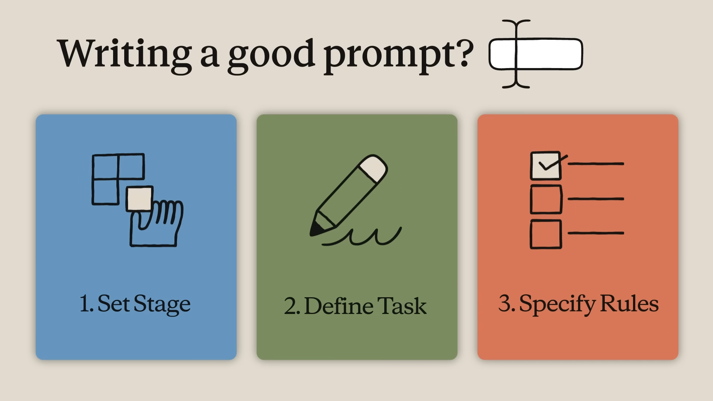
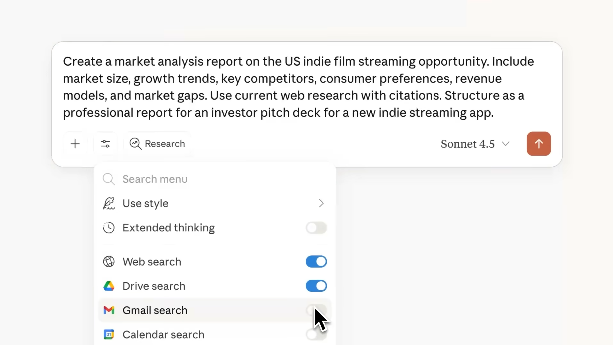
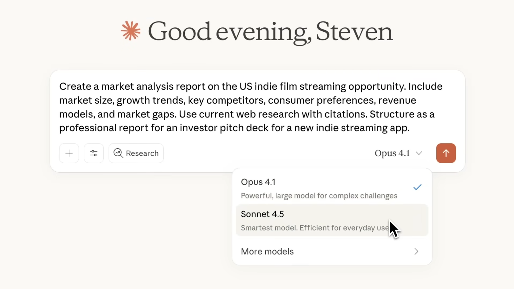
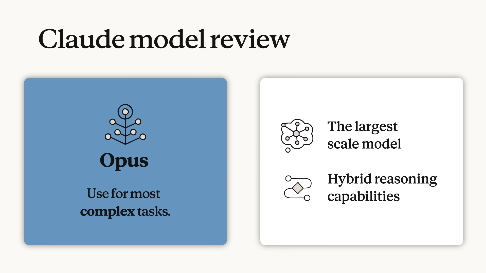
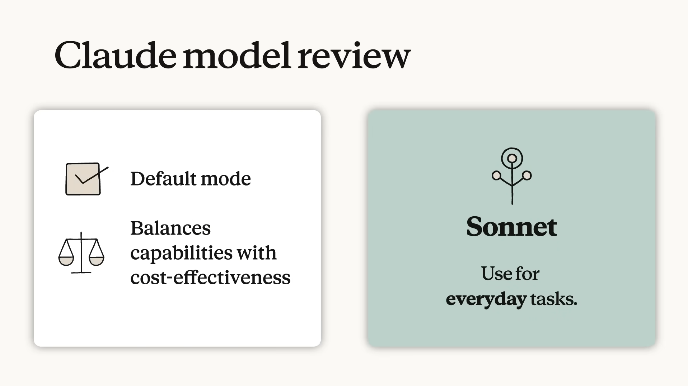
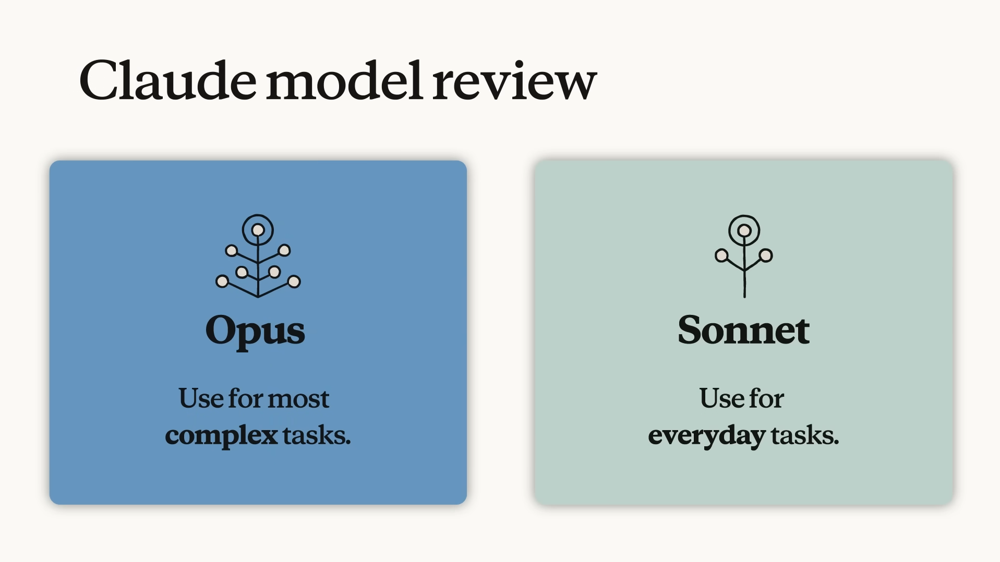
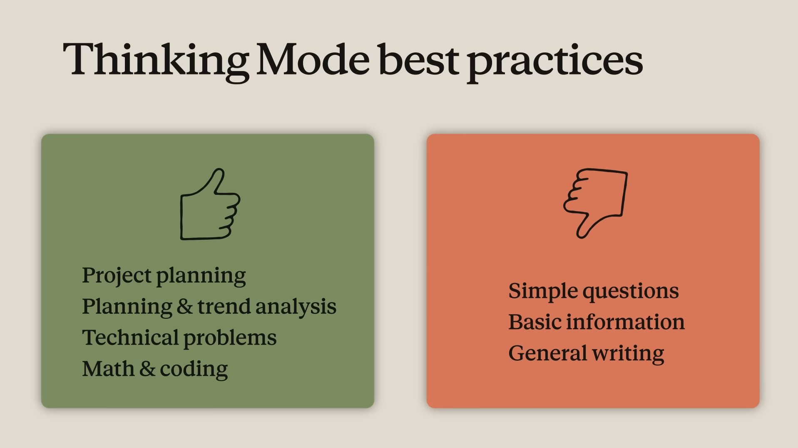
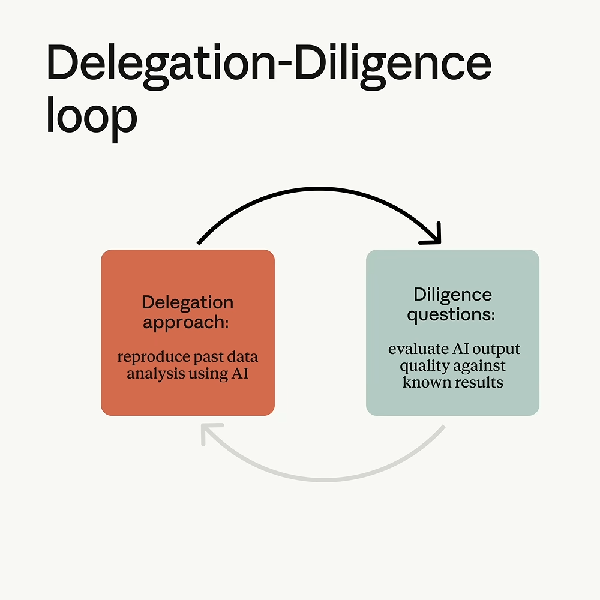

[⬅ Back to course index](../README.md)

# 📚 Claude 101 — Course Notes

---

## Chapter 1: What is Claude?

> Claude is more than a chatbot—it's an AI assistant designed to be your thinking partner.

### 🧠 Key Takeaways

- **Claude is built to be helpful, harmless, and honest** — At a high level, Claude is guided by principles that help it avoid toxic or discriminatory outputs, avoid helping humans engage in illegal or unethical activities, and broadly behave as a helpful, honest, and harmless AI system. This approach, called **Constitutional AI**, means Claude is trained to align with human values and operate transparently.
- **Claude is more than a chatbot** — Claude is capable of a wide variety of conversational and text processing tasks while maintaining a high degree of reliability and predictability, including summarization, search, creative and collaborative writing, Q&A, coding, and more. Think of Claude as a thinking partner who can help you tackle complex problems and work through challenging situations, not just answer simple questions.
- **Claude is designed to be steerable and collaborative** — Claude can take direction on personality, tone, and behavior, and customers report that Claude is much less likely to produce harmful outputs, easier to converse with, and more steerable—so you can get your desired output with less effort.
- **You can access Claude wherever you work** — Claude apps are available to all plan types—Free, Pro, Max, Team, and Enterprise. Your conversations, projects, memory, and preferences sync across all devices when you're signed in. Whether you're at your desk or on the go, Claude is available through web, desktop, and mobile apps.

### 🛠️ Understanding Claude's Capabilities

Claude can help with a wide range of tasks that go far beyond simple question-and-answer interactions to assistant-like partnership that can both **automate** *and* **augment** your work.

| Area | What Claude Excels At |
|------|------------------------|
| ✍️ **Writing & content creation** | Collaborates on social media posts, professional emails, and complex reports. Because Claude is trained to take direction on personality and tone, you can iterate together on structure and clarity until your voice comes through clearly. |
| 🔎 **Research & analysis** | Helps you explore research angles, compile findings, and analyze data to surface meaningful insights. You can upload documents and Claude will help you make sense of complex information — enabled by Claude's large **context window**, which can ingest 200K+ tokens (about 500 pages of text or more), with up to 1M tokens available on Pro, Max, Team, and Enterprise plans when using supported models. |
| 💻 **Coding assistance** | One of Claude's greatest strengths. Strong performance on real-world coding tasks means it can help you write, debug, and explain code across multiple programming languages. |
| 🧩 **Problem-solving & reasoning** | Handles complex cognitive tasks, mathematical problems, strategic thinking and analysis, and research. Claude can respond near-instantly or take time to reason first — a capability called **Thinking**. When a problem calls for careful analysis, Claude can work through it step by step before it answers. |
| 📖 **Learning new things** | Adapts to your learning style and pace. **Learning mode** is a Claude experience that guides your reasoning process rather than providing answers, helping develop critical thinking skills. |

> Get inspired on ways to use Claude in your specific function by exploring the [use-case gallery](https://claude.com/resources/use-cases) on claude.com. For a deeper dive into what AI can (and can't) do, see the [AI Capabilities](https://anthropic.skilljar.com/ai-capabilities-and-limitations) course.

### 🌐 Ways to Access Claude

Claude is the intelligence—the AI assistant you're learning to work with throughout this course. That same intelligence is available across multiple interfaces, each suited to different types of tasks.

| Interface | Description |
|-----------|-------------|
| **[Claude.ai](https://claude.ai/)** (+ mobile/desktop apps) | The primary way most people interact with Claude — ask questions, brainstorm ideas, create and edit documents, and more. Ideal for conversations, writing assistance, research, analysis, and creating files. **This is the focus of this course.** |
| **[Claude Code](https://claude.com/product/claude-code)** | An agentic coding tool designed for developers, but usable for all kinds of file manipulation on your desktop. Can directly edit files, run commands, and create commits. |
| **[@Claude](https://claude.com/claude-and-slack)** | Brings Claude directly into Slack — chat from the AI assistant header in any channel/conversation, or tag @Claude in threads. When connected, Claude searches your workspace's channels, DMs, and shared files for context. |
| **[Claude Design](https://claude.ai/design)** | A dedicated space for turning ideas into working interfaces. Describe what you want — or start from a sketch or screenshot — and Claude builds an interactive prototype you can refine and hand off to your team. |
| **[Claude for Microsoft 365](https://support.claude.com/en/articles/13892150-work-across-excel-powerpoint-and-word)** | Brings Claude into Excel, PowerPoint, Word, and Outlook as a sidebar — analyze, draft, and edit inside the document you already have open, carrying context from one app to the next. |

> This course focuses primarily on [Claude.ai](https://claude.ai/), but you can also check out [Claude Code in Action](https://anthropic.skilljar.com/claude-code-in-action) for more on using Claude in development workflows.

### 🤔 Lesson Reflection

- What tasks in your current work might benefit from having Claude as a thinking partner?
- Take a look at your calendar (or better yet, ask Claude to) and identify a few tasks you might want to use Claude to support.

---

## Chapter 2: Your First Conversation with Claude

> ⏱️ Estimated time: 20 minutes · 🎥 Video: *Getting started with Claude.ai*

> Claude brings AI intelligence, but you bring the context and expertise that makes the work meaningful.

### 🎯 Learning Objectives

By the end of this lesson, you will be able to:
- Start a new conversation with Claude and navigate the interface
- Write effective prompts using clear, specific language
- Upload files and images to provide Claude with additional context
- Use follow-up messages to iterate and refine Claude's responses

### 🧠 Key Takeaways

- Claude is a powerful, intelligent collaborator that amplifies your capabilities across all of your work. Claude brings AI intelligence, but **you** bring the context and expertise that makes the work meaningful.
- The best approach when speaking to Claude is like you would a coworker — **naturally, concisely, and conversationally.**
- Before your next conversation with Claude, consider: **setting the stage** (your role, objectives, and context), **defining the task** (what action you want Claude to take), and **specifying rules** (style, tone, and examples).
- When you upload relevant documents or background information into a chat, Claude considers that content in its response — think of it as a shortcut so Claude can understand what your needs are.
- The real power of Claude comes with **continued and frequent communication**, not just one-off prompts.

### 💬 Starting Your First Conversation

When you open [Claude.ai](https://claude.ai/), you'll see a clean interface with a text input area at the bottom of the screen.

Your prompts can range from simple questions (like brainstorming code names for a new feature) to complex requests to co-create files.

### ✍️ Writing Effective Prompts

All interactions with Claude begin with a **prompt**, and these prompts, combined with other context, impact Claude's response. The best approach when speaking to Claude is like you would a coworker — naturally, concisely, and conversationally.

But you may ask, what is a good prompt? Before your next conversation with Claude, consider a few things:

| # | Element | Ask yourself |
|---|---------|--------------|
| 1 | 🧩 **Setting the stage** | What is your role and what are your objectives? Is there context about your work that Claude should know about? |
| 2 | ✏️ **Defining the task** | What action do you want Claude to take? Do you want Claude to write, analyze, build, or something else? |
| 3 | ✅ **Specifying rules** | What's the style or tone you want Claude to use? Are there examples that you can attach to show Claude what you're looking for? |

#### Putting It Together

Here's an example prompt that uses all three elements:

> *"I'm the marketing lead at an indie streaming startup, and we're preparing an investor pitch deck for Series A investors. Can you research the current state of the independent film streaming market and identify key trends, competitor positioning, and growth opportunities? Use current web research with citations and structure it as a professional report of up to 5 pages, with an executive summary, market analysis, competitive landscape, and growth opportunities."*

| Element | How it shows up in this prompt |
|---------|--------------------------------|
| 🧩 **Setting the stage** | Marketing lead at an indie streaming startup, preparing a Series A investor pitch deck — the context and objective |
| ✏️ **Defining the task** | Research the market, with relevant details (trends, competitors, opportunities) — the specific action |
| ✅ **Specifying rules** | Current web research with citations, structured as a professional report — the exact style and format |

Here's that same prompt being entered into Claude.ai — note the toolbar below the input box (tools menu, model picker, and Research toggle):

> 💡 **Want to go deeper?** This prompt framework is adapted from the **4D Framework for AI Fluency**, developed through research collaboration between Professor Rick Dakan (Ringling College of Art and Design) and Professor Joseph Feller (University College Cork). The framework identifies four core competencies — **Delegation, Description, Discernment, and Diligence** — that enable effective collaboration with AI. See [ai-fluency/README.md](../ai-fluency/README.md) for the full course notes.

#### 🤖 Choosing a Model: Opus vs. Sonnet

The model picker (shown above) lets you choose which Claude model handles your request:

| Model | Best for | Notes |
|-------|----------|-------|
| 🔵 **Opus** | Most **complex** tasks | The largest scale model, with hybrid reasoning capabilities |
| 🟢 **Sonnet** | **Everyday** tasks | Default mode — balances capabilities with cost-effectiveness |

#### 💭 Extended Thinking Mode

Inside the tools menu you'll also find **Extended thinking** — a toggle that gives Claude space to reason step-by-step before answering. It's not a fit for every prompt:

| ✅ Good fit | ❌ Not worth it |
|-------------|-----------------|
| Project planning | Simple questions |
| Planning & trend analysis | Basic information |
| Technical problems | General writing |
| Math & coding | |

### 📎 Adding Context

Uploads, connectors, and custom preferences offer ways to give Claude even more context about your work.

Claude can analyze both text and visual elements (like images, charts, and graphics) in PDFs and other documents.

| Supported file types |
|-----------------------|
| PDF, DOCX, CSV, TXT, and common image formats like PNG and JPEG |

Some practical ways to use file uploads:
- Upload a document and ask Claude to summarize the key points
- Share an image and ask Claude to describe or analyze what it sees
- Attach a spreadsheet and ask Claude to identify trends in the data
- Upload code and ask Claude to explain how it works or find bugs

Once uploaded, Claude will automatically attempt to parse the file's content. In the chat, the file appears as an attachment and you can then prompt Claude about it.

> 💡 **Pro tip:** If you'd like Claude to consider specific preferences in every response, go to **Settings > General > "What personal preferences should Claude consider?"** to set preferences that apply to every conversation.

### 🔁 Iterating on Claude's Responses

Conversations with Claude are meant to be **iterative**. Chaining bite-sized prompts together allows for a natural dialogue where you guide the conversation based on Claude's replies.

If Claude's first response isn't quite what you wanted, you have several options:

| Option | Example |
|--------|---------|
| **Ask follow-up questions** | Build on Claude's response by asking for more detail, a different angle, or clarification: *"Can you expand on the second point?"* or *"That's helpful, but can you make it more concise?"* |
| **Provide feedback** | Tell Claude what you liked and didn't like about its response: *"This is good, but the tone is too formal. Can you make it more conversational?"* |
| **Redirect or restart** | If Claude went in a different direction than you intended, steer it back: *"Actually, I was asking about X, not Y. Let me clarify..."*. Worst case, restart your conversation in a new chat to fully refresh the context. |

> 💡 **Pro tip:** You can also click the pencil icon on any of your messages to edit and resubmit your prompt — useful when you want to refine your request rather than add a new message.

### 🌟 Personalizing Claude

Two features help Claude work better for you over time, increasing the power of your prompts:

| Feature | What it does |
|---------|---------------|
| 🧠 **Memory** | Automatically saves key context from your conversations — your role, preferences, past decisions, and working style — so you don't have to repeat yourself every time you start a new chat. Review, edit, or delete anything Claude remembers anytime in Settings; memory syncs across all your devices. |
| 🎨 **Styles** | Customize how Claude communicates. Choose from preset options — like concise, formal, or explanatory — or create your own custom style by describing exactly how you want Claude to write. Once set, your style applies across all conversations automatically. |

### 🤔 Put It Into Practice

Before moving on, try prompting Claude with a question or task. If you need an idea to get started, feel free to explore the [use-case gallery](https://claude.com/resources/use-cases).

---

## Chapter 3: Getting Better Results

> ⏱️ Estimated time: 15 minutes

### 🎯 Learning Objectives

By the end of this lesson, you will be able to:
- Recognize common challenges when starting out with AI and use troubleshooting techniques to overcome them
- Define AI Fluency and know where to go to learn more about working with AI in a fluent way
- Explain how you might set up evals to better understand how Claude might perform with your unique workflows

### 🛠️ Common Challenges and How to Fix Them

As you start working with Claude, you'll likely encounter moments where the response isn't quite what you expected. **This is normal** — it's an opportunity to refine your approach.

| Challenge | What's happening | Try this |
|-----------|-------------------|----------|
| **Claude's response is too generic** | Your prompt didn't include enough context about your specific situation | Add details about your audience, role, or constraints. Instead of *"Write an email about the project delay,"* try *"Write an email to our enterprise client explaining that the software integration will be delayed by two weeks. They've been patient so far but this is the second delay. Keep it professional but apologetic."* |
| **The response is too long (or too short)** | Claude is guessing at appropriate length | Be explicit: *"Give me a two-paragraph summary"* or *"Keep this under 100 words"* or *"I need a comprehensive analysis — length isn't a concern."* |
| **Claude didn't follow my format** | Claude understood what you want but not how you want it presented | Show, don't just tell. Provide an example of the format, or describe the structure explicitly: *"Use bullet points with bold headers for each section."* |
| **I got confident-sounding information that turned out to be wrong** | Claude occasionally generates plausible but incorrect information, especially with specific facts or niche topics (a **hallucination**) | For high-stakes work, verify key facts independently. Ask Claude to cite sources or indicate confidence level. Enable web search to ground responses in current information. |
| **The tone isn't right** | Claude defaults to helpful and professional, which may not match your needs | Describe the tone in plain language: *"Make this more conversational"* or *"This should sound authoritative and formal."* Provide an example of writing in the style you want. |

### 🔁 The Iteration Mindset

One of the most important shifts when working with Claude is recognizing that your **first prompt rarely produces a perfect result** — and that's okay. Think of your initial prompt as the start of a conversation, not a one-shot request.

Effective Claude users:
- **Treat first drafts as starting points.** Review what Claude produces, identify what's working and what isn't, then refine.
- **Give specific feedback.** *"Make it shorter"* is fine, but *"Cut the first two paragraphs and make the conclusion more action-oriented"* is better.
- **Know when to start fresh.** If a conversation has gone off track, sometimes it's faster to open a new chat with a clearer prompt than to try to redirect.

### 🧭 What is AI Fluency?

> **AI Fluency** is the ability to collaborate effectively with AI tools — not just knowing which buttons to click, but developing the judgment to use AI well across different situations.

The **4D Framework for AI Fluency**, developed through research collaboration between Professor Rick Dakan (Ringling College of Art and Design) and Professor Joseph Feller (University College Cork), identifies four core competencies that, when combined, help you make the most of your AI interactions:

| # | Competency | What it includes |
|---|------------|-------------------|
| 1 | 🎯 **Delegation** | Deciding what work should be done by humans, what work should be done by AI, and how to distribute tasks between them. Includes understanding your goals, AI capabilities, and making strategic choices about collaboration. |
| 2 | 💬 **Description** | Effectively communicating with AI systems. Includes clearly defining outputs, guiding AI processes, and specifying desired AI behaviors and interactions. |
| 3 | 🔍 **Discernment** | Thoughtfully and critically evaluating AI outputs, processes, behaviors and interactions. Includes assessing quality, accuracy, appropriateness, and determining areas for improvement. |
| 4 | 🛡️ **Diligence** | Using AI responsibly and ethically. Includes making thoughtful choices about AI systems and interactions, maintaining transparency, and taking accountability for AI-assisted work. |

You've already been practicing these skills throughout this course:
- The prompt framework from **Lesson 2** (setting the stage, defining the task, specifying rules) is rooted in **Description**.
- The troubleshooting techniques above draw on **Discernment** and **Diligence**.

> 💡 To learn more, check out the full [ai-fluency/README.md](../ai-fluency/README.md) course notes — our free AI Fluency course explores all four competencies in depth, with practical exercises and real-world applications.

### 📊 Evaluating Claude for Your Workflows

As you start integrating Claude into more of your work, you might wonder: *how do I know if Claude is actually good at this particular task?*

This is where **Discernment** becomes essential. **Evals** (short for evaluations) are a way to develop intuition for assessing Claude's outputs on the tasks that matter to you — systematic ways to test how well Claude performs on specific types of tasks that matter to you.

#### Why Evals Matter

Your work is unique. Claude might excel at drafting marketing copy but need more guidance for technical documentation in your specific domain. Running simple evals helps you:
- Understand where Claude adds the most value in your workflow
- Identify tasks where you'll need to provide more context or examples
- Build confidence in Claude's outputs for recurring tasks

#### 🧪 A Simple Eval Approach

You don't need complex infrastructure to evaluate Claude. Here's a practical approach:

| # | Step | What to do |
|---|------|------------|
| 1 | **Gather examples** | Collect 5–10 examples of a task you do regularly — emails you've written, reports you've created, analyses you've done. |
| 2 | **Create test prompts** | Write prompts that would generate similar outputs. Include the context you'd naturally have when doing this work. |
| 3 | **Compare outputs** | Run your prompts and compare Claude's responses to your examples. Ask: *Does Claude capture the key information? Is the tone and style appropriate? What's missing or could be improved?* |
| 4 | **Refine your approach** | Based on what you learn, adjust your prompts, add examples to show Claude what good looks like, or identify where human review is essential. |

### 📈 Example: Using Claude for Data Analysis

> 🎥 This example is taken from the *AI Fluency for nonprofits* course, but it's relevant for anyone working with data in AI.

To evaluate how Claude might work with your data:
1. Find a dataset you've manually analyzed
2. Create prompts that request Claude to do the analysis on your behalf
3. Compare Claude's results to your originals
4. Note patterns and refine your prompt accordingly — maybe Claude gets the right numbers but misses the overall patterns

This kind of lightweight evaluation helps you develop intuition for how to work with Claude on tasks that matter to you — and where to focus your review and refinement energy.

### 🤔 Lesson Reflection

- Which of the common challenges have you already encountered? What techniques might you try next time?
- Where in your work would a simple eval help you understand if Claude is a good fit for a recurring task?
- How might the 4D Framework help you think about your collaboration with Claude?

---

<!-- Add new lectures below this line -->
